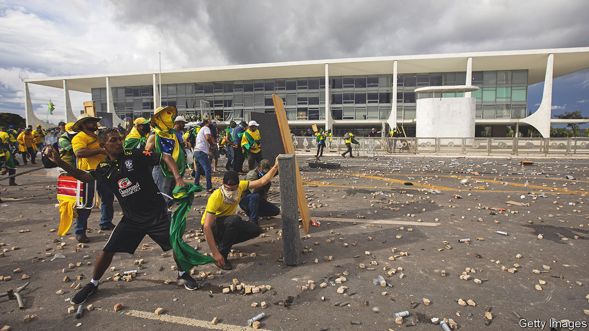
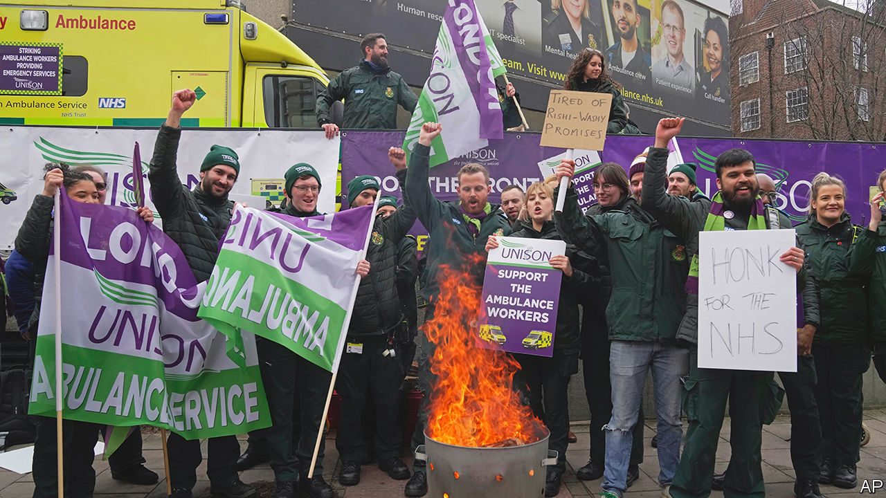

###### The world this week

# Politics 

#####  

 

> Jan 12th 2023 

Thousands of supporters of Jair Bolsonaro, who was  president until narrowly losing an election in October, , Congress and the Supreme Court in an attempted insurrection. They smashed offices and attacked journalists and the police. Luiz Inácio Lula da Silva, the new president, put security in Brasília, the capital, under the control of his government. Mr Bolsonaro, who has been in Florida since December, distanced himself from the violence. But a few days later he posted a video which once again questioned the validity of the election result.

Protests continued to rage in , following the ousting of Pedro Castillo, a left-wing president, after his attempted “self-coup” in December. At least 19 people died this week. Dina Boluarte, who is now president, is among several politicians to be investigated by the attorney-general’s office for “genocide”. She denies any wrongdoing.

 security forces arrested Ovidio Guzmán, a son of “El Chapo”, the former head of the Sinaloa drug cartel. At least 29 people were killed in the ensuing violence. The arrest may help appease critics of the soft approach to organised crime taken by Andrés Manuel López Obrador, the president, which has included defending the release of Mr Guzmán after he was captured in 2019.

Joe Biden met Mr López Obrador and Justin Trudeau, his Mexican and Canadian counterparts, to discuss further economic integration at a summit in Mexico City. The gathering of the  leaders was marked by friction on other issues. Mr Biden wants Mexico to do more to tackle drugs flowing north. Mr López Obrador criticised the United States for its “disdain” for Latin America. The US and Canada expressed concern about Mexico’s nationalistic energy policy. 

Mr Biden said he was surprised by the discovery of ten  at an office he had used before the start of his presidential campaign. The papers were found on November 2nd last year, shortly before the midterm elections, and were handed to the National Archives the following day. A second batch of documents was subsequently found at a different location. The news comes five months after the FBI removed a trove of sensitive material from Donald Trump’s home in Florida. 

Ayes to the right

America’s  adopted  proposed by hard-right Republicans in exchange for supporting Kevin McCarthy as speaker. Mr McCarthy was elected to the job on the 15th round of voting. The new rules make it harder to reach agreement on spending and allow just one congressman to call a vote to oust the speaker. Democrats said they were crafted for “MAGA extremists”. 

Dozens of countries  on travellers from , as covid-19 continued to tear through the country. In retaliation, China stopped issuing short-term visas to people from South Korea and Japan, which had imposed some of the most stringent measures. The WHO said China’s official statistics under-represented the true impact of covid in the country.

 government held talks with the IMF in an effort to restart a bail-out programme for the country. The IMF wants Pakistan to raise fuel prices and taxes, which the government is reluctant to do. Amid warnings that Pakistan’s foreign-currency reserves cover less than a month’s worth of imports,  said it may extend an $11bn rescue programme of investments and loans to the government. 

executed two more protesters. The men said they had been tortured into falsely confessing that they had killed a member of the security forces during protests against the government last year. At least 100 people have been sentenced to death or charged with capital offences in connection to the unrest.

Annual inflation surged to almost 22% in . The Egyptian pound has sunk to a new low against the dollar after the central bank devalued the currency for the third time in ten months, which will increase pressure on the bank to raise interest rates. 

Uganda’s worst  outbreak in two decades has officially ended. The virus, which usually kills roughly half the people it infects, took 55 lives in 142 confirmed cases before it was contained.

Rebels in  northern region of  have begun handing over heavy weapons under a peace deal struck in November. The two-year civil war has claimed hundreds of thousands of lives, mostly from starvation and illness due to a blockade of the region by government forces.

 face “unprecedented” security and humanitarian challenges, according to the UN. Jihadists, criminal gangs and other armed groups have forced the closure of more than 10,000 schools and 7,000 clinics in the region.

 independent electoral commission said that a  scheduled for February 25th may have to be postponed because of a wave of attacks on its offices.

The West appeared to be stepping up its . America, France and Germany all indicated that they are sending various types of infantry fighting vehicles. But what Ukraine is really after are main battle tanks. Reports say that Britain might be preparing to send a limited number of Challengers; German-made Leopards or American Abrams would be better.

Vladimir Putin replacedcommander in Ukraine, putting the armed forces’ chief of staff, Valery Gerasimov, in charge of the war and demoting Sergei Surovikin, known for his brutal tactics, to become his deputy after just three months in charge. 

To the barricades!

The French government  to the state pension system, including an increase in the official retirement age from 62 to 64.  would still have the lowest retirement age in any of Europe’s big economies, but the policy is incredibly unpopular. Unions have called nationwide strikes. 

 


 government, facing a wave of industrial action, introduced a bill that would require unions representing railway, ambulance and fire-service workers, among others, to provide a minimum level of cover during strikes. Even if passed in Parliament the legislation won’t come into force until later this year, but the bill has further angered those who are currently on strike. Unions claim the new law may be illegal.

