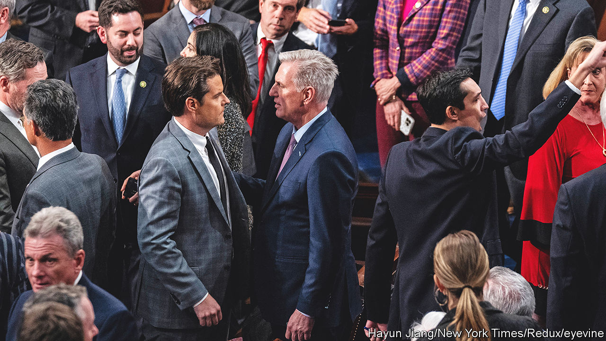

###### House rules

# After a spectacularly chaotic start for Congress, more discord looms 

##### Some of Kevin McCarthy’s rule changes looks good. His deals do not 

 

> Jan 12th 2023 

Having a prolonged fight over a prenuptial agreement on the eve of a wedding hardly bodes well. It may not thwart the ceremony altogether but it certainly increases the chances that the union will be nasty, brutish and short. Such is the lot of Kevin McCarthy, the newly minted Republican speaker of the House, who had to endure four days of agonising negotiations with members of the Freedom Caucus, a hardline contingent of his own party, before he could obtain power. Rather than pedestrian haggling over alimony or unseemly furniture, however, Mr McCarthy had to trade away a considerable amount of his own power and pre-commit to aggressive fiscal hawkishness.

One of the more important powers he ceded in this negotiation was the ability for any single member to call for a vote of no confidence. Just five sufficiently irate defectors within his own party would, when banding with the opposition, be enough to depose the man. The gun held to Mr McCarthy’s head before his ascension is still there. This matters for how America will govern itself for the next two years (and, quite possibly, beyond that).

Exactly how damaging the results will be is not yet clear. Some of the agreements that Mr McCarthy made were officially ratified on January 9th in the 55-page rules package that sets the terms for the next Congress. Others were gentlemen’s agreements, apparently drawn up in a secret three-page addendum, which have not yet been revealed. But three preliminary conclusions can already be drawn: Mr McCarthy will begin his job as one of the weakest speakers of the modern era; the policy agenda of the Republican Party is confused, to say the least; and the federal government is even more likely to return to its chaotic pattern of lurching from one self-made crisis to the next.

Start with the person some are already calling the “speaker in name only”. The threat of defenestration always overshadowed the difficult speakerships of Republicans John Boehner and Paul Ryan. At the start of her turn at power in 2019, Nancy Pelosi, the Democratic leader, managed to defang the “motion to vacate”, which is how the House gets rid of speakers. And although Mr McCarthy, having witnessed all of this while in opposition, resisted the reinstatement of this rule, he was eventually forced to accept that his employment is, like for so many Americans, at will.

Rather than being able to punish members of the Freedom Caucus for their intransigence, as he once threatened, Mr McCarthy is having to dole out rewards. A powerful campaign-expenditure group associated with him has agreed to stay out of certain primary elections, largely to the benefit of prospective hardline candidates.

Three members of the Freedom Caucus will sit on the powerful Rules Committee, which controls when and how bills are debated on the floor of the chamber. This committee is the primary vehicle through which the speaker controls the business of the legislature. Ceding three seats to the Freedom Caucus, however, ensures that these members would have a de facto veto over Mr McCarthy’s agenda. The concessions have led some moderates to bristle. “I’m not going to be held hostage by anyone,” says Nancy Mace, a Republican congresswoman from South Carolina who briefly entertained the idea of voting against the rules package.

Asked whether or not he thinks the speaker will hold true to his commitments, Scott Perry, a Republican representative from Pennsylvania and chairman of the Freedom Caucus, replies swiftly: “I sure do or I wouldn’t have made them. I don’t think they’re overly difficult.” Many of the concessions extracted by Mr Perry and his colleagues, who forced Mr McCarthy to endure 15 excruciating roll-call votes while a deal could be hashed out, are procedural. A lot of them relate to rushed consideration of must-pass legislation “We asked for the tools necessary to be able to stop what just happened right before Christmas, which was 4,000 pages dropped at two o’clock in the morning or something like that spending $1.7trn with 7,200 earmarks,” says Mr Perry, referring to the omnibus spending package passed in the waning days of the lame-duck Congress.

New rules

The new rules require 72-hour notice for legislation, “germaneness” requirements aiming at limiting the addition of extraneous provisions and make it easier for congressmen to actually debate legislation on the floor of the House and offer amendments. The extraordinary consolidation of power within congressional leadership has meant that members are treated more as partisan automatons than thinking legislators. These seem like improvements, even if they will slow the pace of lawmaking and may make dealmaking harder.

But the policy concessions that Mr McCarthy was forced to give are different. They show that there is still little coherence in the Republican platform after the tumult of the Trump era, in which many of the basic intuitions of conservatives on matters like trade, foreign interventions and the rule of law were turned upside down. What remains is a cacophony of past ideas and their dim echoes. The mid-1990s bombast lives on, though the sweeping agenda of Newt Gingrich’s famed “Contract with America” is only palely imitated by Mr McCarthy’s own “Commitment to America”, which fits on a single page. The new supermajority requirement to raise new taxes and pledges to enact spending cuts echo the starve-the-beast anthem of Grover Norquist, the anti-tax activist of the same era. The creation of a new select committee to investigate “the weaponisation of the federal government” as a platform for counter-investigations of the Justice Department reflect the paranoid style of Donald Trump.

Even before the inauspicious beginning to the new congress, American pundits had feared a return to the brinkmanship over budgets that dominated most of Barack Obama’s presidency. Then, Republicans forced government shutdowns and nearly pushed the country to partially default on its debt payments in the hopes of extracting spending cuts, which was successful, and compelling the president to repeal his signature health-care law, which was not. The new power dynamics made apparent in Congress have only raised the probability of a return to this. Only it is not clear what House Republicans would want in return: the chaos may be the point.

Some members of the Freedom Caucus have a particularly volatile mix of ideologies: fiscal hawkishness, a libertarian mistrust and dislike for authority and a breezy, populist self-assurance. Mr Perry, the Freedom Caucus chairman, says votes to raise the debt ceiling, a self-imposed cap, are “a moment of clarity” and should be subject to negotiation. “If we’re just going to continue to increase the debt ceiling without addressing what causes the debt ceiling to increase, I think that’s a pretty hard sell for most conservatives,” he says. Ms Mace, the relative moderate, agrees, too. “I’m not going to be supporting a debt ceiling vote unless there’s a plan to rein in spending or balance the budget over the next ten years,” she says.

Throughout the Trump years, the Republican concerns about the debt seemed to go into hibernation, when the party passed a big tax cut even as the economy boomed. Even now, the new rules are aimed at slashing spending, but leave open the possibility of further tax cuts, which would worsen the country’s fiscal position. “What you want is all politicians to let go of their pretend ways of fixing things,” says Maya MacGuineas of the Committee for a Responsible Federal Budget, a think-tank. “Pretending that there’s space for more tax cuts, without companion spending cuts, is just continuing to push an illusion and that leads to a loss of trust.”

Yet even if Mr McCarthy is forcibly led more than he leads, a minority of Republicans will not be able to dictate terms to a Democratic-controlled Senate and White House. However chaotic the legislative process becomes, the outcomes may, as a result, look more normal. Government spending is probably not going to increase. New fears that isolationist Republican congressmen might slash defence spending either for reasons of austerity or Russophilia may be overblown given that Chuck Schumer, the Democratic leader in the Senate, and Mitch McConnell, the Republican leader in the Senate and ardent supporter of American support for Ukraine, would have to sign off, too. But if they do not get their way, Mr McCarthy’s marriage with his party’s right could end unhappily. ■


