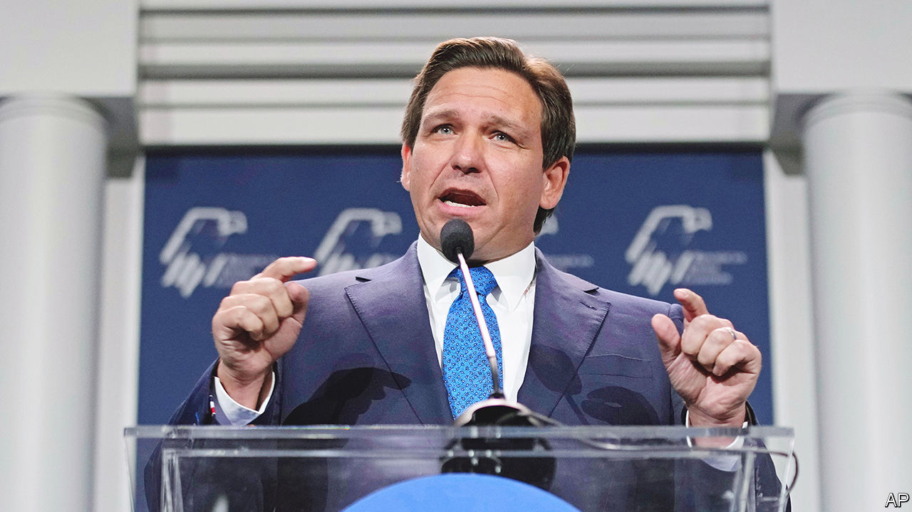
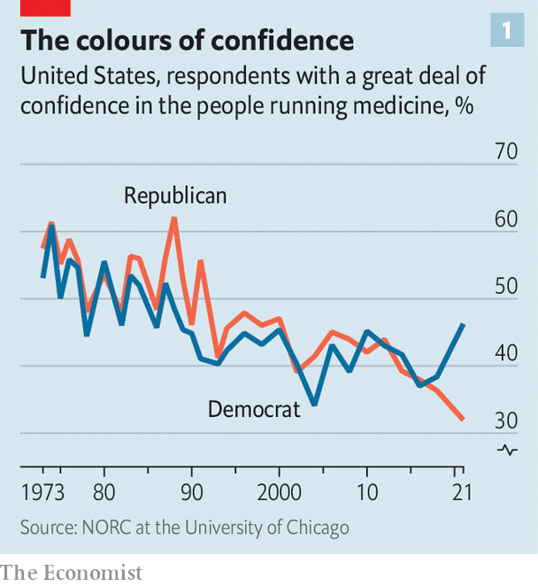
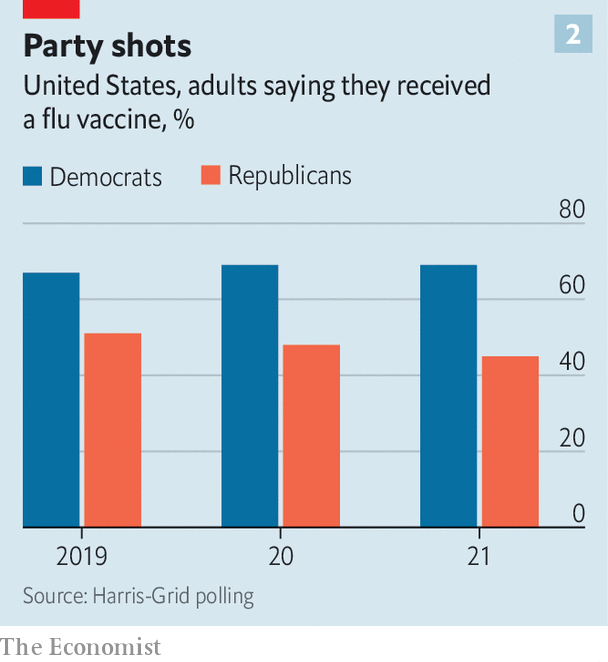

###### Red and blue science

# America’s culture wars extend into medicine 

##### Florida is exhibit A 

 

> Jan 8th 2023 

ASIDE FROM public schools, another covid and  casualty, no institution had a steeper fall in public confidence in 2021 than the medical establishment, according to Gallup, a pollster. In 2022 this downward trend continued: only Americans’ confidence in the  and  fell faster. And politics is making matters worse.

 


The decline is not new. In 1966 seven in ten Americans said they had great confidence in “the people in charge of running medicine”; by 2012 just three in ten did. Whereas in 2018 public faith in the medical establishment was nearly identical in both camps, by 2021 it had split, rising to 46% among Democrats and falling to 32% among Republicans.(see chart 1).

One politician who has tapped into these feelings is Ron DeSantis, Florida’s Republican governor, who sprang to prominence during the pandemic by keeping his state open in the face of establishment pressure for lockdowns. He looks likely to run for president on an “anti-woke”, “anti-migration” and “anti-mandates” platform. In December he all but added “anti-vax” to his list, requesting a grand-jury investigation into possible “crimes and wrongdoing committed against Floridians related to the covid-19 vaccine”. He also promised that a Public Health Integrity Committee would scrutinise advice from the CDC, the Food and Drug Administration and the National Institutes of Health. 

The state Supreme Court has since approved his request for a grand-jury probe. His state boards of medicine and osteopathy are soon expected formally to endorse guidance to ban transgender treatment for minors, a move seen by some as a political takeover of medical institutions. In his inaugural address on January 3rd the governor criticised states that “have imposed medical authoritarianism in the guise of pandemic mandates and restrictions that lack a scientific basis”.

Jay Hmielowski at the University of Florida assumes Mr DeSantis is signalling to his base that: “Trump supported lockdowns, I opened the state. Trump supported vaccines, I questioned aspects of vaccines.” He expects him to soften his position in the later stages of any presidential run, but adds that in this phase it makes political sense to signal a harder line. One feature of Mr DeSantis’s approach is that, as part of his attack on mainstream scientists, he presents himself as a guardian of true science. His vaccine announcement was made at a 90-minute nerdy roundtable with selected scientists discussing several studies. It was hard to imagine Donald Trump sitting through it. But Mr DeSantis listened attentively, telling his audience: “I think people want the truth and I think people want accountability, so you need to have a thorough investigation into what’s happened with these shots.”

That last criticism is not without grounds. Many countries struggled with imperfect decision-making between scientists and politicians during the early stages of covid-19. But whereas others mostly got through without seriously harming science’s reputation, America did not. In the run-up to the 2020 presidential election, Democrats also politicised the issue of vaccines. In a televised debate Kamala Harris, now the vice-president, said that she would be vaccinated if public-health professionals recommended it, “but if Donald Trump tells us that we should take it, I’m not taking it.” Efforts to stifle dissenting views on topics such as mask efficacy and school closures did not help. 

Few areas of medicine have become as politically heated, and in need of cool-headed research, as treatment of transgender children. Neither side seems to be engaging in good faith. Some Democrats have misrepresented the medical consensus on how best to help children with gender-related distress, presenting this as a closed matter when there is no global scientific consensus. The cherry-picking of evidence by medical bodies such as the American Academy of Paediatrics helps explain why Republicans have become twice as likely as Democrats to believe scientists have agendas beyond the pursuit of scientific fact.

Mr DeSantis’s determination to ban transgender treatment for minors may partly be a reaction to a lack of scientific rigour on the issue by Democrats, and some of America’s medical bodies. Several southern governors have sought similar bans, but most have been blocked in courts. By going through his state’s board of medicine, Mr DeSantis not only ensures that the ban is more likely to get through but will also enable him to claim it is based in science. “Florida appears to be the focus group for now,” warns Brandon Wolf from Equality Florida, an LGBTQ+ rights group, “If successful, I can guarantee you will see other states replicate it.”

Science the following

Political opportunism, with both parties loving science where it suits them and spitting it out where it does not, is nothing new to James Cantor, a sex researcher who has seen “fair-weather friends” come and go. He has acted as an expert witness for Florida’s government in several gender-care cases. He remembers how 20 years ago he was pitted against lesbians and feminists because he focused on the role of biology in explaining differences between the sexes, whereas they saw most differences as social constructs. “Well, here we are 20 years later and suddenly I’m their darling now the science, which hasn’t changed, suits their argument [that sex differences are real],” he chuckles.

 


All this has real consequences. Republican voters are less likely to get a covid-19 booster. They have also become more hesitant about other vaccines, including flu shots (see chart 2). An outbreak of measles in Ohio in November and December seemed entirely caused by unvaccinated children. “We haven’t had politicised epidemics before,” says Robert Blendon, at Harvard University. “There were never Republican views of polio, or H1N1 or smallpox, and Democrat views.” ■


