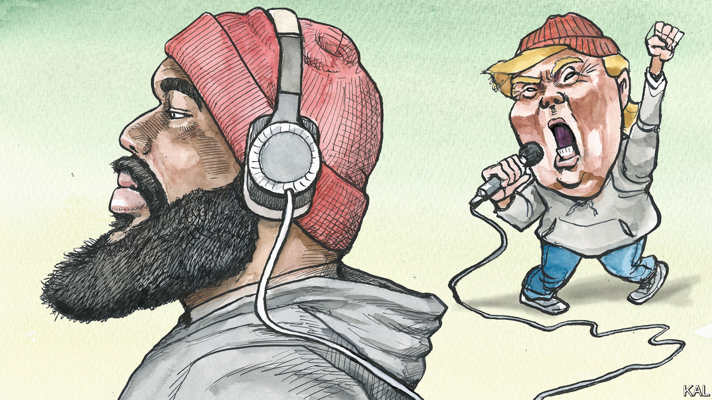

###### Lexington

# How rappers are strengthening Donald Trump’s movement 

##### And ensuring it will outlast him 

 

> Jan 12th 2023 

Here is An unsettling bit of evidence of technological, cultural and racial progress in America: the town of Philadelphia, Mississippi, where in one of the most infamous crimes of that era the Ku Klux Klan killed three civil-rights workers in 1964, is now home to a black rapper helping create the propulsive soundtrack of Donald Trump’s movement to “Make America Great Again”.

Christopher Townsend, who raps under the name Topher, dislikes the label “MAGA rap” that Spotify and other platforms apply to his genre. He sees it as one more way the establishment tries to villainise artists like him and keep people from hearing their messages. When pressed he calls himself a Christian conservative rapper. Jesus, he notes with a chuckle, also “triggered some people”.

Labels aside, Mr Townsend and rappers such as Forgiato Blow and Bryson Gray are the true culture warriors of the MAGA movement. By bringing rhyme, rhythm and the tropes of hip-hop to its messages of patriotism, gun rights, vaccine rejection, free speech and antipathy to abortion, they are churning out chart-topping singles and making MAGA seem edgy and subversive, the basic ingredients of cool. Their success is a sign that Mr Trump’s politics will endure well beyond him.

Over lunch recently at Ronnie’s Steak-N-Grill in Philadelphia, Mr Townsend pulled out his phone to play a rap he had just posted to Instagram opposing Kevin McCarthy as Speaker of the House. In the song, “Circus”, which he later polished over the internet with his producer in Romania and posted to other platforms, Mr Townsend calls Mr McCarthy a sell-out and mocks Mr Trump’s order that conservative opponents “knock it off”:

Sorry Trump, I know he’s the guy you picked

But we won’t “knock it off” till he gets kicked

It’s always “play nice” then we get tricked

It’s so obvious—this time go eat a dick!

Mr Townsend says he still supports Mr Trump for president in 2024, but is confused by his temporising on Mr McCarthy, abortion and other matters. “So it’s like, ‘Bro, these are hard issues we was all, like, for you for. And now you’re changing up?’” He says he might be drawn to Governor Ron DeSantis of Florida, if he runs. (In one blistering burst in his song “Devil Want Our Kids”, Mr Townsend chains “DeSantis” with “chances”, “advances”, “campus” and “stances” to condemn teaching children about gender identity and sexual orientation.)


Mr Townsend, 31, served as a cryptological analyst in the Air Force before moving to Philadelphia with his wife, a teacher. He loves the ‘Sip, as he calls his state; you could not pay him to move to “any of those Democrat-controlled cities”. A fireplug of a man who raps—and eats lunch—in a MAGA-red knit cap, he can glower with the surliest of rappers. But his music can also be buoyant and empathetic and, in person, so is he. His influences range beyond Mr Trump to Booker T. Washington, Malcolm X and Eminem. 

Mr Townsend grew up in the hamlet of Kilmichael, Mississippi. His mother taught him to be the man of the house by ten years old, he says, but she drank, and his father, married to another woman, was not much in his life. When he was 12 or 13 one of his mother’s boyfriends hit her in the face with a two-by-four, and as she bled it took an hour for the police to respond. “I learned early on no one was coming to save me,” he says. “And I think that’s what fuels my ideology today. No government, nobody.”

Mr Townsend’s contempt for authority points to a reversal of cultural polarity under way in America. The left once drew energy from scorning authority and bourgeois convention. But as it becomes America’s enforcer of social norms, it increasingly treats the arts as a tool for instruction. As a result it is surrendering what puts the arts in society’s vanguard, the capacity to question and shock. What more transgressive act could an artist perform than to don a MAGA cap, as Kanye West did? 

Mr Townsend dismisses accusations of anti-Semitism against Mr West and is offended by the music industry’s uneven moral standards, given that some rappers use the N-word and celebrate drug-dealing or violence against women. “Why haven’t they censored that?” he asks. “So they don’t care about black people getting murdered? Or slurs getting thrown around about black people?”

The fire next time

Mr Townsend has no illusions that America is a post-racial society. But he thinks movements like Black Lives Matter ignore reality to foster black victimhood and that the Democratic Party has ill-served black Americans for generations, a theme of many of his songs. Joe Biden “put our people in the system”, run the lyrics of “Twenty Twenty”. “Mr Crime Bill Biden—is that your decision?”

Mr Townsend’s biggest hit—“the life-changing song”—was “The Patriot”, performed with a frequent collaborator, The Marine Rapper, who is also black. The song went to No. 3 in Billboard’s rap chart in December 2020.” “This is where we make a stand, no more give or take,” raps Mr Townsend. “March around the capitol, storm the city gates.” Those lyrics took on new weight after the two men performed the song near the Capitol on January 6th, and it vanished for a time from Spotify and other platforms (and subsequently surged to No. 1). 

Mr Townsend says he learned of the attack after it happened and that he opposed the violence. “I don’t think that was the time to do it,” he says. “And I also don’t think you should ever do something when you have no strategy.” But he is not against overthrowing the government, and he fears the day is approaching when that might prove necessary. Republican leaders are thwarting the wishes of their voters, he argues, pointing to aid to Ukraine and the election of Mr McCarthy. Should the revolution come—“Lord forbid,” Mr Townsend adds—do not be surprised if the rebels have rap lyrics on their lips. ■


