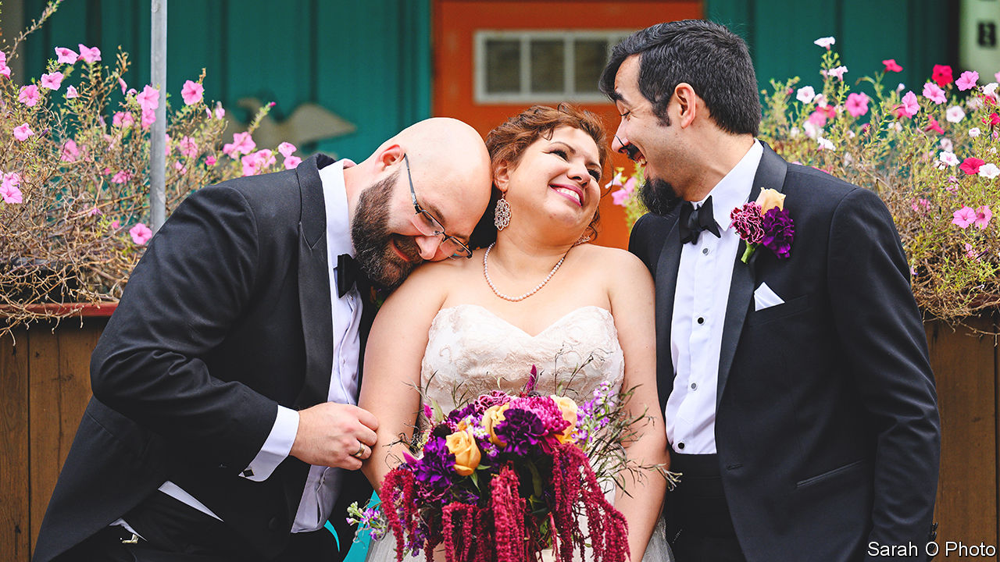

###### Disrupting the dyad

# Polyamory is getting slivers of legal recognition in America 

##### Searching for rights in a monogamous world 

 

> Jan 12th 2023 

It all began with Dungeons &amp; Dragons. In a club for enthusiasts of the fantasy role-play game, Nate met Ashley and Erik, a married couple. Two years of friendship turned to romance and intimacy: first between Ashley and Nate, then him and Erik. They formed a triad. There was frank talk about commitment, finances and parenting—Ashley and Erik have two children, who now call Nate “bonus daddy”. “There’s a lot of love going on,” he says, as the three adults cosy up on their couch. 

In October they held a commitment ceremony resembling a wedding (pictured), albeit with more vows. (“We tried to keep them short,” says Ashley.) The arrangement has no legal weight as a marriage: every state bans bigamy or polygamy. So they signed a “no-nup”: a contract outlining alimony and child-care responsibilities in the event of a break-up or death among partners who were never legally married. Their lawyer, Diana Adams, notarised it with a “lovely stamp that goes ker-chunk”.

Ashley, Erik and Nate are polyamorous, which falls under the umbrella of consensual non-monogamy (CNM)—the agreement to pursue one or more sexual or romantic partners. CNM also encompasses purely sexual liaisons without the love and commitment of polyamory, such as swinging and open relationships. One in 20 partnered people is in a CNM relationship while one in five has engaged in CNM at some point, according to surveys by Amy Moors of Chapman University and her colleagues. Gay people are much more likely to do so than straight ones. Congress’s codification of same-sex marriage, stipulating that such unions must be between two people, “completely erases a lot of queer history”, says Ms Moors.

Triads and quads are what Laura Boyle, a relationship coach, calls “poster-child polyamory”: comprehensible to monogamous people who can grasp the concept of a closed unit living together. In fact networks are often more complicated, represented by V- and N-shaped configurations that don’t imply mutual attraction among several people. Ms Boyle lives separately from her three partners; she co-parents with her ex and his wife. She calls polyamorous people “folks with a scheduling kink” and thinks they are more willing to accept some fluidity in their relationships, for which marriage is a poor framework.

Still, marriage confers tax, health-care and immigration benefits that polyamorous people would like to claim too. States and cities are granting slivers of legal recognition. In September a judge in New York City allowed the third partner of a deceased man to argue that he should inherit their rent-stabilised lease. A dozen states allow triple-parent custody of children.

In 2020 Somerville, outside Boston, became the first city in the country to offer multi-partner domestic partnerships, followed by nearby Arlington and Cambridge. Municipal employers must provide health insurance and other benefits to employees’ partners. Private firms are under no such obligation—that requirement would have to come from the state. Sceptics worry about people claiming an outrageous number of partners. But denying rights on the presumption that people will act in bad faith is no way to operate, says Alexander Chen of Harvard Law School.

Polyamorous people report high levels of discrimination by employers and landlords; courts often treat them unfavourably in custody disputes. Advocates are pushing for ordinances banning discrimination on the basis of relationship status. Stigma indeed means many stay quiet. Survey respondents say polyamorous people are less likely to pay taxes or walk their dog. It is assumed that they feel less sexual satisfaction, less trust and more jealousy when the opposite is true.

Views are changing: in 2020 a fifth of Americans told Gallup that polygamy was morally acceptable, up fourfold since 2006. That reflects more media visibility and growing acceptance of non-traditional families. Millennials are most inclined towards non-monogamy: two in five prefer it, perhaps because the alternative does not pan out so well. In anonymised surveys, a fifth of people in monogamous relationships admit to cheating. ■


