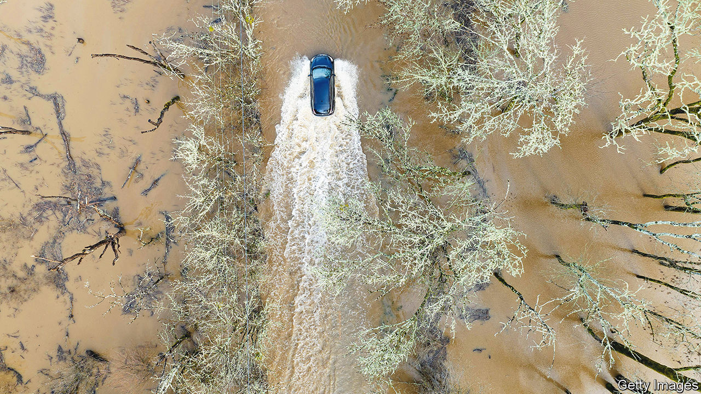

###### Mega-problems

# What California’s deadly storms reveal about the state’s climate future 

##### Climate change will intensify wet and dry periods in the Golden State 

 

> Jan 11th 2023 

FEW THINGS are as welcome in California as rain. Bemoan an overcast sky and you will inevitably get some version of “We need the moisture” in reply. But when it began to pour on New Year’s Eve, kicking off more than a week of storms and interrupting a three-year period of extreme drought, this felt like a release of biblical proportions. The usually placid Los Angeles river raced through its concrete channel towards the Pacific. About 1,000 trees around Sacramento, the state capital, toppled over. As of January 11th, at least 19 people had been killed by winter storms. More than 30m Californians were living under flood warnings. And more wet weather was on the way. 

The storms battering California are known as atmospheric rivers, which act as elongated corridors—hundreds to thousands of miles long—that carry water vapour through the atmosphere in a particular direction. Atmospheric rivers usually make landfall on the west coasts of North America, Chile, South Africa, Europe and Australia, explains Daniel Swain, a climate scientist at the University of California, Los Angeles. At their mildest, the storms can just make for a rainy day.

At their most severe, they rival the hurricanes that clobber America’s east coast. California usually gets its winter rain from atmospheric rivers. The difference this year is the high number of storms in quick succession. Once soil is saturated with moisture from one storm, it needs time to recover before it can absorb more rain. But this time the storms came one after another. When rivers burst their banks, soil parched by years of drought could not soak up the excess water, leading to flooding. Tree roots made brittle by a lack of moisture could not withstand high winds and floodwaters. Areas  are susceptible to flash floods and mudslides. 

It may seem confusing that California is underwater while the American south-west is in the grip of its  for at least 1,200 years. But the Golden State’s severe drought and flooding are both consequences of the warming climate, as the relationship between wildfires and floods suggests. When temperatures rise, the atmosphere can hold more water vapour. A thirsty atmosphere will suck up more water from rivers, reservoirs and soil. This is called “evaporative demand”. When the atmosphere is fully saturated—think of a wet sponge—it will wring itself out, causing precipitation. A study published in 2018 in  suggests that California will probably experience 25% to 100% more “whiplash” events, where the state passes quickly from an extremely dry summer to a very wet winter. 

While officials are focused on water scarcity, worries about a possible “megaflood” to rival the megadrought are spreading. In August Xingying Huang, of the National Centre for Atmospheric Research, and Mr Swain published a study suggesting that climate change has already doubled the risk of catastrophic flooding caused by a month-long series of strong atmospheric rivers. Such a flood, they argue, would temporarily turn the Central Valley, the state’s agricultural powerhouse, into an inland sea, and inundate Los Angeles and Orange Counties, where 13m people live. 

These storms will pass, and summer may erase the gains made in reservoirs and groundwater basins. Attention will again turn to . But the increase in whiplash events reveals a need to adapt to different types of extreme weather, not just water scarcity. Jeffrey Mount of the Public Policy Institute of California, a think-tank, argues that the Central Valley should be building levees farther back from the banks of the Sacramento river, to give the waters more room to roam. In addition to reducing flood risk, wider floodplains could help more water seep into underground aquifers, refilling groundwater basins that have been  by farmers.

Joan Didion, an American writer and a daughter of Sacramento, once described the uncertainty of living beside the valley’s rivers. “I think of the rivers rising,” she wrote, “of listening to the radio to hear at what height they would crest and wondering if and when and where the levees would go.”■


