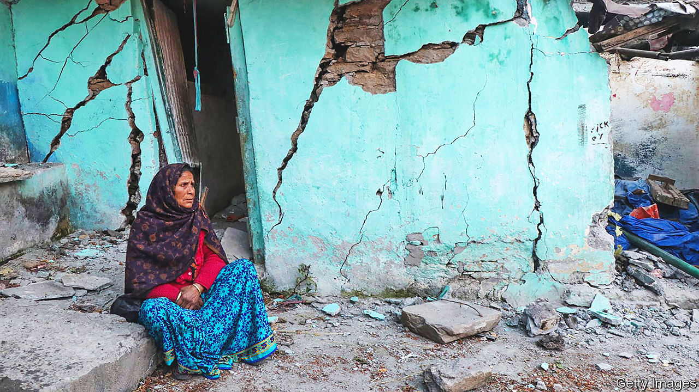
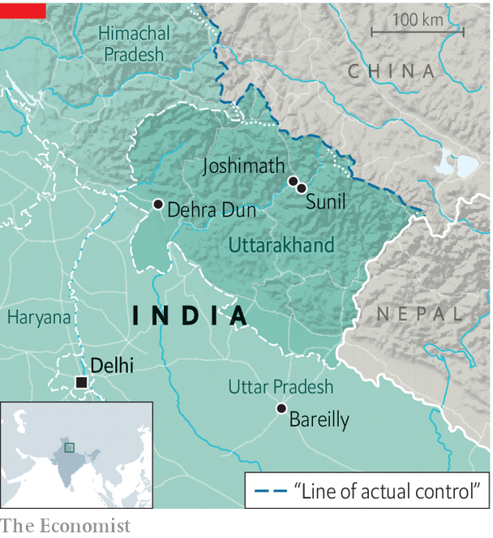

###### Cracks in the façade

# India’s sinking towns spark debates about development 

##### A crisis in the Himalayas embarrasses the government 

 

> Jan 19th 2023 

IT IS NEARLY two years since cracks appeared in the walls of the house in which Durga Prasad Saklani lived with his wife and daughters. Since then the 52-year-old from Sunil, a village near Joshimath in the state of Uttarakhand in the Himalayas, has filed endless petitions warning that his home is sliding down the mountain. For a long time, says Mr Saklani, “nobody cared”.

India’s government wants to develop the country’s remotest corners. Problems around Joshimath underline the difficulty of doing that in the Himalayas. The town is a jumping-off point for hikers and people going to sacred sites at loftier altitudes. Its usefulness to pilgrims—and the recent collapse, due to subsidence, of at least one local temple—makes its travails a particular challenge for the ruling Bharatiya Janata Party, which likes to show off its piety. 

 


Authorities began paying attention to people such as Mr Saklani earlier this month, when cracks that were already visible around town began to multiply. Satellite imagery suggests the area sank by more than 5cm (2 inches) in 12 days during the new year period, having already subsided by 9cm between April and November last year. The district stopped all construction, declared hundreds of houses unsafe and moved their inhabitants, including Mr Saklani and his family, to temporary accommodation. The five of them are now living in one hotel room. The government has given them 150,000 rupees ($1,800) in compensation. At least officials are taking notice now, says Mr Saklani.

Joshimath’s most recent drop may have resulted from the bursting of a groundwater reservoir. What caused that is under investigation. But a high risk of subsidence in the area was recognised in the 1970s, when a government commission concluded that Joshimath’s location—built atop sand and stone deposited by an old landslide—made it a poor venue for large-scale development. Melting glaciers have since left behind more loose material which has pushed up the dangers, says Sarswati Prakash Sati, a geologist from Uttarakhand. 

Nearby towns and villages are affected by similar issues. Yet in recent years there has been little opposition to big construction projects designed to attract tourists. “What is the use of scientific research and reports if they are never executed?” wonders Mr Sati.

Many locals blame Joshimath’s most recent descent on a road built between Hindu pilgrimage sites and on a hydropower project, both of which the central government supports. Atul Sati, a local activist, said that for years the government has failed to protect the town, even after a landslide two years ago that killed 200 people. The head of a local Hindu monastery told reporters that “the planned destruction of the Himalayan region” through development risked Joshimath’s survival as a religious and cultural centre. 

The government denies that its development projects are to blame. But it is worried about public opinion. In mid-January the National Disaster Management Authority told officials and scientists in Uttarakhand to stop speaking to the media. A study detailing the extent of the subsidence has disappeared from the website that published it. Some fear the government plans to paper over the cracks. ■

