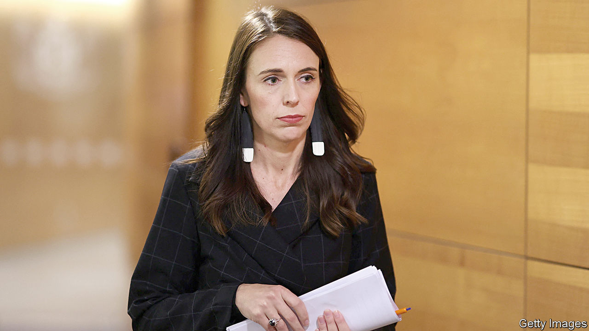

###### Farewells

# Jacinda Ardern resigns as New Zealand’s prime minister 

##### Her successor has an awful lot to do 

 

> Jan 19th 2023 

JACINDA ARDERN said tearfully that she had found “time for reflection”. Being prime minister requires you to have “a full tank, plus a bit in reserve for those unexpected challenges”, she declared at a meeting of her Labour Party in the city of Napier. After five years as  leader, the tank had run dry. Ms Ardern announced that she would step down as prime minister no later than February 7th, and perhaps as soon as January 22nd. “I am human. Politicians are human,” she explained. “We give all that we can, for as long as we can, and then it’s time.”

Few saw that coming. Since being elected prime minister in 2017, at the age of 37, Ms Ardern has steered her country through a mass killing, a volcanic eruption and the covid-19 pandemic. At a time of rising populism, she gained a reputation for kindness. When a white-supremacist shot dead 51 mosque-goers in Christchurch in 2019 she donned a headscarf, embraced grieving families and coined a national refrain by declaring: “They are us.” In early 2020 she was quick to close New Zealand’s borders in response to covid. The death toll from the pandemic stayed low. 

Her prowess also puffed  At home, Ms Ardern won the last election in 2020 with 49% of the vote—the best result for any party since 1951. However, her pulling power has lately weakened. Successive polls have shown that Labour is trailing National, the main opposition party. One poll conducted in December found that 38% of New Zealanders would vote for the conservatives in the coming election, compared with 33% for Ms Ardern (though she was still their preferred prime minister).

That reflects an increasingly gloomy mood. Inflation in New Zealand is above 7%. Between 2020 and 2021 house prices rocketed by 25%, leaving New Zealand with some of the most expensive homes in the English-speaking world. Many Kiwis grumble that they cannot afford to buy or rent a property. 


This is not what Ms Ardern promised. She came into office with lofty plans to “build a fairer, better New Zealand” by slashing child poverty, ending homelessness and erecting 100,000 cheap houses. But that “idealism collided hard with reality”, in the words of David Seymour of the right-wing ACT Party. Labour’s affordable-housing targets were scrapped. A well-intentioned policy to put homeless people into emergency accommodation is blamed for causing crime. Gangs are warring. Kiwis have been getting worried about a spate of ram-raids—an ostentatious kind of theft that involves driving cars through shop windows. 

Whoever succeeds Ms Ardern will have an awful lot to do ahead of a general election which is due to take place on October 14th. The most obvious replacement, Grant Robertson, the deputy prime minister, has already ruled himself out. The “continuity candidate” would therefore be Chris Hipkins, a 44-year-old who oversaw New Zealand’s pandemic response, argues Neale Jones, Ms Ardern’s former chief of staff. 

A choice could be made as soon as January 22nd, when a vote will be held among the party’s caucus in Parliament. If two-thirds of them agree on a new leader, that person will immediately replace Ms Ardern as prime minister. If they do not, Labour’s members will also get a vote. Do not expect the kind of mania that accompanied Ms Ardern’s rise. She pulled her party out of the doldrums in 2017, and catapulted it to victory amid a bout of “Jacinda-mania”. Her successor might be lucky just to limp back into office. ■

