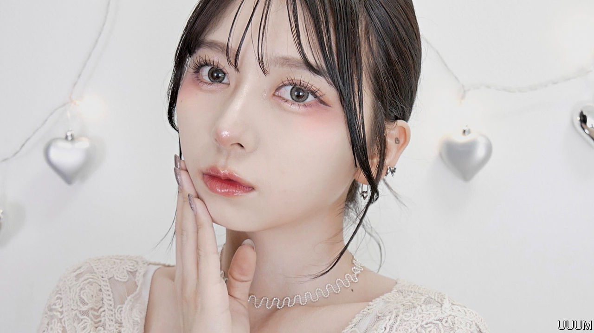

###### Making faces

# Japanese youngsters want to look like Chinese starlets 

##### Fashions used to flow the other way 

 

> Jan 19th 2023 

WHITE GLITTER shimmers around Chang Chia-jung’s eyes. Her lips are bright red; her skin glows. Ms Chang, who was born in Taiwan and now lives in Japan, is a fan of what she calls (Chinese make-up). She learned from influencers on RED, a Chinese social-media site. Now she posts tutorials of her own for Japanese audiences. Her skills have earned her thousands of followers on Instagram and Twitter.

Beauty gurus across Japan are going potty for styles of make-up made famous by starlets from China. The boom began four years ago with the break-out success of a look known as Chiborg. That combines the words for China and cyborg; it aims to make young faces seem preternaturally chiselled. More trendy now is (pure desire), which involves trying to look alluring and innocent all at once. Chinese celebrities have beauty “on another level”, says Nanako (pictured), a 24-year-old Japanese woman who also has lots of followers online. 

Enthusiasm for these styles is driving up sales in Japan of Chinese brands of cosmetics, such as Florasis and ZEESEA. Older Japanese have long avoided Chinese products, which they consider inferior. But their children are less likely to assume this, with some justification. For years Japan had the world’s second-most-valuable market for cosmetics, after America; the Chinese market outgrew it in 2019. China’s make-up firms have grown more competent, and more inventive, as their sales have ballooned. 

Tensions over disputed islands and Taiwan have poisoned ties between Japan and China in recent years. But unlike the trade in products such as semiconductors, which governments seek to control, cosmetics are “apolitical”, says Goto Yasuhiro of Asia University in Tokyo. Behind the rows, he says, youth cultures in Japan, China and South Korea are growing increasingly alike.

A survey in 2021 suggested that more than 40% of Japanese aged 18-29 feel “affinity” towards China, compared with only 13% among those in their 60s and 70s. Sugai Fumihito, who works for an outpost of the Beijing Language and Culture University in Tokyo, says many youngsters studying Mandarin at his institution cite Chinese make-up as a reason for their interest. “I never imagined a day when Japanese consider Chinese to be ‘cool’,” he says. “Lots of Japanese have started to admire Chinese people,” echoes Ms Chang. “That’s thanks to Chinese make-up.”■

