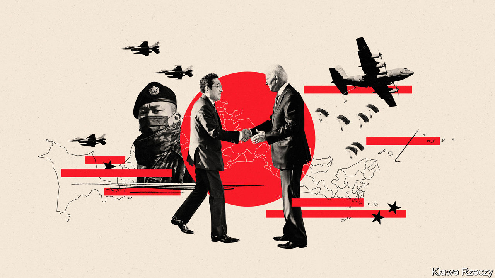
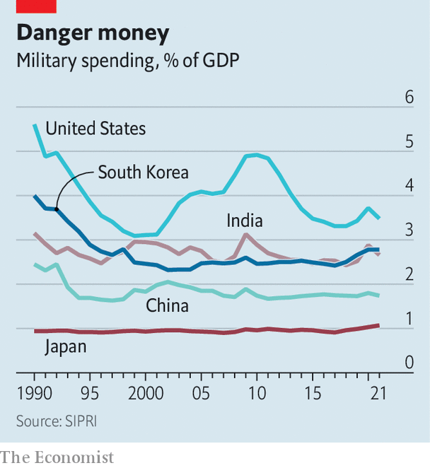

###### Military muscle

# Japan’s armed forces are getting stronger, faster 

##### America seems delighted 

 

> Jan 19th 2023 

Spend enough time on Japanese military bases and in policymakers’ offices, and you will eventually encounter the same unusual map. It depicts East Asia rotated 90 degrees anti-clockwise, as if to show the region from Beijing’s perspective, looking out across the East China Sea. The Japanese archipelago, and in particular the Nansei island chain stretching from Kyushu to Taiwan, seems to form a wall. China’s ambitions for a greater global role, the map suggests, run right through Japan.

In recent years this precarious position has encouraged Japan to do more to ensure its security. When the late Abe Shinzo was prime minister, Japan beefed up its Self-Defence Forces (SDF)—as its armed forces are called, in deference to its pacifist constitution—and loosened laws that limit their ability to use force. Yet such steps were incremental—and also controversial. Plenty of people in Japan worried about backsliding towards militarism.

 


Changes have accelerated in the past year. In December the government updated its National Security Strategy and two important defence-policy frameworks. Japan will spend vastly more on defence and acquire powerful new weapons. China’s belligerence, under Xi Jinping, has helped fuel this. But Vladimir Putin’s invasion of Ukraine has played a bigger role. “The basic assumption for years was that we won’t have to fight a war,” says Sasae Kenichiro, a former diplomat who chaired a council advising on the new security policies. “Now for the first time, the Japanese people sense the possibility of armed conflict in this region and are asking what it means for Japan.”

Shifts in public opinion have allowed the government to take steps that were taboo just a few years ago. Keeping defence spending capped at around 1% of GDP has been an informal but inviolable rule since 1976. Now Japan plans to raise spending to 2% of GDP by 2028, and cough up an additional ¥43trn ($326bn) over the next five years. Japanese leaders have long refrained from acquiring long-range missiles, even though the government concluded, back in 1956, that doing so would not breach the constitution. Now Japan plans to purchase hundreds of cruise missiles from America and develop its own long-range missiles. Whereas Abe’s reforms drew tens of thousands out to protest, the latest changes have attracted support from a majority of Japanese in polls.

War in Ukraine has pushed Japan to think more about what combat would involve. “Putin did it, why not Xi?” says one senior Japanese official. “Dictators are not always rational.” 

Japan plans to spend a big chunk of its new defence money stocking up on parts and ammunition, as well as hardening military facilities against missiles. The SDF also hopes to catch up in cyber-warfare, where it is a laggard. Officials think Japan would not withstand the kind of cyber-onslaught Ukraine has faced; they reportedly plan to quadruple the size of Japan’s cyber-forces by 2028, to about 4,000 people. The SDF will adapt its command structure by establishing a joint headquarters with a single figure responsible for overseeing ground, air and land forces.

All this has delighted foreign-policy types in America. “I have rarely had such a sense of elation about the celebration of the US-Japan relationship,” Kurt Campbell, who oversees Indo-Pacific affairs in the White House, gushed after Kishida Fumio, Japan’s prime minister, met Joe Biden on January 13th. For American planners, Japan’s size, economic heft, strategic geography and military potential make it the most important Indo-Pacific ally when it comes to counterbalancing China. Japan has become essential, in particular, to America’s plans for responding to crises around Taiwan. In the 1990s “our attitude was: fine, we’ll do it ourselves,” says Michael Green, a former senior American official. “That’s not the attitude anymore—we can’t do it without Japan.”

America has announced plans to make Okinawa, in southern Japan, the base for one of three new “marine littoral regiments”, designed to scatter along the island chain, avoid detection and seek to close sea passages to Chinese ships. The two countries have also declared that their alliance extends into space and agreed to expand joint training and use of military facilities. Although Japan does not have a combined command with America (unlike South Korea or NATO), it will need American help with targeting and intelligence to use the new missiles it desires. That will require “a command-and-control system that is more integrated than ever before,” said Oue Sadamasa, a retired Japanese air force general, at a recent seminar in Tokyo.

For all the bonhomie, doubts about America’s staying power are also helping drive Japan’s reforms. Officials have concluded from watching the war in Ukraine, and America’s withdrawal from Afghanistan, that America will only come to the aid of those who are ready to fight for themselves. Japan is seeking to strengthen ties with its other partners: on his way to America Mr Kishida stopped in London to sign an agreement with Britain that makes it easier for soldiers to train and operate in each other’s territory. Japan is also planning to develop a next-generation fighter jet with Britain and Italy. Japan, like others, worries about the possible return of Donald Trump or one of his acolytes. “We have to think about Plan B,” says one influential scholar.

Many in Japan question whether the new policies will work out. Mr Kishida has yet to clarify how he will finance the new spending; the ruling Liberal Democratic Party is split on whether to raise taxes, cut spending or issue more government bonds. The plans will require more personnel, but Japan’s population is shrinking and the SDF already struggles to meet recruitment targets. And it is still unclear how the public would respond if Japanese soldiers were actually sent into combat.

Japan must also communicate clearly what it is up to, lest its changes only end up fuelling conflict. Co-operating more closely on security with South Korea, another American ally, would help deter China. But the Japanese build-up makes many in Seoul wary. China itself has been caustic: “This reminds us of the last time Japan took a wrong turn and brought a terrible disaster to Asia,” crowed the , a Chinese tabloid. One risk is that China does not see a wall being fortified, but a force creeping towards it. Japan is trying to offer some reassurance: its new security strategy refers to China as a “challenge” but does not label it a “threat”, as some hawks had sought. Japan, for better or worse, cannot change its place on the map. ■

