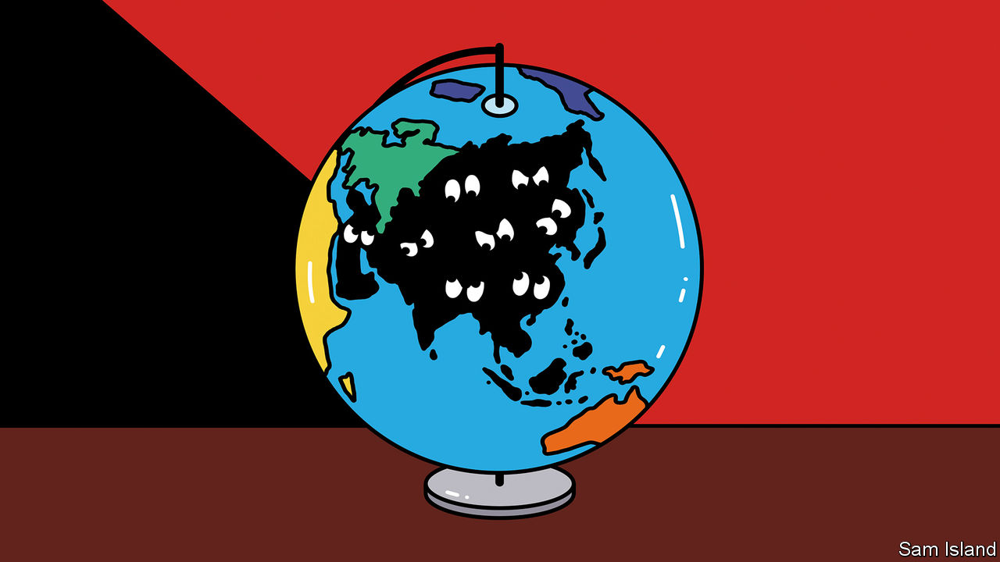

###### Banyan

# Who gets to define what Asia means? 

##### A new book on inter-Asian exchange shows how hard it is to pin down 

 

> Jan 19th 2023 

WHEN RISHI SUNAK became Britain’s first non-white prime minister last October, Ronny Chieng, a Chinese-Malaysian comedian, was charged by “The Daily Show”, an American satirical current-affairs television programme, with commenting on the news. “I know everyone is really excited that this is the first Asian prime minister. But let’s be clear: Indians are not Asians,” he declared. 

The segment provoked a minor backlash in America. But some viewers in Asia nodded along, for Mr Chieng’s tongue-in-cheek rant struck at something they recognised. For centuries the people of the region’s western and southern parts and those of the east and south-east have struggled to make sense of each other. That struggle is at the heart of “How Asia Found Herself”, a new book by a historian, Nile Green, who teaches at the University of California, Los Angeles. 

The term Asia was coined by Greek geographers some two millennia ago and did not appear on the continent it described until the 1600s, at the dawn of the age of European empire. The foreign roots of the word—and the concept—are visible in the transliterations that Asians made as they grappled with the idea:  in Arabic, Persian and Urdu;  in Bengali and Gujarati;  in Japanese;  in Chinese. 

It took until the 19th century for the term to catch on, and even then its most salient use was oppositional: Asia as an anti-colonial device, as “not Europe”. Even the “Asian values” promoted by Lee Kuan Yew, Singapore’s founder, are best understood in opposition to Western ones. The irony, as Mr Green notes, is that it was European colonial infrastructure that in many cases made inter-Asian cultural exchange possible, whether through steamship routes that opened up the ports of the Indo-Pacific to traders, missionaries and intellectuals, or, more notably, through European languages that served as a bridge between the vast number of Asian tongues. 

As late as the 20th century there were few dictionaries between major Asian languages such as Japanese, Urdu, Chinese and Persian, let alone between minor ones. Sometimes this led to comic outcomes. When Baha’i missionaries sought to convert Japanese in 1914, they resorted to the use of Esperanto, a language invented in Poland in 1887. Similarly, indigenous literature on other Asian cultures was scant, requiring scholars to look to English, French or Russian sources.

When intellectuals from across the continent chose to engage with the idea of Asia as something that united them, it was often as a form of self-projection. Chinese intellectuals looked upon India, whose people had been unable to fight off colonisation, as a lesson in how not to fail. Indians speculated on the influence of ancient Hindu scriptures on Daoism, or of India’s warrior caste on Japan’s samurai. 

Asian Muslims attempted to reconcile the new (to them) religions of Buddhism, Confucianism, Daoism and Shinto with their own faith, casting the Buddha as an Islamic prophet or Confucius as a philosopher. Japan’s Asianists saw their own country as a natural leader, notably through the imperialist project of a continental “co-prosperity sphere”. Acceptance of the idea of Asia did not automatically lead to a sense of brotherhood or respect. As Mr Green writes, “the search for solidarity always raised the question: unity on whose terms?”

In the 1930s an Indian freedom fighter, Rash Behari Bose (who married a Japanese woman and would die a Japanese citizen), proposed to the proto-Hindu-nationalist Veer Savarkar that “every attempt should be made to create a Hindu bloc extending from the Indian Ocean up to the Pacific Ocean.” Some 70 years later Abe Shinzo, then prime minister of Japan, extolled to India’s parliament the idea of a “broader Asia” taking shape “at the confluence of the two seas of the Indian and Pacific Oceans”. What geopolitical analysts have more recently come to call the “free and open Indo-Pacific” now takes in America and Australia as partners in the grouping known as the Quad, which seeks to counterbalance the rise of China. 

Not for the first time, the idea of inter-Asian co-operation includes—and indeed relies upon—the technology and infrastructure of the West. And once again, as one Asian country seeks to draw smaller states into its own sphere, other powers find themselves asking: “Asia on whose terms?” The concept of Asia has for centuries and despite many efforts defied definition. And so once again, in the guise of the Indo-Pacific, it is at its most useful when defined in opposition. ■


