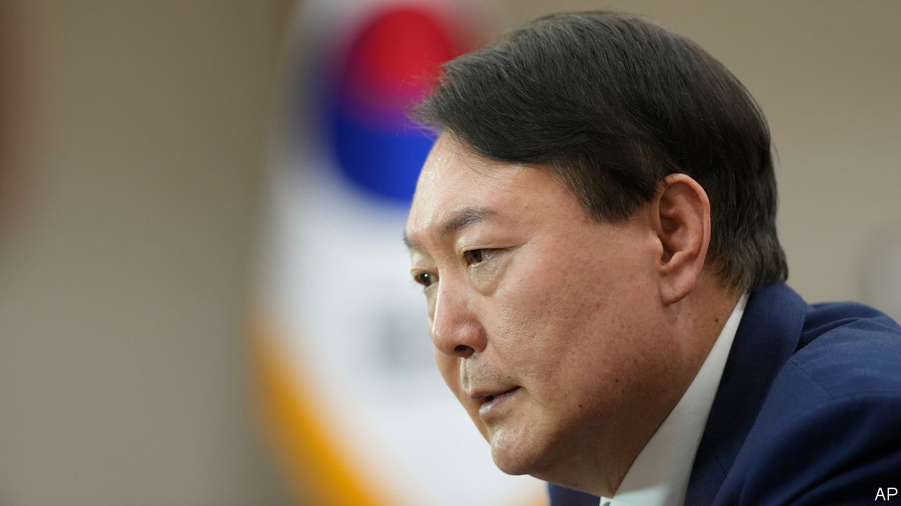

###### Renuclearising

# Why South Korea is talking about getting its own nukes 

##### President Yoon Suk-yeol surprises America by musing about nuclear weapons 

 

> Jan 19th 2023 

Rash talk about nuclear weapons is common from North Korea; less so from the South. In a speech given on January 11th Yoon Suk-yeol, South Korea’s conservative president, speculated that a day may come when the threat from North Korea requires America to deploy nuclear weapons back to the peninsula. Failing that, he said, South Korea could “acquire our own nuke”. He said that this would not take long, given his country’s technological prowess.

It is the first time in decades that a sitting South Korean president has talked about going nuclear. His remarks were admittedly casual, says Yang Uk of the Asan Institute for Policy Studies, a think-tank in Seoul, who was in the room. And they cropped up within a somewhat meandering speech that required its audience to imagine a number of hypotheticals.

Yet it is not the first time Mr Yoon has caught America unaware by speculating about a more robust nuclear policy. Nukes are plainly on his mind. The past year has brought a record number of North Korean missile shots, as well as preparations for a long-expected seventh nuclear test. Diplomacy aimed at “complete denuclearisation of the Korean Peninsula” seems hopeless. And the intensifying rivalry between America and China is worsening military tension in Asia.

Mr Yoon’s words may thus have several intended audiences. The first is domestic. Taking a hard line against North Korea pleases his conservative base. Several polls show robust public support for an indigenous nuclear deterrent. Another is North Korea. In the same speech Mr Yoon said the most effective deterrent against aggression would be to convince the North it would be hit “100 or 1,000 times” more strongly than any blow it could land. A third target may be China, which is being warned that it may one day have another nuclear state on its periphery if it does not do more to rein in North Korea.

Mr Yoon’s main audience is probably America. As North Korea tests missiles with the range to hit the American homeland, many South Koreans are scared that the United States might not risk the destruction of, say, Seattle, to defend Seoul. Donald Trump’s talk of leaving South Korea to defend itself, and the possibility that he or a similarly minded candidate might succeed President Joe Biden in 2025, increase the fear of abandonment. 

South Korea’s president may be seeking stronger American assurances. In November the two countries agreed, among other things, to hold tabletop training exercises that “include a DPRK nuclear use scenario”. But they disagree over what this means. The South Koreans have repeatedly suggested they were discussing “joint nuclear weapons planning and exercises” with America that would be tantamount to NATO-style “nuclear sharing”, in which allies get a say on the use of nuclear weapons (and some are tasked to deliver them). Joe Biden, America’s president, shot down that suggestion with a curt “no”.

Jon Wolfsthal of Global Zero, a group that seeks the abolition of nuclear weapons, thinks Mr Biden will not offer a more tangible nuclear commitment. He notes that America’s nuclear weapons “are like Domino’s Pizza: we can be there in 30 minutes, or your money back”. America, he says, would resist South Korea building its own nukes. 

Mr Yoon is highly unlikely to go that far. “He’s not saying we will go nuclear today or tomorrow,” says Mr Yang. After his speech, Mr Yoon’s office quickly restated South Korea’s commitment to nuclear non-proliferation. The danger, however, is that his loose talk may only create a split with America—to the delight of North Korea and China. ■

