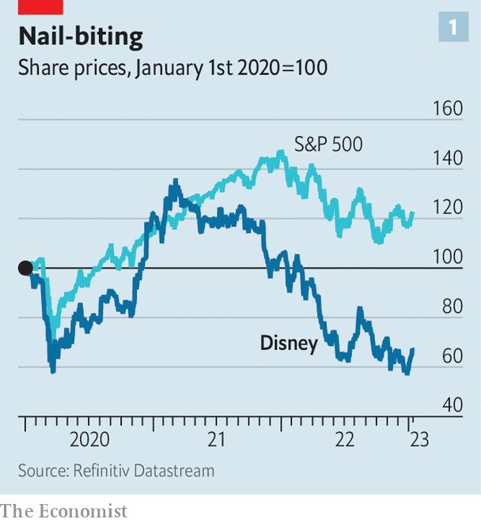
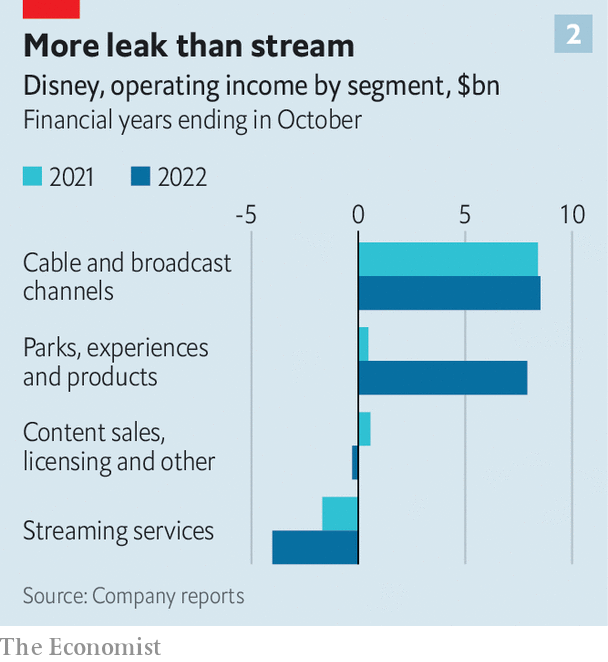
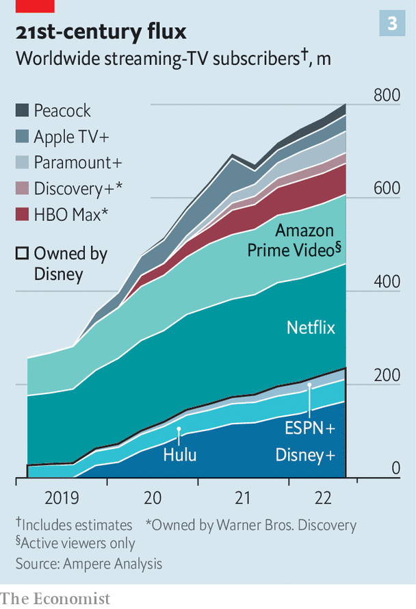
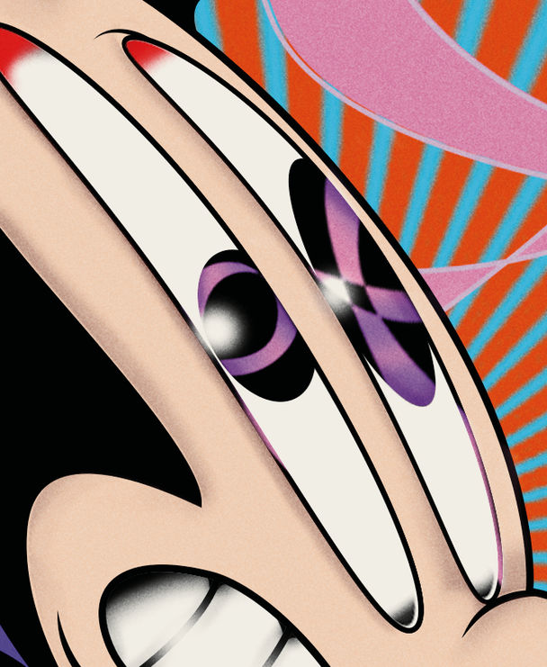

###### Thrills and spills

# As Disney turns 100, its business is on a rollercoaster ride 

##### The decline of TV and cinema and rise of streaming will reshape entertainment 

 

> Jan 19th 2023 

Splash Mountain, a popular ride in Disneyland, towers over attractions that encapsulate the 100-year history of the Walt Disney Company. To the south, on Main Street USA, a little cinema screens “Steam Boat Willie”, in which Mickey Mouse made his debut in 1928. In the centre of the park the Sleeping Beauty Castle evokes the classic Disney animations of the 1940s and 1950s. On the outskirts are areas themed around Star Wars and the Marvel universe, which Disney took over during an acquisitions spree in the 2000s. Passengers at the high point of the ride have a few seconds to take in the view. Then, with a lurch, their car makes a near-vertical plunge and everyone gets drenched.

In the run-up to its centenary, which Disney will start celebrating on January 27th, the company itself has been on something of a rollercoaster ride. The world’s biggest entertainment firm, with a market value of $180bn, still rules the box office, with four of the ten highest-grossing films of 2022 (including the sequel to the most lucrative ever, “Avatar”). Its American theme parks have bounced back from pandemic shutdowns to generate record profits. Its broadcast and cable-television networks continue to rake in billions of dollars a year. And in streaming, the medium of the future, Disney has racked up more subscriptions than anyone, last year overtaking Netflix. During 12 thrilling months in 2020-21, investors clung on as the company’s share price doubled.

 


Then came the plunge into cold water (see chart 1). In the past year Wall Street has realised that Hollywood’s old formats are decaying faster than its new ones are growing. Cinema has not fully recovered from covid-19, and may never. Cable is in steepening decline. Meanwhile Disney’s streaming division is still losing more than $1bn a quarter as it competes with rivals like Apple and Amazon, who use streaming as a loss-leader for their other businesses. Disney’s market value has dropped by half since its peak in 2021, back to the depths it plumbed at the outbreak of the pandemic. In November the company sacked its chief executive, Bob Chapek, and brought his predecessor, Bob Iger, back from retirement.

Mr Iger, a corporate Jedi who led Disney for a successful decade and a half until 2020, has been given two years to turn things around. He must manage the decline of Disney’s legacy businesses, make its new ventures profitable and find a successor who can fend off the threat from Silicon Valley. His performance is already under fire from Nelson Peltz, an activist investor whose company, Trian Fund Management, has bought a 0.5% stake (worth $900m) and is demanding a seat on the board. How Mr Iger navigates these challenges will help shape the entertainment business and determine whether Disney survives another hundred years.

In the 1950s Walt Disney literally sketched out why the firm he had founded decades before was so successful, drawing doodles of Mickey Mouse and Donald Duck on a flow chart showing how the different parts of his empire mutually reinforced each other. The Disneyland park “plugs movies”; television “plugs merchandise”; the film studio “provides interchange of stars” for TV, he noted. At the centre of the diagram he put the studio’s creative output, which generates the intellectual property that powers every part of the business.

The strategy remains unchanged. At Disneyland visitors can board a replica of the  to relive scenes they first saw in “Star Wars” at the cinema. On their way out they can buy a $25 Baby Yoda doll, a reminder to tune in for the next season of “The Mandalorian” on the Disney+ streaming service. Streaming, which turns TV viewers into direct customers for the first time, promises yet more cross-promotion. In future Disney+ might recommend shows based on the rides a subscriber has taken at its theme parks, for instance.

 


But several pillars of this structure are now wobbling at once. Take broadcast and cable television, which contribute the biggest share of Disney’s profits (see chart 2). The industry is in long-term decline, as households swap pricey cable packages for cheaper streaming services, as well as free content on YouTube and the like. The primetime audience of ABC, a broadcast network owned by Disney, has fallen by nearly a third in the past four years. Since July Americans have spent more time streaming than watching cable, according to Nielsen, which measures audiences. From next year only a minority of American households will have cable subscriptions, forecasts eMarketer, a research firm.

Cable companies have been able to protect profits by raising prices for their remaining customers, who are addicted to sport, in particular. But this strategy has run out of road. In November Disney reported a 5% year-on-year drop in quarterly revenue from its television businesses. A weak advertising market, with neither American elections nor mammoth sporting events this year, makes matters worse. MoffettNathanson, a firm of analysts that had expected operating profit at Disney’s cable networks to fall by 4% this financial year, now predicts a drop of 17%. TV (as opposed to streaming) “is marching to a distinct precipice, and it’s going to be pushed off”, Mr Iger said in September, shortly before his return. Disney’s recent results suggest “that cliff may be closer than any of us thought”, MoffettNathanson argues.

 


As old-fashioned TV totters towards the abyss, Hollywood studios are scrambling for parachutes in the form of streaming services. Disney+ made a blisteringly strong start in 2019, signing up 10m American households on its launch day. Its debut in Europe a few months later handily coincided with the first covid lockdowns, adding millions more. It now has 164m subscribers. If one includes ESPN+, Disney’s sports streamer, and Hulu, its general-entertainment platform, Disney has more streaming subscriptions even than Netflix, and a lot more than everyone else (see chart 3).

Yet the streaming business is losing money hand over fist. The trigger for Mr Chapek’s ejection was his announcement in November that Disney’s streaming losses in the latest quarter had run to $1.5bn, twice the loss incurred a year earlier. The cause is what John Malone, the chairman of Liberty Media, a big entertainment investor, has described as a “mad Oklahoma land-rush” for market share. To win subscribers, Hollywood’s biggest studios have ramped up their combined content spending by 50% since 2019. Amazon and Apple, new to the game and eager to stock their libraries, have been writing big-tech-sized cheques that have raised costs for everyone. “We sit around and go, ‘Can you believe what Apple’s paying?’,” said Reed Hastings, who on January 19th resigned as Netflix’s boss, at a recent conference.

Despite splashing out on content, studios have kept streaming prices low. In America and Canada the average Disney+ subscriber paid $6.10 per month in the latest quarter, less than half the figure at Netflix, which has been around for longer and has steadily raised its prices. Disney’s streaming customers outside America and Canada, who make up over 70% of the total, generated even less. The 61m subscribers in India, who tune in mainly for the cricket, each contributed $0.58 a month.

At Wall Street’s urging, Hollywood is shifting its focus from growth to profits. Some studios have announced deep cuts. Warner Bros Discovery, for instance, cancelled an almost-finished $90m-movie, “Batgirl”, among other projects. Mr Iger has promised to take a “hard look” at costs. Disney is also raising prices: in December it added advertising to the cheapest tier of Disney+, while increasing the price of an ad-free subscription by 38%, to $10.99 a month in America. Mr Iger may drop the target of adding another 50m Disney+ subscribers by the end of next year, a goal that could drag the unit further into the red. As Mr Malone recently warned, “There is a lot of blood flowing down the gutters of people who are streaming. Some of them can afford it and some of them can’t.” The assumption is that there will be some consolidation or closures among the many streaming services, with Disney’s smaller rivals looking most vulnerable.

Adding to the pressure is the uncertain outlook for Disney’s other divisions. The cinema, where Disney properties from Mickey Mouse to “Toy Story” first entered the public imagination, is losing its cultural clout. Theatres around the world lowered their curtains at the start of the pandemic, reducing global box-office receipts in 2020 to 19% of what they had been in 2019. Despite the success of the “Avatar” sequel and a few other blockbusters, takings in 2022 were only 65% of the pre-pandemic level. Gower Street Analytics, a research firm, forecasts that this year receipts will still be a quarter below the pre-covid norm.

Part of the reason is China, where Disney’s blockbuster of 2019, “Avengers: Endgame”, made a quarter of its takings. In addition to the lockdowns that suppressed ticket sales last year, the government has become sniffier about Western films. In February “Black Panther: Wakanda Forever” will become the first Marvel film to be allowed a cinematic release in China in three-and-a-half years.

In the West, too, cinema’s power is fading. Even before the pandemic, consumers were losing the habit of going to the movies for anything bar the most spectacular releases. The average American visited the cinema five times in 2000 but only 3.5 times in 2019. During the same period the country lost 1,600 of its cinemas. Covid sharply accelerated this decline; now many in Hollywood suspect the box office will never fully recover.

A permanently weakened cinema market would dent Disney’s earnings: it made an operating profit of $2.7bn from its film studio in 2019. But the indirect cost could be even higher if the shift makes it harder to popularise new stories and characters. There is a nagging worry in Hollywood that the small screen struggles to make the lasting impression that the cinema once did. Many note that Netflix, despite keeping its 223m subscribers perfectly content, has struggled to launch enduring franchises of the sort that Disney churns out.

Romantics ascribe cinema’s power to the magic of a shared experience, or to the sensory impact of a vast screen and thumping sound system. To watch “Dune” on a mere television is “to drive a speedboat in your bathtub”, declared its director, Denis Villeneuve. Pragmatists suspect that cinema’s power has more to do with the way it is marketed. Persuading millions of people to watch a film during a short run at the theatre requires a concentrated promotional blitz, in which $100m or more can be blown in a few weeks. Studios are glad to avoid that cost in favour of a softer streaming launch. But executives wonder if skipping the theatre makes it harder to create an enduring cultural icon.

Similar questions are being asked at Disney’s amusement parks, where the awesome power of its creative assets is most clearly on display. As children high-five Spider-Man, grown men wander around in $35 mouse ears. Superfans can get married outside the Sleeping Beauty Castle, the holiest place in the Disney religion, for $125,000 (Mickey Mouse can attend, for $2,070 per half-hour).

The parks have come roaring back from pandemic closures, as families splurge on treats deferred during lockdown. The relevant division earned an operating profit last year of $7.9bn, 16% more than before the pandemic, making it the company’s main source of growth. At its American properties Disney has harnessed pent-up demand, introducing airline-style pricing to charge more in busy periods. For a family of four, tickets for a day at Disneyland and the adjoining California Adventure park in high season cost nearly $1,000, not including any $14 Wakandan pork wraps or $40 lightsabers the visitors may buy.

Some at Disney worry that, by milking customers so vigorously, the company may weaken the parks’ role in reinforcing brand loyalty among their 150m annual visitors. “Why are they going in front of us?” a girl asks her mother as another family sweeps to the front of an hour-long queue for the Indiana Jones ride. The answer is that since 2021 Disney has let visitors pay $25 for a pass to skip a queue. Other parks, like Universal Studios, do this too. Still, points out a former Disney parks executive, for a visit to Disneyland to be successful, “Parents have to be the heroes”—and it is hard for them to feel heroic while explaining to their children that they are in the second-class lane.

Mr Iger is said to be more sympathetic to these concerns than Mr Chapek was, but until other parts of the business pick up, Disney will need to wring what money it can from its parks. What is more, the parks face a political distraction. Last year Mr Chapek enraged Republicans in Florida by criticising the state’s so-called Don’t Say Gay law, which restricts discussion of LGBT matters in classrooms. In retaliation the state passed a law to abolish the special business district in which Disney World has operated on favourable terms for over 50 years. The law, which takes effect in June, leaves much unclear, including who should pay off the district’s debt. Florida’s governor, Ron DeSantis, is expected to run for president next year and seems unlikely to back down in his war on “woke CEOs”.

The power to plant and nurture intellectual property in cinemas and parks gives Disney an advantage over rivals from Silicon Valley. “If the centre of creation of [intellectual property] shifts from the cinema…Disney would find itself as just another contender, with a smaller war chest than the big tech companies that will be looking to invest and acquire,” notes Enders Analysis, a media-research firm.

 


As storytelling moves to new formats, Disney may need to broaden its creative horizons. “Disney needs to see what a broad business it’s in. It builds worlds and characters, not just movies,” argues a former executive. In 2021 Deloitte, a consultancy, found that whereas past generations of Americans named TV as their favourite kind of home-entertainment, Generation Z—roughly, those under 25—ranked it last. Their main hobby, by some distance, was video gaming.

Gaming is a blind spot for Mr Iger, who wound up Disney’s gaming arm during his previous stint as chief executive. Today Disney licenses its brands to developers like Electronic Arts, which makes Star Wars and Marvel games, among others. With Netflix, Amazon and Apple now offering gaming subscriptions alongside video, Disney looks like the odd one out. Last year Mr Iger told the  about the moment he realised that, by licensing Disney’s video content to Netflix, he was helping a competitor: “I woke up one day and thought, ‘We’re basically selling nuclear weapons technology to a third-world country, and now they’re using it against us.’” Having Star Wars video games on non-Disney platforms like Amazon’s Luna may soon feel like a similar mistake.

Before launching Disney+ Mr Iger bought a controlling stake in BAMTech, a streaming-technology company. The goal was to get “engineering DNA” into Disney, says a former colleague, who thinks Mr Iger may make another acquisition to inject some gaming DNA. Electronic Arts, with a market value of $34bn, is said to be looking for a buyer. Or Disney could step into the metaverse by acquiring Roblox, a gaming platform worth almost $20bn, or the privately held Epic Games, which as well as making “Fortnite” runs the Unreal Engine, a 3D-modelling tool which Disney used to make “The Mandalorian”.

Disney is carrying $37bn of net debt, however, a hangover from Mr Iger’s last shopping spree, which culminated in the purchase of the 21st Century Fox studio for $71bn. Mr Peltz, the activist investor, has complained about the firm’s creaking balance-sheet, in particular. Offloading some legacy assets before they expire could provide some financial room for manoeuvre.

People close to Mr Iger say he did not plot his return and is unlikely to drag out his second act. That makes the search for a successor urgent, and there is no obvious heir. Meanwhile, the job is getting ever more demanding. Streaming has turned Disney into a gigantic direct-to-consumer business, as well as a far more international one. Its boss must manage political relationships with everyone from Florida’s Republicans to the Chinese Communist Party. And as technology puts Hollywood in competition with Silicon Valley, Disney will have to find new ways of exploiting its intellectual property, the one thing its richer rivals cannot yet match. The enduring value of those creations was foreseen by Walt Disney, who declared on the eve of Disneyland’s opening: “I only hope that we never lose sight of one thing—that it was all started by a mouse.” ■


