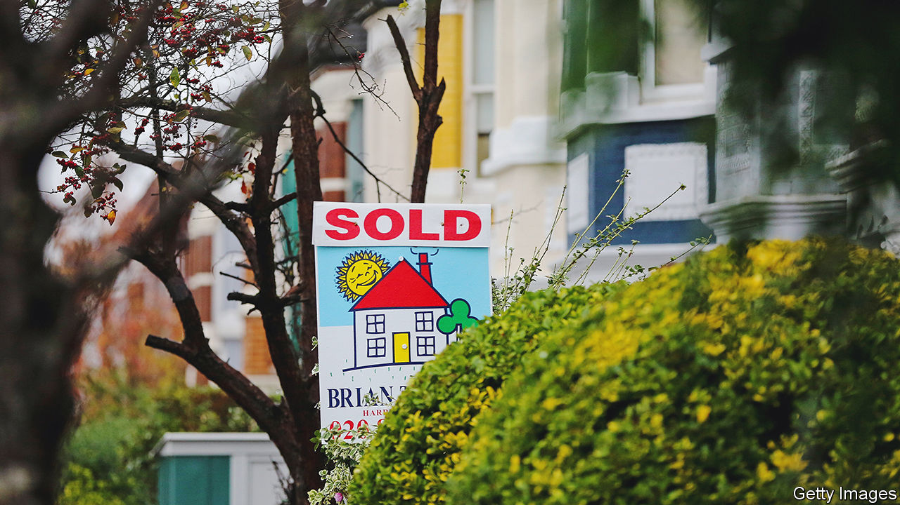
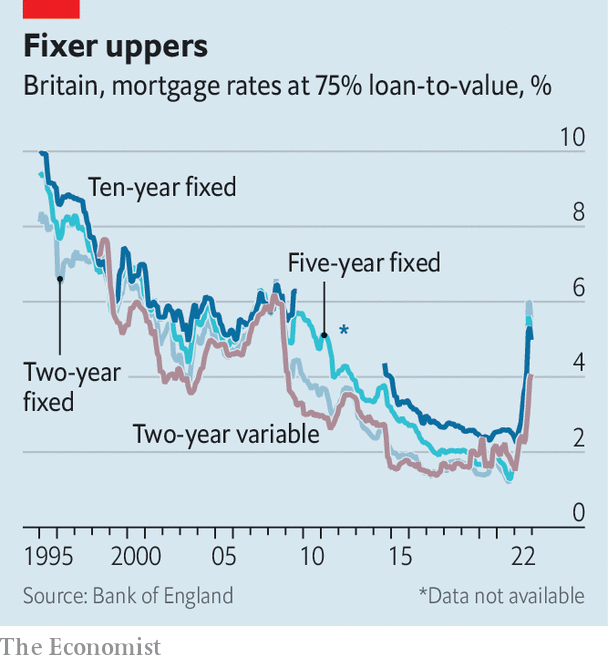

###### Safe as houses

# Britain is well-placed to cope with a downturn in the housing market 

##### But it will still hurt, particularly for recent first-time buyers 

 

> Jan 19th 2023 

Tanya McWaters, a 30-year-old television production manager, and her husband may have managed to buy right at the peak of the housing market. Like others their age the couple used their savings, as well as a little money from her parents—and, in their case, emptying his Australian pension pot—to cobble together the money for a deposit. They moved from a rented flat in London into a house in Bicester, near Oxford, last April. “I love it,” she says. “[The mortgage bill] was the same as our rent for the one-bed in London.”

Not for much longer. Having taken out a one-year fixed-rate mortgage as “the economy was so confusing at the time”, they now face a steep rise in their housing costs. Even the best deals on offer would see the couple’s monthly housing bill increase by £300 ($370), over 25% more than they pay now. “It’s a bit grim,” she says.

 


According to data from the Office for National Statistics (ONS), over 1.4m fixed-rate mortgages will come to an end this year. Nearly all of these mortgages have an interest rate of less than 2.5%; new two-year fixed-rate mortgages will typically cost more than double that, at about 6%. The average variable-rate mortgage, which tracks the Bank of England’s base rate, is about 4.4% and will rise further as the central bank tightens monetary policy. Heftier mortgage bills will be painful. The big question for the economy is whether they signal something really ominous.

As in many other countries, housing transactions surged in Britain during the covid-19 pandemic. Low interest rates, a temporary pause in stamp duty on some property sales and the spread of working from home combined to fuel a dash for space. First-time buyers were enthusiastic participants in the market, accounting for more than half of all new mortgages during the pandemic. Between March 2020 and November 2022, the average cost of a house rose by a quarter, from £233,000 to £295,000, according to official statistics. 

That surge in house prices is now firmly in reverse. “There is a big hit to affordability from higher interest rates,” points out Andrew Burrell, a property economist at Capital Economics, a consultancy, which is forecasting a peak-to-trough fall of 12% in house prices. Savills, an estate agent, predicts that house prices will fall by 10% this year, the steepest drop in prices since the financial crisis in 2008. 

But such a fall would take the price of an average house back only to the level it was at in the second half of 2021. For most of last year, house prices continued to rise. That all came to an end in October. “Mortgage rates spiked during the Truss turmoil,” says Neal Hudson of Residential Analysts, a consultancy, referring to the effects of the disastrous mini-budget unveiled by the government of Liz Truss. The cost of government borrowing has since fallen as Ms Truss’s policies were reversed, but mortgage rates have stayed high. 

The wave of first-time buyers during the pandemic will be at the sharp end of this reversal because they have bigger mortgages and less equity. The only mortgage metric “flashing red”, says Mr Hudson, is the ratio of loans to incomes. Low interest rates allowed borrowers to spend the same amount of their incomes on housing while taking out larger mortgages. Even modest rate rises, by historic standards, will mean budgets taking a hefty whack. According to the Resolution Foundation, a think-tank, the typical mortgage holder who renews their policy in 2023 will see a £3,000 annual increase in their bill, enough to reduce their after-housing-costs income by a hefty 12%. 

“We can afford it,” says Mrs McWaters, of the rise in her mortgage bill. She and her husband, who also works in TV, will reduce the amount they usually put into savings, towards their pensions, in order to tide themselves over. Others, however, will struggle. Debt-advice charities report that they are seeing a gradual increase in the number of homeowners asking for help; they usually make up only a small percentage of their caseloads. Morgan Wild, head of policy at the Citizens Advice Bureau, says many people show up after they fall behind on their energy bills, having tried to cut back elsewhere to keep their mortgages ticking over.

Stretched borrowers do have more options than in the past. In August the Bank of England scrapped an affordability test, introduced in 2014, that had restricted the range of mortgages that could be offered. The removal of this rule will allow some banks to offer more interest-only or variable-rate mortgages to those coming off fixed deals. “What the regulator and the banks are both thinking is that if this is a period of elevated rates, we don’t want high levels of repossessions,” says Lucian Cook, head of residential research at Savills. That is a lesson learned from the housing bust in the early 1990s.

Trouble in the property market is unlikely to provoke the same kind of vicious cycle of bank failures as it did in 2008. Banks are better capitalised and mortgage standards have improved. In 2007 nearly 15% of mortgages had a loan-to-value ratio of more than 90%; in 2021, the latest year for which the Financial Conduct Authority, a regulator, has a full set of figures, the proportion was around 4%. Data from UKFinance, an industry body, shows that the average first-time buyer’s mortgage in 2022 had a loan-to-value ratio of around 77%, compared with over 80% in 2007. Very few are likely to fall into negative equity. 

That will not be great consolation to pandemic-era first-time buyers, who must pay higher bills for an asset that is worth less. But it offers some reassurance to regulators and economists. Housing will not help the economy this year, but it is unlikely to drag it into a deep recession. ■


