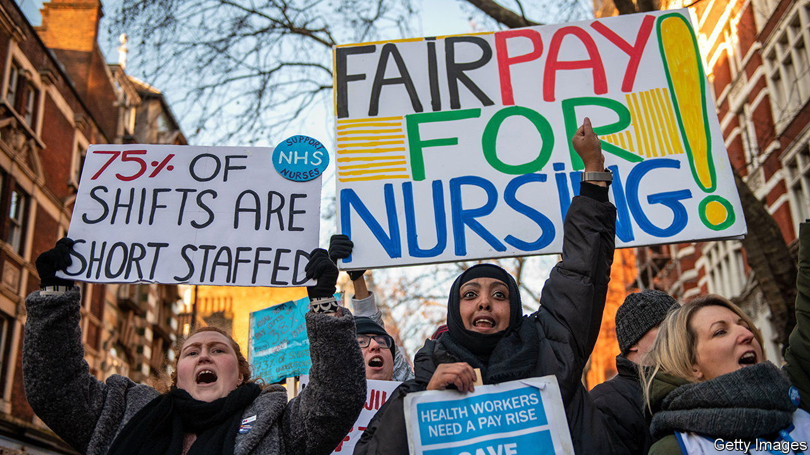
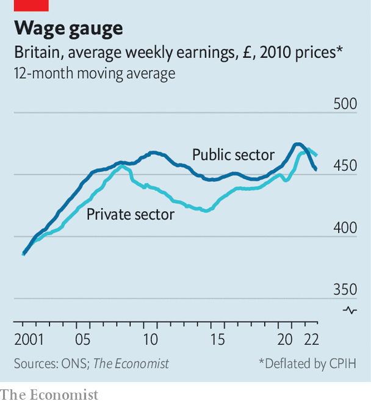

###### The going rate

# Britain’s trade unions lose faith in the pay review bodies 

##### A wave of strikes reflects suspicion of the way public-sector wages are set 

 

> Jan 19th 2023 

British employers lost 467,000 working-days to strikes in November, the highest in over a decade, according to figures released by the Office for National Statistics (ONS) on January 17th. That mark will almost certainly be breached before Britain’s winter of strife is over. Scottish teachers, London bus drivers, nurses, courtroom staff and driving instructors were among those picketing this week.

More strikes are being called by the day. On January 16th teachers in England and Wales voted for seven days of walkouts. Some 100,000 civil servants in 124 government departments will strike on February 1st. The government sounds by turns emollient and aggressive: a bill that would force certain unions to maintain a minimum level of service during industrial action is now going through Parliament. 

 


Grievances over pay lie at the heart of the disputes. Private-sector pay (excluding benefits such as pensions) increased by 7.2% in the year to November, the ONS said on January 17th, compared with a rise of 3.3% in the public sector, and a rise in consumer prices of 10.7%. But underpinning these grievances is a loss of faith in the pay review bodies (PRBs) that advise the government on what to pay public-sector employees. The trade unions say the PRBs lack clout and independence. On January 11th, 14 unions representing health-care workers said they would not submit evidence to the NHS PRB as it starts to weigh salaries for the 2023-24 fiscal year. 

There are eight PRBs, covering the armed forces, doctors and dentists, other NHS staff, prison officers, teachers, police and the most senior public-sector managers. They typically number six to eight wonks and worthies, appointed by the government. The PRBs analyse evidence from the government, employers and unions, and commission their own research, before proposing pay deals.

There is not much evidence that the PRBs are ministers’ cronies. In its report last year, the NHS PRB warned that an “exhausted and demoralised” workforce was leaving to take low-paid work in the private sector and putting patient safety in jeopardy. It rejected the argument that higher wages would mean fewer staff, arguing a reliance on expensive agency workers was a false economy. A prb’s job is to protect the interests of workers whose industrial muscle is weak, says Alasdair Smith, a former member of several—either because, like soldiers, they are banned from striking or because, like teachers, they have limited options in the private sector. 

Yet it is also true that ministers have the upper hand in the process. Each year secretaries of state issue remit letters, stressing the factors that a PRB should consider, including what funding it considers available. Since the 1990s governments “have put consistent pressure” on them to rein in pay, says Mr Smith. “There is a culture of not rocking the boat too much.” PRB members keep a low profile, and do not give interviews or appear before Parliament, which may contribute to an excessively consensual approach, he says. For chunks of the past decade, the PRB process has been bypassed altogether. 

The work of PRBs can also be muddled by competing objectives. In its latest remit letters, British ministers stress that the PRBs must be mindful of the risk of stoking inflation through higher wages. The Scottish government, meanwhile, says that pay policy should help the poorest workers. But there are much better tools for tackling both those issues, says Ben Zaranko of the Institute for Fiscal Studies, a think-tank—namely, monetary policy and the benefits system. Instead, pay should be focused squarely on filling the jobs the government wants doing for a price it is willing to pay. 

Perhaps the biggest issue is one of timing. When the Treasury gave its evidence to last year’s pay round in December 2021, inflation was forecast to peak at 4-5%. By the time the NHS pay body recommended a rise of 4.8% in July 2022, an increase accepted by the government, inflation had breached 10%. The structure of public-sector budgets make things worse: although pay reviews are conducted annually, the departmental budgets from which salaries are drawn are fixed for three years. The solution may be a mechanism by which PRBs can recommend departmental budgets are reopened in extreme circumstances, says Mr Zaranko. Such sensible reforms are needed if confidence is to be regained. ■


