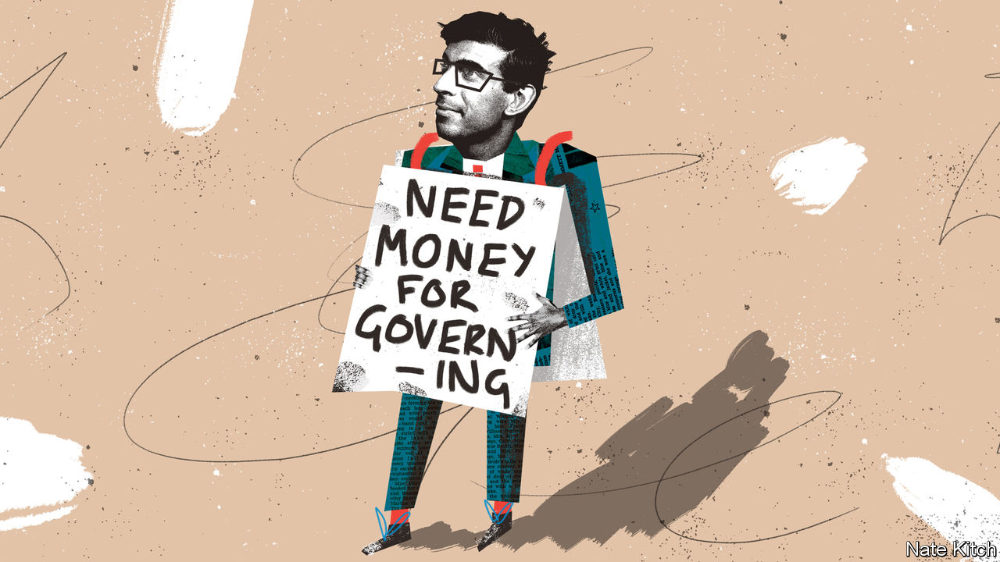

###### Bagehot

# British politics needs more money 

##### Why bag-carriers, wonks and MPs deserve a pay rise 

 

> Jan 19th 2023 

At times it feels as if Westminster is awash with cash. Boris Johnson, the former prime minister, recorded the biggest single donation in British political history, when a crypto mogul handed over £1m ($1.2m). Moonlighting mps have earned a collective £17m from second jobs since the last election. According to a handy new database put together by Sky News, a broadcaster, and Tortoise Media, a news firm, over £180m has flowed into Westminster since 2019, triggering a week of chatter about the unhealthy effects of Mammon on politics. 

British politics does have a problem with money: there is not enough of it. Total political donations per year add up to roughly the cost of a competitive Senate race in America. A benevolent millionaire could fund almost all of Britain’s biggest political think-tanks and have change left from £20m. Salaries for those working in government and Parliament are skimpy. British politics operates on a shoestring. Being cheap comes at a high cost. 

Start at the bottom of the political food chain. There are many humiliations involved in being a ministerial aide, from serving as a metaphorical punchbag to helping a minister hone his conference speech while he strides around a hotel room in his underpants. To cap it off, considering the importance of the job, the pay can be lousy. Only a few top aides earn six-figure salaries. For the rest, pay ranges from £40,000 to £80,000, to help run departments with budgets that can stretch to over £100bn. In Britain it is quite common to find a minister trailed by a 20-something, not because they are especially brilliant but because they are the only one willing to put up with terrible conditions.

Away from the government front bench, things are even worse. Although opposition parties are handed “short money” from the state to fund their day-to-day parliamentary business, the amounts are stingy. Labour, which is odds-on to form the next government, recently searched for a new head of economic policy. The salary on offer was about £50,000, for a key role shaping the direction of a £2trn economy. The prospect of power may be enough to tempt someone to quit a well-paid career elsewhere. Equally, the weight of a mortgage may keep them where they are. 

Things are no better in think-tank land. Even the largest ones have puny budgets. The most well-known, such as the Resolution Foundation, operate on budgets of less than £3m per year. Scrappier outfits get by on barely a tenth of that, relying on mischievous tweets by recent graduates to make a splash. Poor pay is near universal. A junior researcher can expect to earn about £26,000, an amount not much above the London living wage. When wonks are expected to be able to crunch numbers as well as any banker, hiring becomes tricky. Those with the right skills can find a job at a bulge-bracket bank in Canary Wharf that pays far more. 

This matters. Good government requires a healthy stream of good ideas. Milton Friedman, a free-market economist, was right when he argued that in a crisis “the actions that are taken depend on the ideas that are lying around”. But good ideas are harder to generate when the pay is poor. Germany solves this problem with generous state funding. America solves it by having plutocrats from across the political spectrum pump cash into think-tanks. Britain leaves the problem unfixed by not having enough of either. The result is a surfeit of think-tanks that produce worthy but thin work, or that chase headlines rather than solving deep problems. 

A lack of money also dilutes the quality of the politicians tasked with putting those ideas into practice. When salaries were first introduced for MPs in 1911, they amounted to £400 per year or roughly six times the average wage of the time. Now an MP earns around £84,000, just over double the average full-time wage. (The days of being able to boost pay via dodgy expense claims are long gone, too.) Meanwhile, incomes for high-flyers in professional services have exploded in the past few decades. Lawyers, bankers and even accountants now command large salaries, pulling well ahead of former fiscal peers such as doctors and politicians. The opportunity cost of a career in politics is huge for the most able. 

Pay the price 

Pound-shop politics has upsides. Cheap elections are a blessing. A campaign in which £500m was spent would not produce a better government than one with a budget of £50m. People rightly fear an American-style free-for-all, with politicians dedicated to ceaseless fundraising in order to pay for an electoral arms race. 

Skimping on salaries is undoubtedly popular. Politicians fall over themselves to forgo pay rises because voters loathe the idea. Higher pay for bag-carriers ranks alongside a puppy-cull for electoral popularity. Yet the public expects ever more of modern politicians. Their voting records are pored over; their inboxes are now stuffed with correspondence. Part-social worker, part-legislator, the life of an mp is an exceptionally busy one. On the one hand, voters demand professional lawmakers. On the other, they are not willing to pay the going rate. 

Being an mp will always appeal only to a select few. After all, half the country hates you; and your colleagues are a self-selecting band of overly ambitious sociopaths. But better pay can make even horrid jobs appealing. Plumbers are paid well because they wade through effluent. In their own way, so do those in politics (indeed, one parliamentary candidate recalled being sent a photo of her election leaflet covered in a large human turd). Relying on public spiritedness alone to guide people into politics is as foolish as hoping goodwill will be enough to persuade someone to spend a life unblocking toilets. 

A lack of money leaves much of politics the preserve of those who are rich, mad, thick or saintly. Sadly for Britain’s body politic, the saints are outnumbered by the rest. A little extra money in Westminster would go a long way toward fixing this. If voters want a better standard of politics, someone has to pay for it. ■


