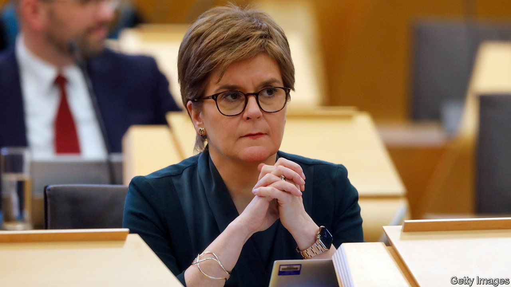

###### Populism, Scottish-style

# The SNP response to the blocking of its transgender act is illiberal 

##### Why the British government’s policy is not an attack on devolution 

 

> Jan 19th 2023 

The Scottish National Party’s plan for their new nation reflects a classically liberal ideal of limited government. It would feature a written constitution, which would entrench fundamental rights and “bind the institutions of the state”, all overseen by a Scottish Supreme Court. For many Scots this is an attractive alternative to Britain, where a swaggering government seems to do as it wants so long as it controls Parliament. 

Which makes a shrill rhetorical turn by the SNP all the more jarring. In November the Supreme Court in London found that the Scottish Parliament in Holyrood could not unilaterally organise a second referendum on independence. On January 17th Alister Jack, the Scottish secretary, announced the decision of the British government to block a new law, passed by Holyrood in December, which would make it much easier for people to change their gender in law. Mr Jack argues that the Scottish bill would affect the operation of equalities law, a matter reserved for Westminster, across Britain. Whether he is right is also likely to end up being tested at the Supreme Court. 

In response, outrage. Nicola Sturgeon, the SNP leader, said this was a “full-frontal attack” on the Scottish Parliament, and that democracy itself was at stake. Her colleagues accuse Mr Jack of behaving like a “colonial general”. His is a risky move, given Scotland has long enjoyed autonomy in many areas. But for bodies such as the Scottish Parliament to be constrained by law, which is reviewable by the courts, is not an assault on democracy but a precondition of it. 

The clause that Mr Jack used to halt the bill is drawn from the same Scotland Act that created the Scottish Parliament, a settlement carefully drafted by Scottish politicians and endorsed by Scots in a referendum over 25 years ago. To argue that Scotland’s constitutional order should change is legitimate. To claim it is an alien imposition is absurd.

The rhetorical shift reflects the pressure that Ms Sturgeon faces from impatient SNP members as the avenues to a referendum close. She has threatened to turn the next general election into a “de facto” vote on independence, a legally meaningless course.

Scottish nationalists regard their destiny as joining a family of modern European democracies. Yet Germans do not declare the death of democracy when their highest court strikes down the decisions of federal and state parliaments as. When SNP politicians denounce procedural obstacles as thwarting the “will of the Scottish people”, they resemble the English Brexiteers they hope to escape. ■


