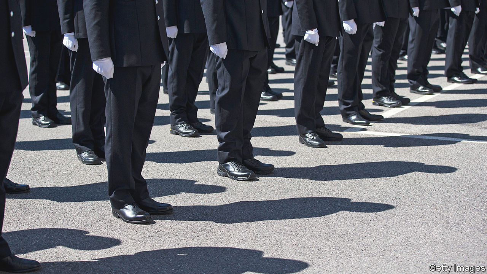
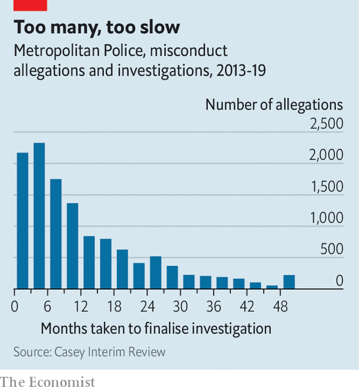

###### Predators in the police

# The toxic culture of the Metropolitan Police Service 

##### The case of David Carrick is the latest in a line-up of horrors 

 

> Jan 18th 2023 

PREDATORS THRIVE in institutions that smooth access to victims. The Metropolitan Police Service is . David Carrick, who on January 16th (and in an earlier hearing) pleaded guilty to 24 counts of rape and dozens more sexual offences over a 20-year period, used his position as a Met officer to prey on women, showing them his warrant card to win their trust and telling them later they would not be believed. The Met says that on nine separate occasions it and other police forces had been made aware of “off-duty incidents” involving Mr Carrick. Despite a “pattern of behaviour that should have raised concerns”, the force  it was harbouring one of Britain’s most prolific rapists.

 


This tale of violent misogyny and impunity in Britain’s largest police force is horrifyingly familiar. After a serving Met officer, Wayne Couzens, kidnapped, raped and murdered a young woman, Sarah Everard, in 2021, it emerged that many complaints about “The Rapist”, as he was dubbed by colleagues, had gone uninvestigated. (Mr Carrick was known by other officers as “Bastard Dave”.) In October the interim findings of a report by Dame Louise Casey, one of a number of probes sparked by Ms Everard’s murder, showed how shockingly badly the Met handled misconduct allegations. It took on average 400 days to resolve allegations of misconduct (see chart). Less than 1% of officers involved in two or more cases had been sacked. Allegations of sexual misconduct “and other discriminatory behaviours” were especially likely to be dismissed.

The revelations about Mr Carrick are likely to lead to calls for a wider-ranging inquiry than any so far commissioned, perhaps along the lines of the Macpherson Report, which followed the murder of Stephen Lawrence, a black teenager, in London in 1993. Some believe the rot runs so deep that someone from outside the institution should take charge of removing it.

For now, though, the task of reforming the Met’s toxic culture is the responsibility of the force’s newish commissioner, Sir Mark Rowley. Since he took over in September, the Met has embarked on a number of reforms designed to kick out degenerate officers. Most significantly, it has set up a domestic-abuse and sexual-offences unit to investigate allegations against serving officers. This week, after Mr Carrick’s crimes emerged, Sir Mark said it was investigating at least 800 of its 35,000 officers; more than one in every 50 of the Met’s officers has been taken off frontline duties while they are being probed.

Many more changes will be needed. Mr Carrick’s case illustrates the importance of rigorous vetting. The Met says that when he joined the force in 2001 there were already two allegations against him; today, it says, owing to more “robust” vetting he would not have been offered a job. He should have been vetted again ten years later but was not—something that happens too often but is being tackled, it says. 

Yet a former senior Met officer says it is not clear how vetting processes have really changed beyond becoming a more thorough version of the background and security checks it already conducts. He says the force should consider putting all candidates through psychometric testing. It already uses such tests to assess officers’ suitability for counter-terrorism roles; tests designed to profile personality types could be used to weed out bullies and narcissists, he reckons. 

The litany of horrors raises the question of whether the Met has more reprobate coppers than other forces. It is impossible to know. But the Met does have distinctive characteristics. Met police tend to live outside the area they serve—many come from Kent or Essex, and Mr Carrick came from Hertfordshire—which may mean they consider themselves separate from the people they serve. That may foster a different culture to that of other forces. Given that London has a higher proportion of ethnic minorities than the counties that surround it, it could be especially relevant to attempts to tackle racism in the force.

It is also possible that some departments in the Met are more likely to foster undesirable behaviour than others. Mr Carrick, like Mr Couzens, was part of the Parliamentary and Diplomatic Protection Command, which provides officers to guard the Palace of Westminster. It is considered an elite unit. It is also “one of those units where you put constables standing outside Parliament for hours on end,” says the former officer. There’s a lot of banter, not very much supervision and “it can attract lazy people who want to hold a gun”. The Met also has a smaller proportion of female officers than most other forces (around 30%; the average is 34%). 

Though some of its problems may be particular to the Met, its scandals are likely to hold lessons for other forces. The social pressure among police to be a team player can be unhealthy. Officers should feel able to express misgivings about a particular colleague without fearing they will be punished for it. “The mantra you hear all the time in the police that ‘you’re my colleague so you need to have my back’ is overdone,” says the former officer.

Misogyny is a problem in all police forces, notes Zoë Billingham, who for 12 years was Her Majesty’s Inspector of Constabulary and Fire and Rescue. “One of the things that worries me is that more chief constables from other forces should be standing up and saying this [misogyny and violence against women] is a problem everywhere and we are going to tackle it,” she says. “That doesn’t seem to be happening.”

More concerning yet, she adds, is what such scandals reveal about the way police deal with allegations of rape and sexual assault. Rape has the lowest charging rate of all crimes: less than 2% of reported rapes lead to convictions. It can be difficult to prove a rape has taken place, especially when victims do not want to testify. Yet “there is still a lingering sense that some officers are less responsive to crimes typically suffered by women, [such as] domestic violence and rape,” Ms Billingham says. The worry is that the Met’s latest scandal will further deter women from reporting such crimes. “People will be thinking what if, God forbid, you reported a rape and someone like Carrick turns up?” she says. Or, as is more likely, one of the innumerable officers who heard dreadful things about him, but did absolutely nothing. ■


