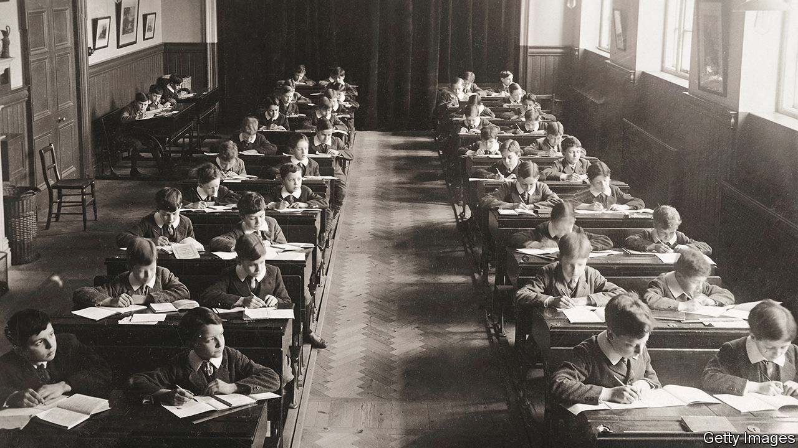

###### The silent treatment

# Why super-strict classrooms are in vogue in Britain 

##### An instructive visit to the Michaela school in north London 

 

> Jan 16th 2023 

To understand how discipline is changing in British schools, go to Michaela Community School in north London. Among the first things you see are vast bright billboards. Whereas other schools coax pupils, cosset them with congratulations and avoid marking in red pen lest they sear young souls, Michaela has no truck with such softness. “I am the MASTER of my fate”, reads one billboard, in unrepentantly large capitals. “Work HARD Be KIND”, reads another. “Especially”, barks a third, “when it is DIFFICULT”. 

And pupils at Michaela do work. HARD. As breathless news reports relate, they listen attentively in lessons; walk in silence in corridors; chant poetry in the lunch hall—and ace exams. Almost a quarter of its pupils are on free school meals, yet almost three-quarters of its A-Levels (exams usually taken at 18) were graded A or A*. It is rated “outstanding” by Ofsted, a state inspectorate, and its most recent Progress 8 score (a nerdy educational tool used to measure the value added by a school) is not just the best in the country but, according to Tom Bennett, a former teacher who is the government’s behaviour tsar, “the best that there’s ever been. It is extraordinary.”

Michaela, which opened in 2014, is also extraordinarily contentious—because it, its exam-acing children and its charismatic head teacher, Katharine Birbalsingh, are at the centre of an argument over how strict discipline should be in British classrooms. The debate is bitter, has deep roots and is itself strikingly undisciplined: Ms Birbalsingh, an outspoken figure who stepped down as chair of the government’s social-mobility commission this month, has received death threats. 

One reason this debate is so bitter is that classroom politics in Britain are intimately tied up with class politics. Once, education in Britain was scrupulously egalitarian in its disciplinary methods, with the children of princes and paupers alike beaten till they bled (“the agony”, wrote Roald Dahl, was “unbelievable”). Then, in the 1960s, grammar schools closed, new comprehensive schools opened and the stern old ways were comprehensively rejected by many.

At this time a comfortable Rousseauian consensus was growing, which held that children were eager sunbeams who really wanted to learn and that teachers merely had to assist them. Strict discipline, silence and chalk were out; games, group work and good vibes were in. Which, says Mr Bennett, is a pity, as the Rousseauian ideal is “rubbish. You can have dancing bears and holograms…but if kids don’t want to learn they’ll tell you to get stuffed.” 

Left-wing sociologists rejoiced at this turn (I have no interest, wrote one, in seeing “school as a launching pad for educational sputniks”). Traditionalists went into a moral panic. But the old methods weren’t rejected by private schools. Pay enough money and you could continue to have your child caned until 1999. Private schools were seen to stand for odd uniforms, antiquated methods and excellent results; state schools conjured up an image of progressive methods and poor results. The fact that this was a gross over-simplification was irrelevant. For a time, a sign outside Michaela’s premises read: “Private School Ethos—No Fees”.

Momentum now seems to be with Michaela’s approach. Walk into other high-achieving academies in London (King Solomon Academy in Marylebone, at which every pupil learns a musical instrument, is one; Mossbourne Academy in Hackney, another) and you are likely to see similar techniques. This is the rise, says Mr Bennett, of what you might call the “neo-strict” school.

The “neo-” bit matters. This is not Gradgrind. The old-fashioned version of discipline controlled largely through punishment. Neo-strictness does use sanctions but chiefly it weaponises praise. Merit points are handed out and children strive for them. When a question is asked in Michaela, every arm rises in unison.

Critics of neo-strictness argue that it leads to schools kicking out children who can’t cope. But Michaela’s exclusion rate, though higher than the national one, is restrained: there have been seven exclusions from the school over the past five years. And, says Ian Patterson, a former head teacher who now advises London academies, chaotic classrooms are “certainly not egalitarian”: kids with settled home lives manage disruption better and disadvantaged ones flounder. 

Moreover, children like discipline. What adults see as strictness, they often perceive as safety and the promise of success. Michaela pupils are unnervingly keen on their school. Your correspondent was shown around by a pupil who said that she wanted to be “a doctor or a surgeon” and study at “Cambridge or Oxford”. Sociologists may not want to launch educational sputniks; children often want to soar.

The discipline debate is far from over but it is open in a way that it hasn’t been in years. Back at Michaela the bell rings for lunch, and the children file into the dining hall where the lunchtime poetry recital begins. A young teacher stands at the front and shouts the first word of each line; the pupils respond with the rest. 

Today, the poem is “Invictus”. “Out—” he shouts; “—of the night that covers me,” they shout back at once. On the poem goes, call and response, louder each line, until the final couplet. This, like everything in Michaela, is done in capitals. “I—” he shouts; “AM THE MASTER OF MY FATE,” shout back 170-odd children. “I—” he shouts and, in capitals, the children shout back: “AM THE CAPTAIN OF MY SOUL.” ■


