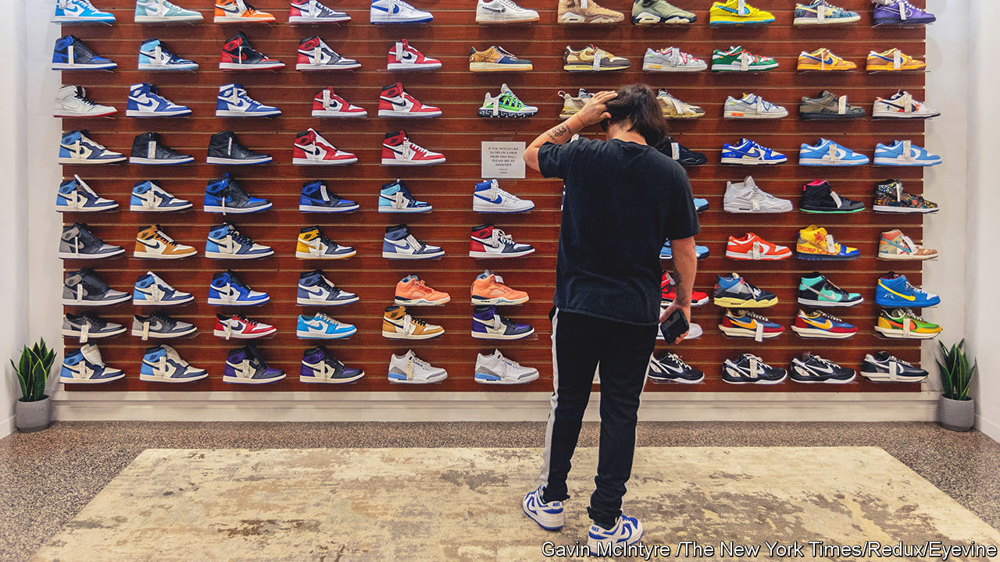
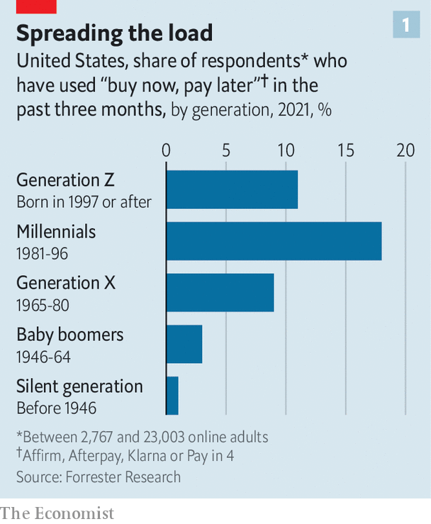
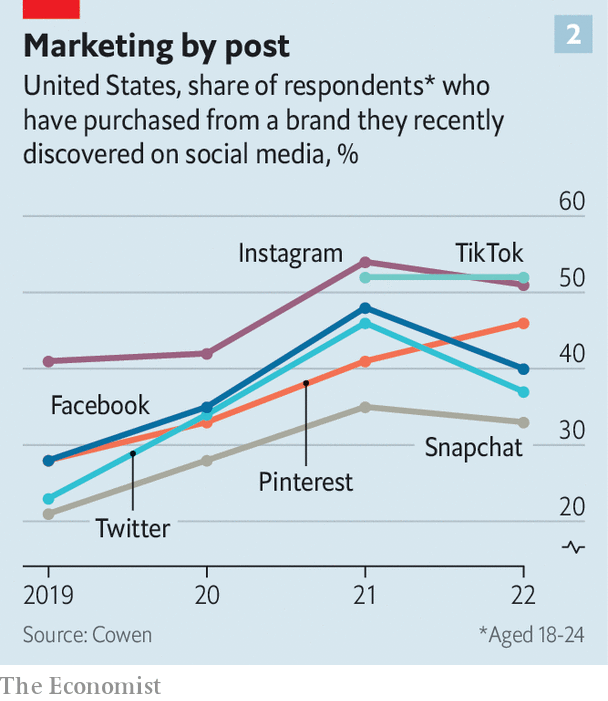

###### Buying time

# How the young spend their money 

##### They are woke, broke and complicated. Businesses should take note 

 

> Jan 16th 2023 

Young people have always perplexed their elders. Today’s youngsters are no different; indeed, they are baffling. They have thin wallets and expensive tastes. They prize convenience and a social conscience. They want shopping to be at once seamless and personal. They crave authenticity while being  in an ersatz digital world. As they start spending in earnest, brands are trying to understand what these walking paradoxes want and how they shop. The answers will define the next era of consumerism.

Their absolute numbers are formidable. The European Union is home to nearly 125m people between the ages of ten (the youngest will become consumers in the next few years) and 34. America has another 110m of these Gen Zs and millennials, a third of the population. The annual spending of households headed by American Gen Zs and millennials hit $2.7trn in 2021, around 30% of the total. 

A good place to start dissecting the  of young consumer is to consider the economy that has moulded them. At one end of the scale, today’s 30-somethings came of age in the midst of the global financial crisis of 2007-09 and the ensuing recession. Their younger peers had a bit more luck, beginning their careers in years when tightening labour markets had pushed up wages. Until, that is, the covid-19 pandemic upended many of their lives.

These two big shocks have fostered pessimism among the young people who experienced them. A study by McKinsey, a consultancy, published in 2022, found that a quarter of Gen Zs doubted they would be able to afford to retire. Less than half believed they would ever own a home. 

Uncertainty about the future may be encouraging impulsive spending of limited resources in the present. The young were disrupted more by covid than other generations and are now enjoying the rebound. According to McKinsey, American millennials (born between 1980 and the late 1990s) spent 17% more in the year to March 2022 than they did in the year before. Despite this short-term recovery from the dark days of the pandemic, their long-term prospects are much less good. American millennials and Gen Zs have accumulated less wealth than Gen X or Boomers at the same age. 

 


Easy access to means of spreading payments may encourage splashing out (see chart 1). According to another survey by McKinsey in October, 45% of Europeans in their teens and early 20s planned some kind of splurge in the next three months whereas 83% of Boomers, born before 1964, said “No” to such profligacy. Forrester, a market-research firm, found that most users of “buy now, pay later” apps are around 20. Megan Scott, a 20-year-old student from London, speaks for many of her peers by admitting that, when shopping, she has no restraint—until, she chuckles, the bill arrives. 

In many ways youngsters’ shopping habits, like their lives, are defined by the “attention economy”—buying stuff online is far quicker and easier than a trip to the shops. The proliferation of social media means there are many new ways of attracting consumers’ eyeballs. Young shoppers never knew a world without smartphones. More than two-thirds of 18- to 34-year-old Americans spend four hours or more on their devices each day. A heightened expectation of convenience comes with being raised in the age of Airbnb, Amazon and Uber. Young people want their shopping to be totally hiccup-free. 

The light-speed online world also appears to have lowered tolerances for long delivery times. A study by Salesforce, a business-software giant, found that Gen-z Americans are the likeliest of all age groups to want their groceries delivered within an hour. They are more likely than the rest of the population to use their phones to pay for shopping, says Forrester. 

These “always-on purchasers”, as McKinsey has christened them, often shun a weekly shop for quicker fixes of everything from fashion to furniture. They like subscriptions, often favouring shared access to products rather than outright ownership. This has buoyed online-rental sites (like Rent the Runway for fashion) and streaming services. Investors may have fallen out of love with Netflix but Gen Z has not; the company remains one of the most popular brands among that age group in America.

 


The internet has also changed how the young discover brands (see chart 2). Print, billboard or tv advertising has given way to social media. Instagram, part of Meta’s empire, and TikTok, a Chinese-owned video-sharing app, are where the young look for inspiration, particularly for goods where looks matter such as fashion, beauty and sportswear. TikTok’s user-generated videos can propel even tiny brands to speedy viral fame. Such apps are increasingly adding features that allow users to shop without ever leaving the platform. According to McKinsey, by 2021 six in ten Americans under the age of 25 had completed a purchase on a social-media site. Some are following the Chinese model of “social commerce” by mixing live-streamed entertainment with the chance shop. 

For the time being, though, young Western consumers prefer to make purchases outside social media, and often scour sites like Amazon for bargains. According to Cowen, an investment bank, spending on subscriptions to Prime, Amazon’s home-delivery and entertainment service, trails only phone bills, food and travel in young people’s shopping baskets. 

Physical shops are not entirely shunned, as long as the experience feels personal and, ideally, integrates virtual and physical worlds. Nike, for example, is successfully targeting young buyers by allowing them to design their own trainers on its website, to pick up in person after attending an in-store dance class, and then encouraging them to tag the brand in a review on TikTok or Instagram.

The new world of shopping has also allowed the young to take a more informed view of the companies that they buy from. The attention economy’s information overload has not dulled youngsters’ senses but appears to have made them hypersensitive, especially to any brand that pretends to be something it isn’t. Edelman, a public-relations firm, found that seven in ten Gen Zs across six countries fact-check claims made in adverts. Citing survey data that show some teens have shunned certain brands because of their shady ethics, Forrester has taken to calling young consumers “truth barometers”. 

Brands that do not match up to the long list of requirements had better watch out. If they do not get what they want and how they want it, youngsters are happy to try something new. According to the survey by McKinsey from October 2022, nine in ten Gen Z and millennial Europeans had changed how they shopped, where they shopped or the brands they bought in the previous three months. 

How the young shop is clearly in flux. What they buy, too, is changing. What older generations consider discretionary, such as wellness and luxury, have become essentials. Self-care is all the rage. On the hunt for clothing that will set them apart, the young are turning to posh brands at an ever more tender age. According to Bain, a consultancy, the average Gen Z shopper makes their first luxury purchase when they are 15, compared with 19 for their 30-something counterparts. Some buy posh items as a hedge, believing that they can hold value even during tough times. Helpfully, such items can now be traded easily on second-hand sales platforms such as Vinted and Vestiaire Collective. 

More broadly, young consumers profess to be more values-driven than previous generations. Research by Forrester shows that this attitude is even more common among teenagers and 20-somethings than among slightly older counterparts. Some of these values are centred around identity (race, gender and so on). Others stem from things the young care about, such as climate change. kpmg, an accounting firm, found that the Gen Z crowd across 16 countries worries more about climate change and natural disasters than any other generation. According to a survey by Credit Suisse, a bank, youngsters in emerging markets are more fretful still. 

Revealed preferences paint a more nuanced picture. On the one hand, Forrester has identified Patagonia, a premium outdoor-clothing brand with a record of green do-goodery, as a Gen Z favourite in the rich world. The young are the most likely of all age groups to try—and stick with—alternative proteins such as oat milk and plant-based meat alternatives. But not at any price. Credit Suisse found that on average, consumers globally will pay an average premium of 9% for more environmentally friendly grub. Young consumers in the rich world are less willing to pay premiums for these alternatives than their counterparts in emerging markets.

Youngsters’ appetite for instant gratification is also fuelling some distinctly ungreen consumer habits. The young have virtually invented quick commerce, observes Isabelle Allen of kpmg. And that convenience is affordable because it fails to price in all its externalities. The environmental benefits of eating plants rather than meat can be quickly undone if meals are delivered in small batches by a courier on a petrol-powered motorbike. Shein, a Chinese clothes retailer that is the fastest in fast fashion, tops surveys as a Gen Z favourite in the West, despite being criticised for waste; its fashionable garments are cheap enough to throw on once and then throw away. Like everyone else the young are, then, contradictory—because, like everyone else, they are only human. ■


