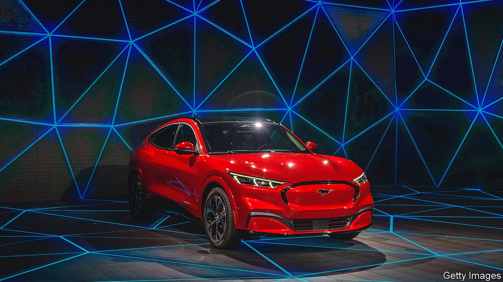

###### Going electric

# Mexico’s electric-car ambitions 

##### Can the country make the most of the battery-powered revolution? 

 

> Jan 19th 2023 

Job adverts hint at its imminent arrival but Tesla is yet to confirm recent reports that it will set up a new electric vehicle (ev) “gigafactory” in Monterrey, a Mexican city close to the American frontier. The rumours have nonetheless set wheels in motion. Noah Itech, a Chinese supplier of automation equipment to the American car company, is building a $100m plant in the city. If Elon Musk’s firm sets up in Mexico it will be the latest in a long list of companies that have chosen to build vehicles in a country that borders the world’s second-largest car market.

General Motors (gm) and Ford, along with Japan’s Toyota and Nissan, have long made cars for export in the country, and more so since Mexico signed a free-trade deal with America and Canada in 1993. By 2021 that had made Mexico the world’s seventh-largest carmaker. But as the industry shifts from combustion engines to battery power, will Mexico maintain its allure?

America has been tardy in its take-up of electric motoring compared with China and Europe, but demand for evs is now growing fast, providing a ready market for Mexican-made cars. Many of Mexico’s advantages hold for evs as much as for internal combustion, such as a skilled labour force that is far cheaper than across the border. “Mexico was the first plant outside Japan for us; there is an extraordinary quality of factories,” says Claudia Rodríguez of Nissan Mexico.

Some firms are converting factories and at least eight plants are already assembling evs in Mexico. One in the State of Mexico, where Ford makes its Mustang Mach-e (see picture), will triple its production of evs to 210,000 units. gm is spending $1bn to reconfigure a plant in Coahuila, close to the border with Texas, where it will make the new model of Chevrolet Blazer from 2024. It plans to convert its other two plants to ev production by 2035. Bombardier Recreational Products announced in October last year that it would build a new factory in Querétaro to manufacture electric motorcycles and batteries for evs. Nidec, a Japanese company, plans to invest around $715m in a factory to make motors for battery-powered vehicles. 

Other factors may push carmakers to make even more vehicles and components in Mexico than they do now, says José Zozaya, who heads the Mexican Automotive Industry Association, a trade body. Supply-chain snarl-ups during the pandemic, and geopolitical tensions between China and America, have made companies think twice about relying on China for parts and production. And carmakers have always liked the flexibility and efficiency that come with sourcing parts and making vehicles close to their final destination. 

Mexico also has huge deposits of the lithium required to make ev batteries. President Joe Biden’s Inflation Reduction Act (ira) specifies that eventually only battery-powered vehicles made with raw materials sourced and processed in America or countries with which it has a free-trade agreement, such as Mexico, will be eligible for subsidies. But new mines take years to come on stream, and nationalisation could add further delays.

Car firms would probably invest even more were it not for bumps in the road. Mexico’s goal is to have evs make up half of all vehicles produced by 2030. gm’s boss in Mexico has said that 15% is more realistic. That is because incentives are lacking. When Tesla set up a “gigafactory” in Nevada in 2014 it came with a $1.3bn sweetener from the state in the form of tax credits. The ira also sets aside $2bn to help convert American factories to ev production. 

The whimsical approach to policymaking of Andrés Manuel López Obrador, Mexico’s president, is another red traffic-light. Executives fret about the government prioritising power generation by national companies, which mostly use oil and gas and are more expensive than private-sector producers. If energy costs rise and supplies become uncertain, manufacturers say they may no longer find Mexico a competitive place to make things. Several months after gm announced the factory conversion in April 2021, it said it would not invest further in Mexico if its laws do not encourage clean energy.■


