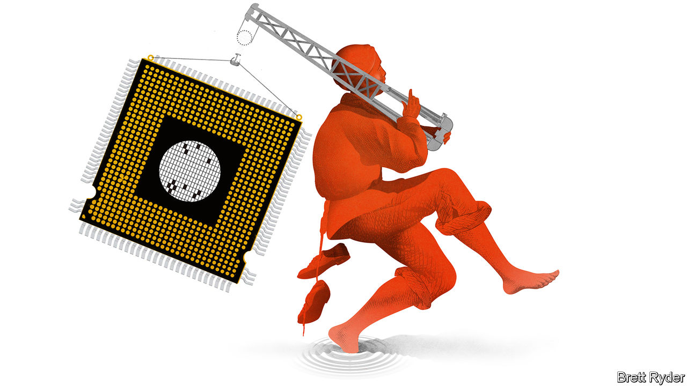

###### Schumpeter

# TSMC is making the best of a bad geopolitical situation 

##### Speak softly, and carry a big chip 

 

> Jan 19th 2023 

For a company worth $430bn that straddles one of the world’s most dangerous geopolitical flashpoints, there is something endearingly unflustered about Taiwan Semiconductor Manufacturing Company (TSMC). Both America and China covet its unmatched ability to make advanced chips. It’s a far bigger supplier to the former than the latter, but if either superpower, through economic pressure or brute force, fully stifled its independence, the fallout would be immense. Many of its fabrication plants are on the west coast of Taiwan and perilously exposed to a Chinese invasion across the Taiwan Strait. Yet it refuses to be panicked. “If there is a war then, my goodness, we all have a lot more than just chips to worry about,” its 91-year-old founder, Morris Chang, said in a podcast last year. His successor as chairman, Mark Liu, insists that peace is in everyone’s interest.

Such insouciance runs the risk of sounding naive. Like it or not, the big-power rivalry over semiconductors—what some call the Silicon Curtain—has solidified in recent months. China has long sought, to little avail, to build a chip industry from scratch. Last year America strengthened its stranglehold on certain “choke-point” technologies, such as artificial-intelligence chip design, chip software and semiconductor-manufacturing equipment, in order to stymie China’s ambitions. Moreover, America’s CHIPS Act, enacted last year, has used subsidies to entice about $200bn in investment commitments. One of the biggest beneficiaries has been Intel, a rival as well as client of TSMC.

In response, TSMC appears as if it has joined Uncle Sam. Last month President Joe Biden stood in front of the firm’s vast new American fab under construction in Phoenix, Arizona, and celebrated a proposed $40bn investment. Yet look closer and TSMC offers lessons on how to handle the dirty business of geopolitics. Contrary to what some people think, the new cold war is not forcing it to break away from Taiwan, where it has foundry capacity for making more than three-quarters of the world’s high-end chips. It is unlikely to jeopardise its profitability, which generates the cashflows necessary to retain its edge. Yet it is thinking about a long-term future in which one day there may be a premium on geographical flexibility. In short, it is playing a subtle game of diplomacy in which its business interests come first.

The fab in Phoenix is exhibit A for those who fear “de-Taiwanisation”. Spread out over miles of desert, it is pharaonic in size. It is due to start making four-nanometre chips next year, which, provided it beats Intel to the punch, will be the most advanced ever made in America. A big part of the $40bn investment, TSMC says, will be a second fab that will start to make even more sophisticated chips in 2026. Its biggest customer in Phoenix will be Apple. Beyond America, it plans to build its first fab in Japan for Sony, another gadget-maker. This looks like a strategy to move closer to its customers, which if you are sitting in Taiwan might look suspiciously like abandonment. 

“Complete nonsense,” retorts Pierre Ferragu of New Street Research, a financial firm. TSMC has almost simultaneously launched a new fab in Taiwan, with four times the wafer capacity—and more advanced technology—than the two proposed Arizona foundries. Its bet on America is more of a long-term insurance policy than an immediate game-changer. It enables TSMC to start the tough job of recruiting a workforce and amassing suppliers in America, providing a baseline for expansion “if the Chinese are crazy enough to bomb Taiwan”. For the foreseeable future, though, most R&amp;D is likely to remain in Taiwan. So will at least four-fifths of TMSC’s capacity. 

Next comes profitability. The fears are two-fold. First, for all the subsidies offered by America, manufacturing there is cripplingly expensive, and the concern has been that TSMC will bear the losses as a gesture of goodwill to the country. Second, the subsidies could support the revival of Intel, which long ago lost its lead in chipmaking to TSMC but has since banged the drum for chip nationalism. In fourth-quarter results on January 12th, TSMC laid some of those fears to rest. Though construction costs in the United States are, officials said, up to five times higher than in Taiwan, they indicated that customers who wanted their chips to be made in America would pay a higher price, protecting profits. Moreover, despite a cyclical downswing in the global chip market, TSMC is boosting market share vis-à-vis rivals such as Intel. As Malcolm Penn, an industry consultant, puts it, it is so far out on the leading edge of chip manufacture that its most advanced products will always be in short supply.

In some ways, TSMC is deftly cosying up to the Biden administration. The Arizona fabs may not solve America’s chip-security problem. But at the very least they will provide some of the good (ie, unionised) manufacturing jobs so beloved of the president. In other ways, the company is building a long-term hedge into its own future. It believes high-end chips will become increasingly complex and costly to manufacture, and the digitisation of the world economy will increase the intensity of their use. In that case, eventually TSMC may outgrow Taiwan, whose population is shrinking. Accessing more global brainpower, in America or elsewhere, will become an imperative. 

Silicon Curtain call 

Will its offshore investments contribute to the oversupply that is currently weighing on the global chip market? No, says Mr Penn. Chip demand increases by 8% a year on average. Provided investments can be adjusted for the state of the market, it makes sense to plan for the future. What matters more is the extent to which America and its allies blacklist China, where TSMC has a fab in Nanjing making mainstream chips for domestic use. The company may be right to believe that cool heads will prevail. But if it is wrong, at least it has started the long process of hedging its bets. ■


