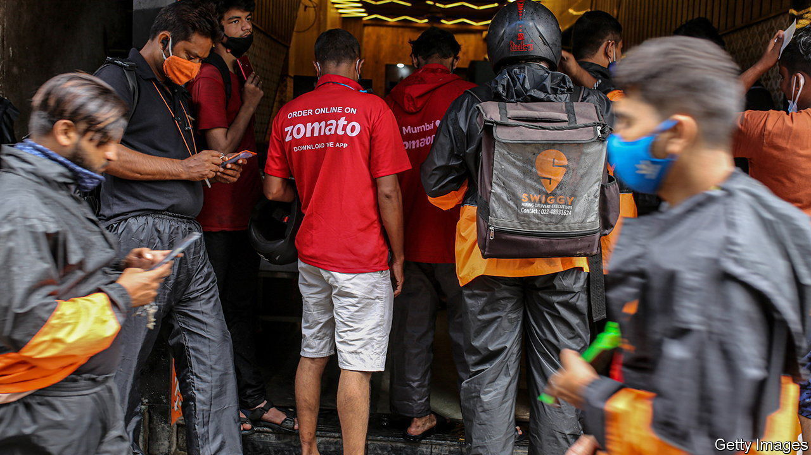
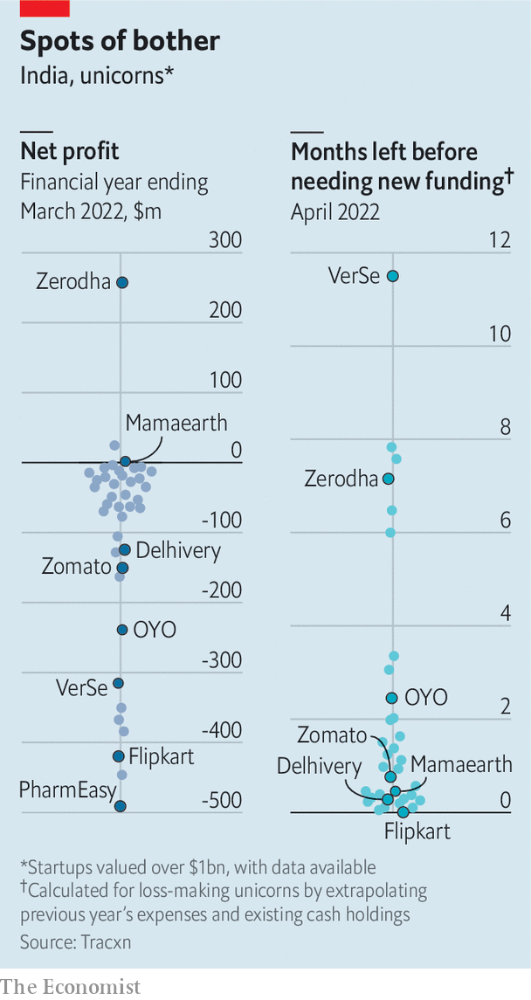

###### Growing pains

# The painful development of India’s startups 

##### Time and money are running out 

 

> Jan 19th 2023 

“How long is your runway before takeoff?” That is how venture capitalists (vcs) begin meetings in India these days, says Ananth Narayanan, founder of Mensa, one of the country’s newest unicorns (companies worth in excess of $1bn). Until recently the main question that mattered for India’s startup scene was valuation. But the mood has changed. Plunging share prices at companies that have gone public have made vc firms much warier about investing. Prizing unrealistic valuations has given way to worrying about how quickly startups might begin to make money. So far Mensa, which buys stakes in digital brands, is one of a handful of such firms that makes a profit.

That leaves plenty that do not. Since the beginning of 2021, the number of unicorns created in India has risen from 40 to 108. Only America and China have produced more. In 2021 promising startups had no trouble finding investors eager to fund fast-growing firms with big ideas. That year investment in startups tripled to $35bn. The momentum continued in 2022, with $3.7bn invested in March alone. Such was the clamour that startups had their pick of “founder friendly” investors who were not too bothered about supervision, the drudgery of background checks and other intrusive oversight.

The environment has since cooled. Investment in December was only $900m. One reason is the woeful performance of firms that went public in 2021: Zomato (food delivery), Freshworks (enterprise software), Paytm (payments), Policy Bazaar (insurance) and Nykaa (fashion). The share prices of each has tumbled in excess of 59%. And while a global rout in tech valuations has coincided with a broader sell-off, that is not true of India. The Sensex, an index of the country’s biggest 30 firms, is close to an all-time high and the economy is growing at a decent clip. 

The poor performance means that other planned listings, such as that of PharmEasy, an online pharmacy, will not now go ahead. Acquisitions have been similarly hit. In October the $4.7bn purchase of BillDesk by PayU, both profitable payments companies, was cancelled. PayU’s owner Prosus, a local vc firm affiliated to Naspers, a Dutch-South African company, is widely believed to have walked away because the fall in Paytm’s share price created a new, and far lower, benchmark for what a payments company is worth.

 


Re-evaluating what startups might be worth is now the foremost concern of all India’s vc firms. Funding hinges on assessing reserves, costs and the time needed to become profitable. In theory, this sort of information is available for all Indian firms because they are required to file public financial statements. But the system operates poorly. Of the 40 startups that have filed results for 2022 only three are profitable, according to Tracxn, a statistical service, and based on their annual spending, only five have enough cash to survive for over six months (see charts).

In response to the tougher environment, costs are being cut. Inc42, an online publication tracking startups, counts 20,500 layoffs over the past year, probably foreshadowing a much bigger wave. Edtech has been especially hard hit, with 16 companies axing over 8,000 employees, the most coming at Byju, India’s most valuable startup, which is sacking 2,500 employees. A post-lockdown return to classrooms and low barriers to creating educational material online has raised doubts about the entire sector’s prospects.

Byju has other problems. It was accused in July of inappropriately aggressive accounting and sales policies, which it denies. Other startups have also come under fire. BharatPe (payments), Trell (social media) and Zilingo (supply-chain management) saw founders quit last year after fraud accusations. BharatPe’s founder denies the allegations as does Trell; Zilingo is investigating the claims. On January 18th Amit Bhasin, a co-founder of GoMechanic, a car-repair firm, admitted to “errors in judgment as we followed growth at all costs, particularly in regard to financial reporting, which we deeply regret” after it cut 70% of its workers.

These tribulations have brought the role of backers into question. Were firms sufficiently monitored? Were valuations credible? Sequoia Capital, a prominent Silicon Valley firm, has invested in GoMechanic, BahratPe, Trell, Zilingo and several edtech companies. It acknowledged in April the governance issues in various holdings and vowed to provide stricter oversight but has declined to comment further. Other foreign vc firms are rethinking how they approach India, too. A more diligent approach may be required. 

How companies come to market is also set to change in response to the losses from public offerings. India’s stockmarket regulator made changes in September that will enable far greater scrutiny. It will force firms to provide information on the prices of private transactions that occurred before listings, as well as the key data used to derive valuations. Large investors will also be required to hold at least half of their shares through at least one accounting period to stop them selling shares during a spell of hype after an offering.

These changes may not head off the carnage to come. Anand Lunia of India Quotient, a vc firm in Bangalore, believes a quarter to half of the current unicorns will become zombie firms that will exist in name but cease to be funded or operate. His willingness to speak openly is unusual; his views are not. Yet for all the concerns about the immediate future, neither Mr Lunia nor many others who think sharp devaluations are coming are pessimistic about the long-term for startups. The economy is growing strongly and India is good at nurturing entrepreneurial software engineers whose skills increasingly apply in every industry. All of this suggests that the storm ahead will be followed by a resumption of growth, eventually.■


