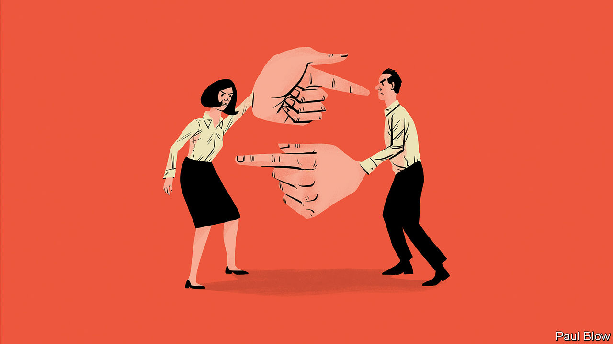

###### Bartleby

# Why pointing fingers is unhelpful 

##### And why bosses do it more than anyone 

 

> Jan 19th 2023 

Casting blame is natural: it is tempting to fault someone else for a snafu rather than taking responsibility yourself. But blame is also corrosive. Pointing fingers saps team cohesion. It makes it less likely that people will own up to mistakes, and thus less likely that organisations can learn from them. Research published in 2015 suggests that a Shaggy culture (“It wasn’t me”) shows up in share prices. Firms whose managers pointed to external factors to explain their failings underperformed companies that blamed themselves. 

Some industries have long recognised the drawbacks of fault-finding. The proud record of aviation in reducing accidents partly reflects no-blame processes for investigating crashes and close calls. The National Transportation Safety Board, which investigates accidents in America, is explicit that its role is not to assign blame or liability but to find out what went wrong and to issue recommendations to avoid a repeat. 

There are similar lessons from health care. When things go wrong in medical settings, the systems by which patients are compensated vary between countries. Some, like Britain, depend on a process of litigation in which fault must be found. Others, like Sweden, do not require blame to be allocated and compensate patients if the harm suffered is deemed “avoidable”. A report published by a British parliamentary committee last year strongly recommended moving away from a system based on proving clinical negligence: “It is grossly expensive, adversarial and promotes individual blame instead of collective learning.” 

The incentives to learn from errors are particularly strong in aviation and health care, where safety is paramount and lives are at risk. But they also exist when the stakes are lower. That is why software engineers and developers routinely conduct “blameless postmortems” to investigate, say, what went wrong if a website crashes or a server goes down. 

There is an obvious worry about embracing blamelessness. What if the wretched website keeps crashing and the same person is at fault? Sometimes, after all, blame is deserved. The idea of the “just culture”, a framework developed in the 1990s by James Reason, a psychologist, addresses the concern that the incompetent and the malevolent will be let off the hook. The line that Britain’s aviation regulator draws between honest errors and the other sort is a good starting-point. It promises a culture in which people “are not punished for actions, omissions or decisions taken by them that are commensurate with their experience and training”. That narrows room for blame but does not remove it entirely.

There are two bigger problems with trying to move away from the tendency to blame. The first is that it requires a lot of effort. Blame is cheap and fast: “It was Nigel” takes one second to say and has the ring of truth. Documenting mistakes and making sure processes change as a result require much more structure. Blameless postmortems have long been part of the culture at Google, for instance, which has templates, reviews and discussion groups for them. 

The second problem is the boss. People with power are particularly prone to point fingers. A recent paper by academics at the University of California, San Diego, and Nanyang Technological University in Singapore found that people who are in positions of authority are more likely to assume that others have choices and to blame them for failures. 

In one experiment, for example, people were randomly assigned the roles of supervisor and worker, and shown a transcript of an audio recording that contained errors; they were also shown an apology from the transcriber, saying that an unstable internet connection had meant they could not complete the task properly. The person in the supervisor role was much more likely to agree that the transcriber was to blame for the errors and to want to withhold payment. Power and punitiveness went together. 

Blame also seems to be contagious. In a paper from 2009, researchers asked volunteers to read news articles about a political failure and then to write about a failure of their own. Participants who read that the politician blamed special interests for the screw-up were more likely to pin their own failures on others; those who read that the politician accepted responsibility were more likely to shoulder the blame for their shortfall. Bosses are the most visible people in a firm; when they point fingers, others will, too. If your company has a blame culture, the fault lies there.■


