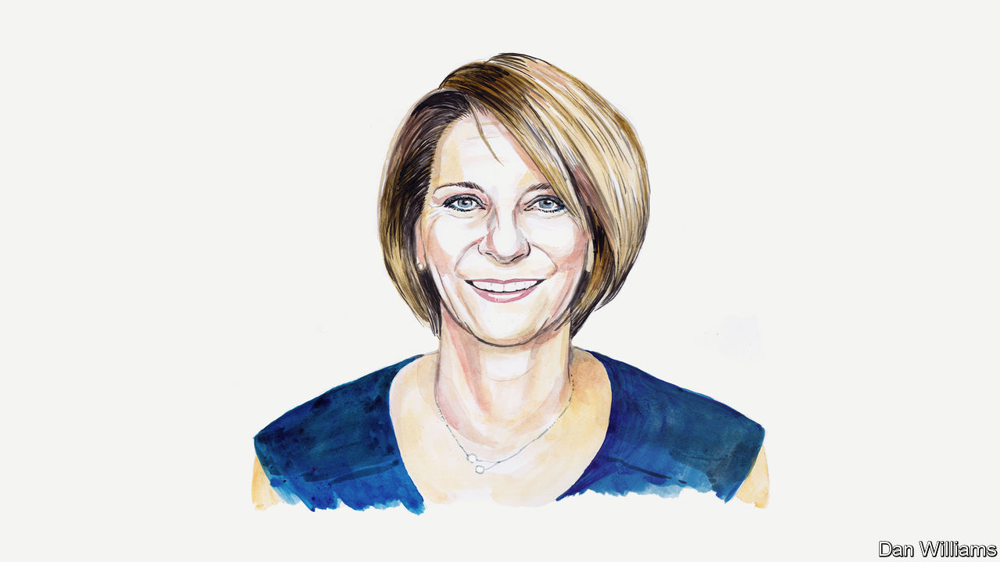

###### Russia and Ukraine

# Mona Juul says Russia-Ukraine talks would be premature—but preparing for them would not 

##### Norway’s UN ambassador writes as part of a series debating the wisdom of peace negotiations 

 

> Jan 18th 2023 

YEARS AGO in Jerusalem, I sat across the negotiating table with a minister in the Israeli government. My task was to try to encourage him to accept an arrangement whereby Palestinians would feel that Jerusalem was also their capital. His opening words welcomed me to the undivided and sovereign capital of Israel for the past 3,000 years and for the next 3,000 years.

For a moment, I felt I was on a mission impossible. However, after a complex process that hardly anyone believed in until the end, the parties finally agreed to the Oslo accords of 1993 that laid out a roadmap for peace between Israel and Palestine. 

When it comes to Russia’s brutal war against Ukraine, the parties are not ready to negotiate peace or ceasefires. The aggressor, Vladimir Putin, is determined to continue his horrific invasion, which constitutes a blatant violation of international law and a breach of the UN Charter. For Ukraine’s part, Volodymyr Zelensky has offered a vision of a peace formula. In a recent essay for , his chief of staff stated that talks were the final step to peace, not the first.

Ukraine is clear on its goals and must decide how best to defend itself against Russian aggression. Norway provides strong military and economic support to Ukraine and is not impartial. We are committed to supporting Ukraine both politically and diplomatically, including in its strategy for peace. In other places around the world, Norway has frequently been asked to facilitate negotiations. We never push parties to negotiate, and a request from them is a precondition for our engagements.

Most wars eventually end at a negotiating table. Discussions there are extremely complicated, even when both parties want peace. Diametrically opposed views are supposed to morph into shared solutions for parties who have killed each other. Sticking to an agreement is even harder. That is why so many armed conflicts flare up again and continue doing so for years.

In Israel, in one of the moments when the peace process faltered I asked another foreign minister whether there was light at the end of the tunnel. He said yes, but also pointed out that there was no tunnel! We, the international community and the UN, should help provide a “tunnel” for Russia and Ukraine. We need to prepare now so as to be ready to provide effective support for eventual peace when the two sides want to negotiate.

One vital lesson from Norway’s engagements as a third-party facilitator of a number of peace processes over the past 30 years is that it is never too early to prepare for potential talks. The warring parties must strategise, meaning they will envision how and when negotiations could secure the interests of their people (as Mr Zelensky’s peace formula seeks to do) even when the grounds for future negotiations are nowhere in sight.

A second lesson is that channels of communication should be established as early as possible. Continued fighting need not preclude contacts. If and when the time for talks draws near, a lack of established contacts may seriously delay and complicate negotiations. Contacts built up over time have proven in many cases to make a major difference in securing a good start, as we saw in Colombia, where negotiations between the government and FARC-EP eventually led to a peace deal.

All conflicts are unique, and each path towards peace will have different twists and turns. Any steps entail hard work, patience and courage from political leaders. Many peace processes require quiet diplomacy, especially to get started. At the same time, talks and settlements must be inclusive and legitimate in the eyes of the people for peace to last. 

History is filled with examples of peace negotiations failing because the right people or groups were not involved in the negotiations. Research from the UN on 40 peace processes conducted since the end of the cold war suggests that the inclusion of women, for example, leads to more enduring peace. Based on my experience, talks succeed only if in the end the most powerful figures from each side are bold enough to meet and reach agreement. 

Whether these lessons might apply to the war in Ukraine is difficult to say at this stage. A peace agreement is only the first step towards a secure and just peace. The UN secretary-general’s efforts have demonstrated, through helping secure the Black Sea “grain deal”, that it is possible to reach agreements with both Russia and Ukraine, at least on certain issues. A potential, future peace settlement between the pair, in line with international law and the UN Charter, must be supported through measures related to the specific issues under discussion. As Ukraine has highlighted in its ten-point peace plan, those issues range from the release of all detained persons to issues of nuclear safety.

The UN may be called upon to monitor a possible future peace agreement, based on a strong mandate and sufficient resources. The body and its members can also play a critical role in supporting justice and reconciliation processes, at the parties’ request. And independent institutions, such as the International Criminal Court, have started investigations to seek accountability for atrocities in Ukraine and justice for the victims and survivors.

It is almost a year since the invasion started. It is absolutely critical that the international community continues both to provide support to Ukraine and put pressure on Russia to withdraw and end its unlawful invasion. The devastation of this war affects us all. And it behoves us all to support the Ukrainian people and any tunnel they request help to devise. ■

_______________


