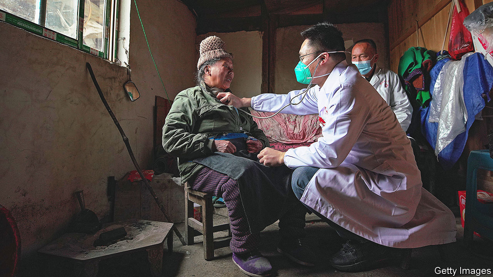
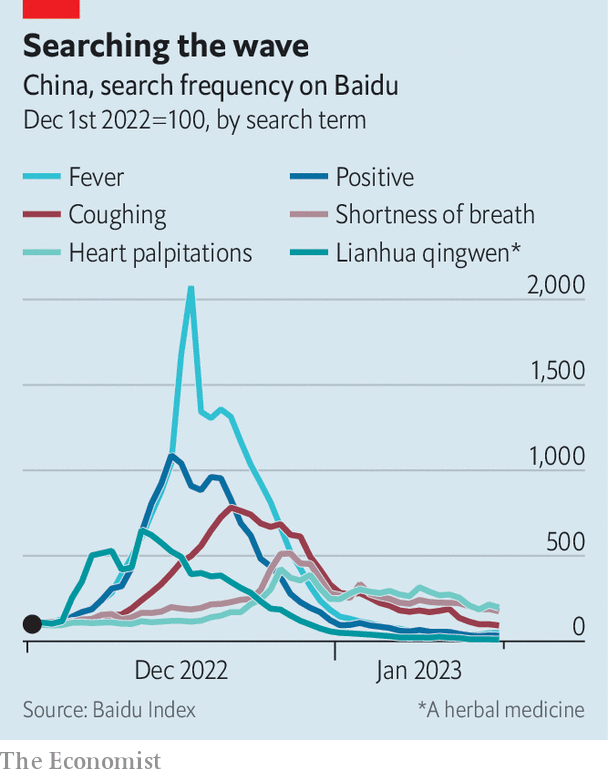

###### Has the wave peaked?

# Covid-19 has already torn through large swathes of China 

##### But a second wave could be more deadly 

 

> Jan 19th 2023 

There were many predictions about the rate at which covid-19 would spread in China. The Institute of Health Metrics and Evaluation in America thought cases would peak on April 1st. By that time, it said in December, a third of the country’s 1.4bn people would have been infected. Airfinity, a London-based data firm, said the peak would come on January 13th, with a second occurring on March 3rd. It predicted there would be 223m infections by May. ’s own model suggested that, if the virus spread unchecked, the outbreak would be at its worst in early January, having infected 75% of the population. 

A lack of good data makes it hard to assess these projections. But statistics, anecdotal evidence and unconventional indicators suggest that covid may already have swept through large swathes of China.

The authorities are pushing the idea of an outbreak on the wane. On January 14th the National Health Commission said the number of visits to fever clinics peaked on December 23rd at roughly 2.9m, and that it has since declined by over 80%. The number of patients with severe symptoms of covid peaked two weeks later. A study by Peking University estimated that, by January 11th, 900m people in China had already caught covid. The government, perhaps wary of losing control of the narrative, quickly deleted reports and social-media posts about the study from the internet.

Many observers had worried that the travel rush surrounding the Spring Festival, which begins on January 22nd, would bring covid from cities to remote areas. But the virus appears to have reached many of these places already. Earlier this month, when our Chaguan columnist visited Weiji, a village in Henan province, a doctor told him that 90% of locals had caught covid. An article dated January 9th in , a state-run newspaper, noted feverish people working in rural Shandong province. The virus had been there, too.

 


In America, a good predictor of case counts early in the pandemic was Google searches for the loss of taste or smell (a symptom of early variants). So  scraped data from Baidu, China’s search giant, to see if they offered clues about the country’s outbreak. Searches for “lianhua qingwen”, a herbal medicine used against covid (with doubtful effectiveness), peaked on December 12th (see chart). Searches for “fever” reached a high five days later. Searches for “shortness of breath”, a lingering symptom of severe covid, peaked on December 27th.

It is a fuzzy picture, to be sure. Least clear of all is the covid death toll. China claims that from December 8th (a day after it lifted most covid controls) to January 12th some 60,000 people died from the virus. The real number is far higher, as the official toll refers only to those who died at medical facilities—and doctors have been discouraged from citing covid on death certificates. Our model suggests the number of covid deaths may top 1m.

Even if infections have peaked in China, things may still get worse. Subsequent waves of the virus killed more than the first in countries such as America and Britain. The Chinese government may be hoping that most people develop some level of natural immunity, lessening the impact of a second wave. Another way to do that is by vaccinating more people. ■


