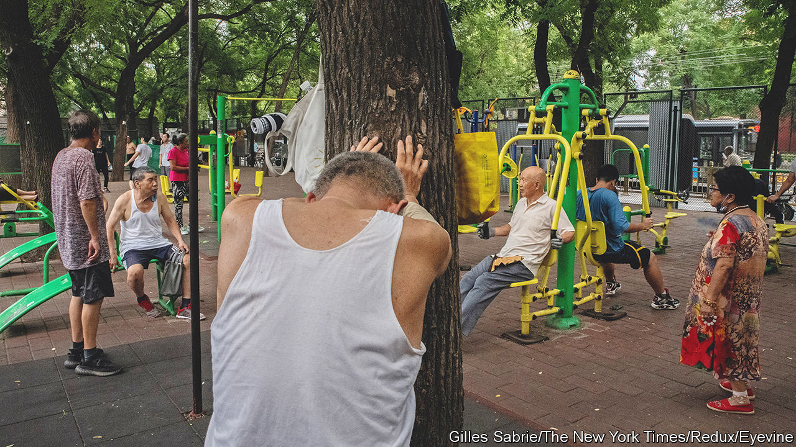
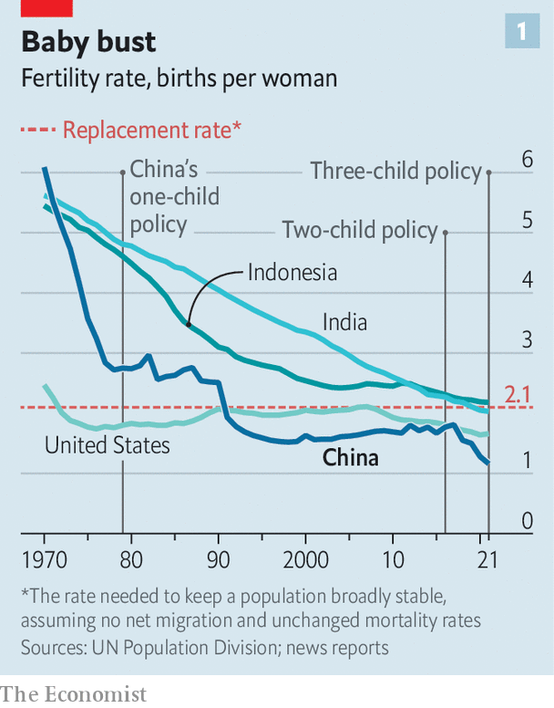
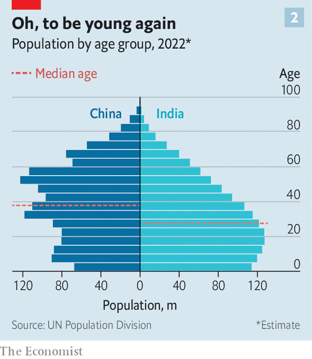

###### Falling China

# For the first time since the 1960s, China’s population is shrinking 

##### Its long reign as the world’s most populous country is probably at an end 

 

> Jan 17th 2023 

“We are the last generation.” As news, released on January 17th, that the country’s population had fallen last year for the first time in decades swept Chinese social media, some commenters used these doom-laden words. They have a special resonance in China. During a weeks-long lockdown in Shanghai last year to prevent the spread of covid-19, an angry resident spat them at a hazmat-suited policeman who had warned him that punishment for violating pandemic-control rules would affect the young man’s family for three generations. The retort, captured on a mobile phone, quickly went viral. Now, as its meaning truly sinks in, some are recalling it.

According to the National Bureau of Statistics, China had 1.412bn people at the end of last year, 850,000 fewer than at the start. Not since 1962, after millions died in a man-made famine triggered by Mao Zedong’s “Great Leap Forward”, had the country recorded a shrinking of its population. 

This time the main cause is not an unnatural number of deaths. On December 7th China scrapped its nearly three-year-long “” policy, causing a surge of infections and many fatalities. On January 14th officials said there had been nearly 60,000 covid-related deaths since then. The actual number is much higher (the official number includes only deaths in hospital and covid deaths are often not recorded as such). But officials say December’s toll from covid is not reflected in the population figure. The reason for the decline is clear: a plummeting desire to reproduce. For many Chinese, even married ones, there will be no next generation. 

Only a few years ago, however, many Chinese scholars and the UN were expecting that China’s population would peak around 2030. That it has reached the turning-point much sooner will be sobering for the country’s leaders. It is yet another reminder that China no longer enjoys the demographic dividend of a huge supply of cheap labour to boost its growth (which the statistics bureau said was 3% last year, one of the lowest rates since the end of the Mao era). Now China is ageing rapidly. Its working-age population began shrinking in 2012. It is following the path of countries such as Japan and South Korea, without having first grown rich, and without having spent enough money on medical and other forms of care that the ballooning cohort of elderly people will need. 

The government has tried desperately to remedy this, though far too late. It was not until 2016 that it gave up its decades-old policy of forcing many people to have no more than one child. In 2021 it switched to a , which is more an aspiration than a restriction. Having more is not punishable. This relaxation—accompanied by a slew of incentives to have children, ranging from cash handouts to tax breaks and longer maternity leave—. 

 


According to the latest figures, 9.56m babies were born in 2022, nearly 10% fewer than in 2021. The rate was the lowest since the Communist takeover in 1949. A decade ago the total fertility rate (the average number of children a woman is expected to have over her lifetime at current birth rates) was 1.7. In 2021 it fell below 1.2, UN figures show (see chart 1). For a population to remain stable, the rate should be about 2.1, assuming no net migration and that mortality rates remain unchanged. 

There are several reasons why baby-making is becoming less popular. The main one is the cost of rearing children. Last year the YuWa Population Research Institute, a think-tank in Beijing, reported that such expenses, as a ratio of GDP per person, were higher in China than in several advanced economies, including America. It identified only South Korea as a more expensive place to have kids. (That country has the world’s .) YuWa warned that China’s declining birth rate could have a “serious negative impact” on the country’s ability to innovate and its “overall national strength”.

Government handouts have done little to ease the burden on parents. On January 10th the city of Shenzhen proposed that couples having a third child (or additional ones) be given subsidies totalling 19,000 yuan ($2,800) during the first three years of the child’s life. But that would amount to only about 8% of the total costs, according to an official estimate published by state media. Despite a recent slump in , prices are still high. Couples often put off getting married until they have bought a home. The numbers tying the knot have been falling since 2014. 

Another economic barrier to childbirth is the cost of looking after the elderly. About 35m Chinese are aged 80 or over. By 2050 the number is expected to more than quadruple. Unless the government massively steps up its spending on care, families will pick up much of the tab. 

 


The reluctance of some young Chinese to marry and reproduce is also a sign of how traditional values are changing. Women are pushing back against the gender inequality of wedlock. The internet seethes with resentment of the idea, implied by the government’s efforts to encourage bigger families, that they become baby-making machines. Some young people, men as well as women, call themselves “chives”, suggesting their resentment of how they are cynically seen as something to be harvested (ie, exploited) in pursuit of national or corporate goals. “Getting married and having little chives can only harm my personal development and lower my quality of life,” wrote one commenter on Weibo, China’s version of Twitter, about news of the fall in population. 

There is soon likely to be another surge of interest in the topic among Chinese netizens. The UN predicts that India’s population will surpass China’s in April. Some believe this has already happened. The end of China’s reign as the world’s most populous country, a position it has held for hundreds of years, will not please Chinese nationalists. Is it possible, they will wonder, that India, long left in the dust by China’s rapid rise, will be able to take advantage of its still-growing working-age cohort to catch up with China (see chart 2), and eventually to rival its power? It will be a year of much demographic head-scratching. ■


