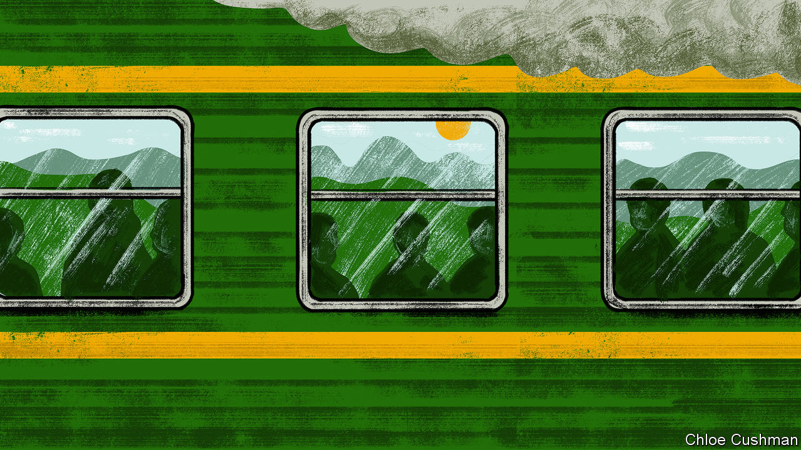

###### Chaguan

# Riding the slow train in China 

##### Talking to migrant workers heading home for lunar new year 

 

> Jan 19th 2023 

For officials in Xi Jinping’s China, making trains run on time is more than a figure of speech. As Mr Xi enters his second decade as supreme leader, his sternly paternalist version of Communist Party rule seeks to draw ever more legitimacy from the provision of customer-friendly public services, supplied via modern infrastructure. In the case of China’s railways, at least, that promise of order and efficiency has been kept.

From January 7th to February 15th the transport ministry predicts that 2.1bn journeys will be made by Chinese heading home for the Spring Festival, or lunar new year. Some will be urban professionals, gliding between cities on high-speed trains. Many will ride slower  or “green-skin trains”, squeezed into crowded carriages or sitting on corridor floors as they trundle across China on journeys that may last 40 hours or more. Many millions of them have not seen home towns or villages—and in many cases their own children and the ageing parents who care for them—for two years, because of pandemic travel curbs.

On January 16th alone China’s rail network carried 8.3m travellers. Chaguan was one of them, buying a standing-room ticket for the first day of a two-day train journey from Guangzhou, in the south, to Urumqi in the far western region of Xinjiang. Chatting in Guangzhou station before dawn, or during long hours rolling through southern China, older passengers remembered the chaos of Spring Festival migration 30 years ago. Back then passengers would climb through windows into trains so full that people would sleep on luggage racks or stand in lavatories. Even 20 years ago new-year trains were cluttered with boxes of fruit, cooking oil, clothes and bedding that workers felt obliged to carry home. 

Today the crush is less intense. Many employers allow more flexible departure and return dates, as China’s labour force shrinks and workers become harder to find and keep. Goods ordered online can be delivered to villages year-round, so there is less demand for physical new-year gifts (red packets of cash for children remain obligatory). More migrants drive home in shared private cars. The train networks have grown hugely. Stations are busy but not overwhelmed. Passengers queue to board trains, with priority lines for children and the frail. There are countries where Chaguan had to pay bribes to board a train or plane. On the Guangzhou-Urumqi run, there are no signs of graft. Seatless passengers queue at the on-board conductors’ office, identity cards in hand, to be allocated places that open up between certain stops, as passengers get off. A primly cheerful holiday atmosphere prevails, like an orderly school trip. Passengers joke that food vendors should give away free holiday meals. A young woman attendant, trim in a brass-buttoned jacket, tells a colleague struggling down a packed aisle that he is to blame for being fat. 

Yet amidst all this efficient service, old divisions of class, wealth, ethnicity and gender can be heard, too. For green trains are rolling cross-sections of life in China, a still cruelly unequal place. Some discrimination is blithely unconscious. A passenger teasingly asks the Urumqi-based crew whether they are Xinjiang natives, meaning Uyghurs. “Do I look like an ethnic minority?” the Han Chinese woman attendant laughs.

Decades of economic growth created winners and losers. Both are found on the train. Mr Zhuang, a lorry driver for Jingdong, an e-commerce and logistics giant, is travelling with his wife to the north-western province of Shaanxi to see their university-lecturer son, about to start a PhD overseas. Mr Zhuang calls his family’s own experience of China’s national rise “life-changing”. Asked about prospects for the post-pandemic economy, he praises Chinese leaders for treating the people “like a father would his child, they want everyone to be well-off.”

Nearby, Mr Xing, a grey-haired man from the central province of Henan, dozes. He is a security guard in Guangzhou, after growing too old for building work. Overall, China’s rural-to-urban migrants are ageing. In 2021 the average age of migrant workers in China hit 41.7 years, up from 34 in 2008. Increasingly, youngsters shun factory jobs far from home. Many old workers without adequate pensions toil past the legal retirement age. Mr Xing shares a prefabricated dormitory room in Guangzhou with his son and son-in-law. The son, a burly 40-year-old supervisor on a production line, had not planned new-year travel, but his children, 10 and 16, “kept calling and saying we haven’t been home for a year.” The eldest attended primary school in Guangzhou, but like many migrant children lacked the residency papers to attend a city high-school, so returned to Henan. The younger Mr Xing hopes to catch up with his daughter over the holiday, maybe taking her to an amusement park. But she wants to be a teacher and has a lot of schoolwork. Pondering so many years away from his children, he sighs: “I don’t know how to describe that feeling.”

Collective progress, individual angst

Mrs Li, a street sweeper in Guangzhou, sits on a bucket by a train door. A widow aged 56, she is six years past the retirement age for female blue-collar workers, but falls foul of China’s stingy, fiddly welfare rules. Years of factory jobs did not generate a big-city pension. Her bare-bones health insurance can only be accessed in her rural home. She makes 4,000 yuan ($590) after a month of 12-hour days, with no days off. When covid quarantines halted work, she should by law have been paid, but her employer, a subcontractor, refused. Without money, “you’re nobody,” she says. Her son, a factory worker, lacks funds to buy the home and car needed to marry. With so much pressure, young people “don’t want kids, they don’t want marriages,” she sighs. Her parents and in-laws have just had covid, so she hopes her arrival will not endanger them. She longs to visit because, at their age, “every new year counts.” Other passengers echo her talk of life’s harsh pressures. Gleaming infrastructure is impressive. Building a fair, happy society is harder.■


