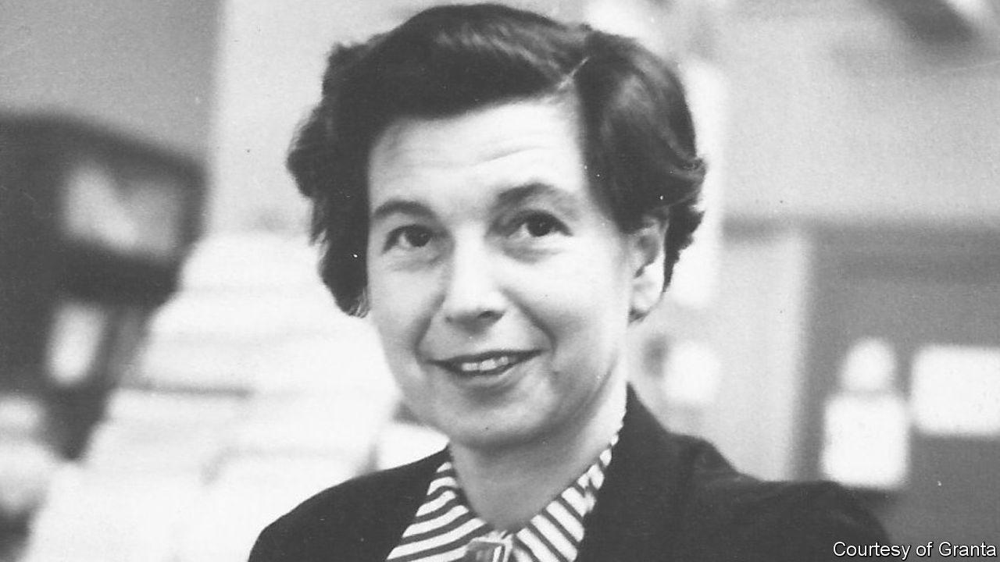

###### Self-portraits

# In “Still Pictures” Janet Malcolm turns her pen on herself 

##### An acclaimed American journalist probes memory, childhood and storytelling itself 

 

> Jan 19th 2023 

By Janet Malcolm. 

Janet Malcolm was a journalist who famously compared journalists to con men, “preying on people’s vanity, ignorance or loneliness…and betraying them without remorse.” She was  who skewered the “voyeurism and busybodyism” of biographies. In her books and articles, mostly for the , Malcolm used her pen like a knife, trimming fat and gutting pieties. She died in 2021, but her distinctive voice lives on in the syllabuses of writing classes around the world. 

With “Still Pictures”, Malcolm has published a kind of posthumous memoir (though she never would have called it that). Given her critique of the biases inherent in storytelling, and her insights into the ways individuals use stories to obscure what is unknown and unknowable about the self, however could she indulge in that most warped and self-serving genre of them all? 

The essays that make up this book all start with the kind of old and unremarkable personal photos that occupy dusty shoe boxes. In an afterword, Anne Malcolm reminds readers that her mother was once the ’s photography critic, but Malcolm’s observations are not really about the images. Rather, she uses the photos to consider the porousness of memory, the way the mind often seizes and distorts some details while misplacing others. “Most of what happens to us goes unremembered,” she writes. This makes autobiography a kind of “novelistic enterprise”.

Given Malcolm’s preoccupation with , it is fitting that she spends much of the book revisiting the haze of childhood. She recounts how her Jewish family fled the Nazis in Prague in 1939 and made a home among fellow Czech émigrés in New York. Malcolm’s father worked as a doctor, changed their surname from Wiener to Winn and helped them become the kind of “ordinary middle class, middlebrow family” that subscribed to the Book-of-the-Month Club and cooked casseroles with Campbell’s cream-of-mushroom soup. (“Does anyone say ‘casserole’ anymore?”) Malcolm internalised the city’s anti-Semitism before her parents told her she was Jewish, so she “resented and hid” this detail about herself for much of her youth.

As a memoirist, Malcolm comes clean about her gaps in memory and her lapses in judgment, and she has characteristically strong feelings about what is moral and appropriate. In writing about her father, for example, Malcolm explains that she is sticking to “lovely plotless memories” about him, as the memories with a plot are invariably those of “conflict, resentment, blame, self-justification—and it is wrong, unfair, inexcusable to publish them.”

Her take on her mother is more complicated. Malcolm writes that she was “warm and loving and unselfish”, roasting squab and baking profiteroles for her two daughters whenever they fell ill. But her mother could also be needy and volatile—she “allowed herself her histrionics”—with a vivacity that perhaps masked “an inner deadness of spirit”. It is a compelling portrait, even if it doesn’t quite cohere. As Malcom writes: “Do we ever write about our parents without perpetrating a fraud?”

Malcolm overlooks her first marriage and touches only briefly on her second. She worked at the  for almost 60 years, yet her account of her career is dominated by the decade she spent defending herself from accusations of libel brought by one of her subjects. She laments her initial reaction to the lawsuit, which was to say nothing in her defence “in dogged accord with the magazine’s stance of unrelenting hauteur”.

The book’s most charming moments are when the incisive, unsparing adult can be found in the child. About a kindly Czech couple who were friends with her parents, Malcolm writes that their dullness “brought out an obnoxiousness in my sister and me for which I would blush today if I were a better person. But a child’s cruelty is never completely outgrown.” ■


