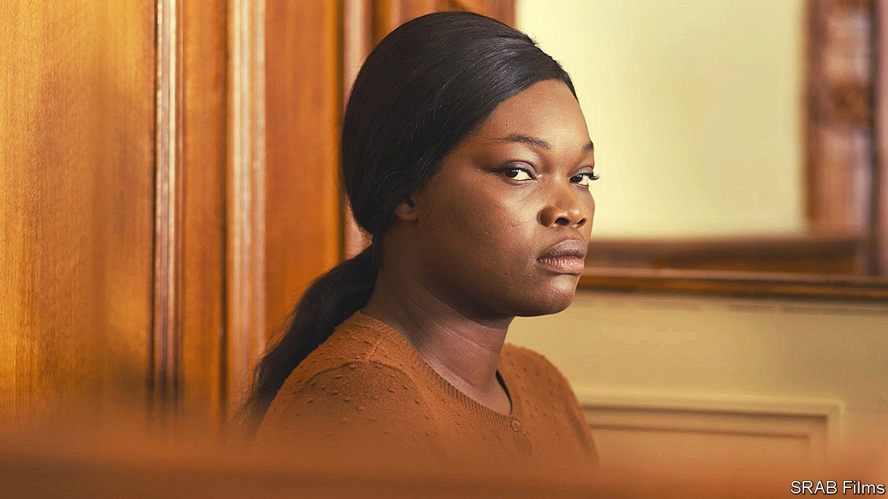

###### Untold stories

# New films in France tackle race, gender, exile and belonging 

##### “Saint Omer” and “Tirailleurs” also examine the complex link between Senegal and France 

 

> Jan 19th 2023 

Laurence Coly (Guslagie Malanda, pictured) is a young Senegalese woman studying philosophy in Paris. One winter evening, she takes a train to the cold northern French coast, checks in to a hotel for the night, walks to the beach on a rising tide and leaves her baby to drown. The tiny corpse is found by a fisherman, who at first mistakes the child for a seal. 

Based on a true story that shook France several years ago, “Saint Omer”, which was released in America on January 13th, follows Laurence’s trial for murder. To describe it as a courtroom drama would be to underplay the subtle, tightly controlled study of motherhood, race, belonging and separation that lies at the centre of this darkly mesmerising film. Selected as France’s entry for this year’s Academy Awards, “Saint Omer” has already picked up prizes at the Venice Film Festival and in Paris. It confirms the place of Alice Diop, its French director, whose parents came from Senegal, as one of a new generation of black directors making films that challenge the way France sees itself. 

The story is seen through the eyes of Rama (Kayije Kagame), a French novelist and university lecturer whose parents also emigrated from Senegal. Rama is writing a book inspired by this case of infanticide and travels to northern France to sit in the courtroom. Under cross-examination, Laurence acknowledges what she did, but is unable to explain it, muttering at one point about “sorcery”. The more that she evokes her childhood struggle to fit in, both in Dakar (where she grew up) or later in Paris (where she moved), the more the parallels with Rama’s own life emerge. With what amounts to a physical ache, Rama grasps their shared hurt: a troubled maternal tie, the pressure of parental aspiration and the unresolved anxiety of a life divided between two cultures.

Ms Diop’s camera is unflinching: her close-up shots leave nowhere else for the viewer to look. As the lawyers attempt to pierce the appalling mystery of infanticide, the movie peels back layers of racial and cultural prejudice. A white university professor called as a witness expresses surprise that Laurence chose to study  rather than a figure closer “to her own culture”. Ms Diop films the scenes of Laurence in a wood-panelled dock, washed through with a glorious golden light: an arresting decision, given the grimness of the subject matter, which seems to call into question the viewer’s perceptions and to hint at the ambiguity of colour.

“Saint Omer” is at once a film about the African immigrant experience in France, and about motherhood everywhere. In this respect it belongs to a wave of compelling films made by black French directors in recent years. These include , which came out in 2019 and examines the casual violence shattering childhood innocence in the French  (high-rise suburbs). Another is  (“Cuties”), released in 2020, which explores girlhood, giggly friendship and the disturbing hyper-sexualisation of pre-teens. Mr Ly was born in Mali and grew up outside Paris; Ms Doucouré was born in Paris to Senegalese parents. Like Ms Diop, these film-makers use their multilayered understanding of contemporary France to tease out the contradictions and complexities of modern lives.

In doing so, each film looks beyond the leafy cobbled boulevards of Paris. Each, in its own way, gives a voice to the unheard. When that voice happens to be elegant spoken French, it disconcerts the viewer and challenges attitudes—exactly as Ms Diop intends it to in “Saint Omer”. Laurence explains in the courtroom that, back in Dakar, her parents refused to allow her to speak Wolof, her maternal Senegalese tongue, at home; having done as instructed, she was mocked by her peers for sounding like a . The eloquence with which Laurence recounts killing her child, Ms Diop has said, constitutes a form of “resistance”, a way “not to be assigned to a place she doesn’t want to be”. “Why did you kill your daughter?” asks the judge in the film. “I don’t know,” Laurence replies politely, as if in a philosophy tutorial; “but I hope the trial will help me understand.” 

When collecting two prizes at the Venice Film Festival last year, Ms Diop nodded to Audre Lorde, a black American feminist: “Our silence will not protect us.” The film-maker has said she hopes her work, which includes several documentaries, will “offer to the world all these missing stories…all these black women who haven’t been heard, for whom we speak in their place.”

The impulse to tell untold stories also drives a new Franco-Senegalese film, “Tirailleurs” (“Father and Soldier”), which was released in France on January 4th. Directed by Mathieu Vadepied, it was co-produced by Omar Sy, one of France’s best-loved actors, who leapt to international fame for his role in “Lupin”, a thriller series . “Tirailleurs” is set in 1917, when Senegal was under French colonial rule, and tells the story of Bakary Diallo (Mr Sy), a cattle herder, whose teenaged son, Thierno (Alassane Diong), is forcibly enlisted into the French army. To try to save him, Bakary volunteers to join his son, leaving the arid scrub of Senegal for the mud and blood of the trenches. 


Shot mostly in Peul (Fulani), a west African language, and screened with French subtitles, “Tirailleurs” touches on exile, fatherhood and colonial brutality. Mr Sy has never spoken Peul on screen before, even though he grew up outside Paris with it as his mother tongue; his father came from Senegal and his mother from Mauritania. The decision to use this language, with which many viewers will be unfamiliar, is as enriching as it is bold.

During the first world war nearly 200,000 soldiers, known as the “”, were enlisted from countries across west Africa to fight for France. If the film itself struggles, disappointingly, to engage the viewer, it has the merit of highlighting their sacrifice. In this sense it achieves for west Africans what Rachid Bouchareb’s “Indigènes” (“Days of Glory”), did in 2006 for the north African soldiers who fought for France in the second world war. When “Tirailleurs” came out, the French government agreed to change a rule that obliged surviving veterans to spend half the year in France in order to receive a state pension. The film not only made sure that African-French voices were heard, but also that they were taken seriously. ■


