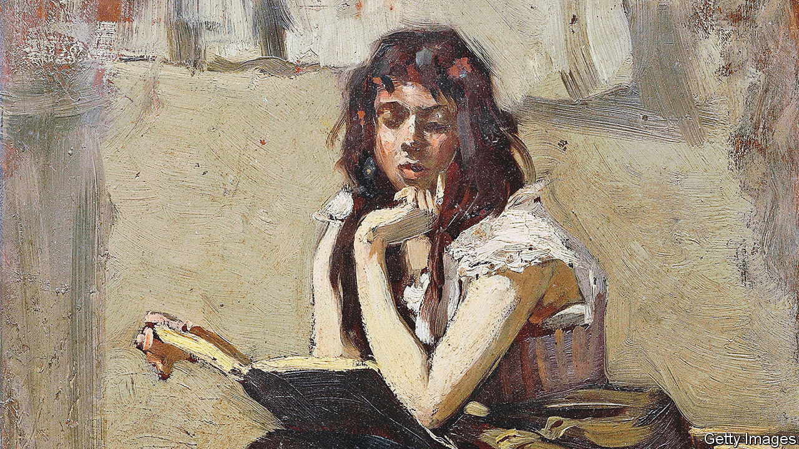

###### Home Entertainment

# “O Caledonia” teaches girls how to grow up 

##### Elspeth Barker’s only novel is a celebration of obstinate individuality 

 

> Jan 19th 2023 

She lies in a heap on the staircase of Auchnasaugh Castle, “twisted and slumped in bloody, murderous death”. Above her, a stained-glass window bears her family motto: “dying but unconquered”. 

It is an odd beginning for a novel that teaches girls how to grow up. “O Caledonia”, however, delights in defying convention. It is a brooding, scintillating coming-of-age tale, full of delicate fashionings of . It suggests that it is better to be strange than to conform. Janet, the heroine, is ungainly and unusual. All the same, her obstinate individuality is thrilling today, when teenagers’ need to fit in seems ever more acute and their foibles are constantly displayed on social media. 

Elspeth Barker wrote “O Caledonia”, her only novel, in 1991. Critically lauded, it nevertheless fell out of print after 2001. In 2017  called it “one of the best least-known novels of the 20th century”. In 2021, a year before Barker’s death, it was reissued by  &amp; Nicholson in Britain. Last year it was released in America and Spain; more editions are coming.

The author was eccentric. She grew up in a Scottish castle before studying modern languages at Oxford—though she failed her final exam, as she slept through it. Aged 22, she fell in love with George Barker, a 50-year-old poet and father to ten children from three relationships. (They had a further five children.) She kept a pot-bellied pig called Portia in the kitchen, wrote for literary reviews and taught Latin at girls’ schools. She encouraged her charges to be maverick young ladies, not simpering little girls.

“O Caledonia” is a lyrical evocation of that sensibility. For Janet, conventional girlhood is a half-existence of dolls, ribbons and submission. If to be feminine is to be pretty and motherly, she is not only unfeminine, but half-feral. A haircut makes her look like a “menacing Hausfrau”. She reads books as though “rending the limbs of some slaughtered beast”. At a loss as to how to handle her priggish younger siblings, she nearly maims one, shoves another out of a moving car and attempts to bury a third. “A nasty rat has buried your baby,” she tells her horrified parents. “She’s gone now.”

Frequently hapless and profoundly misunderstood, Janet suffers from the careless cruelties of adolescence. Girls are cliquey and snide, boys are predatory, adults are rarely better. But Janet stays passionate and maintains a love of language. Beth is “a beautiful name, a velvet name, brownish mauve”. Poisonous hogweed is rechristened “Lord of Luna”. A darkening Scottish sky in winter “sheds an unearthly glory”. Janet perceives strange beauty in the world around her, even if she is derided for it.

Her short life is a hymn to originality. How much better, Barker implies, to be clever and odd than gormless or dull. Friends are few, yet beloved: Janet’s jackdaw, her sole mourner, searches for her “unceasingly” after her death. Refusing to adopt a lesser companion in her stead, in despair he flies into the castle walls. Dying, but unconquered. ■


