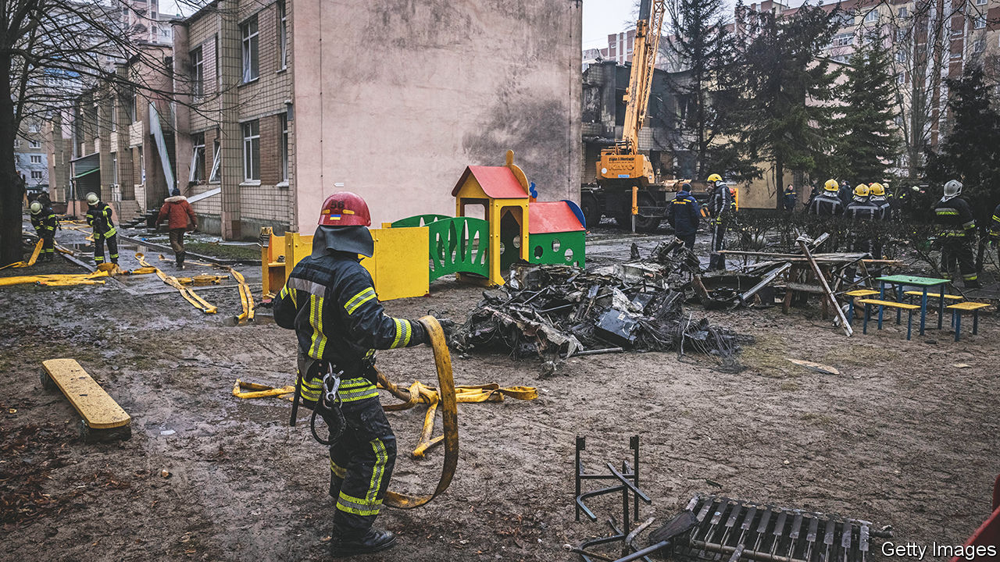

###### Danger zone

# A helicopter crash has dealt a heavy blow to Ukraine’s government 

##### The country loses its interior minister and much of his top staff 

 

> Jan 18th 2023 


YURI AND his wife Vera, both pensioners, thought the sharp sound was an approaching Russian missile, one of many they had seen tear through the skies above their neighbourhood of Brovary, in the east of Kyiv. Vera threw herself against one of the walls of their flat and prayed. “If I’m lucky, I will survive,” she recalls thinking. Yet the explosion that shook Brovary seconds later was from a  helicopter, which struck a kindergarten outside their apartment block, then crashed into another building about a hundred metres away. 

The crash took the lives of at least 14 people, including Ukraine’s interior minister, Denys Monastyrsky; his first deputy, Yevhen Yenin; other senior ministry officials aboard the helicopter; and a child on the ground. Over twenty others are believed to be injured. Mr Monastyrsky is the most senior Ukrainian official to have been killed since the start of . At an extraordinary meeting today, the country’s cabinet appointed Ihor Klymenko, the head of the national police, as his temporary replacement. 

The cause of the crash remains unknown, although poor visibility may have played a part. Witnesses say there was heavy fog over Brovary at the time. Ukraine’s Security Service said its investigators were looking into technical malfunction, breach of air-traffic rules or sabotage as possible causes. The crash started a fire in the kindergarten; flames were shooting out of the roof, says Yuri, who ran to help survivors.


The loss of the leadership of one of Ukraine’s security ministries will have an immediate effect on the war effort. Mr Monastyrsky’s ministry was responsible for co-ordinating the national guard, border-guard service, police, emergency services and part of the country’s territorial-defence forces. Much of these structures worked autonomously, with their own managers. But some of the processes were personalised, so the death of senior officials entails the loss of institutional memory. Many questions are being asked about the wisdom of placing the minister, his first deputy and the ministry’s leading civil servant on one helicopter.

Mr Monastyrsky, 42, was an important player in the country’s National Security and Defence Council, though he had been in his post only since July 2021. He succeeded Arsen Avakov, an influential figure, following a power struggle between the interior minister and presidency. Mr Monastyrsky was seen as a compromise appointment: an MP of President Volodymyr Zelensky’s party on the one hand, but also someone with close connections to Mr Avakov. Mr Avakov had in the past courted controversy by allowing members of far-right fringe groups into law enforcement. Some suspect he may seek to return to the ministry as Ukraine looks for a permanent replacement for Mr Monastyrsky.

But Volodymyr Fesenko, a political analyst based in Kyiv, said it was unlikely Mr Zelensky would offer him the chance. The former interior minister is too much his own man, and is still unamused at being pushed out of his post, he said: “Zelensky will be looking to keep unity at all costs.” ■

