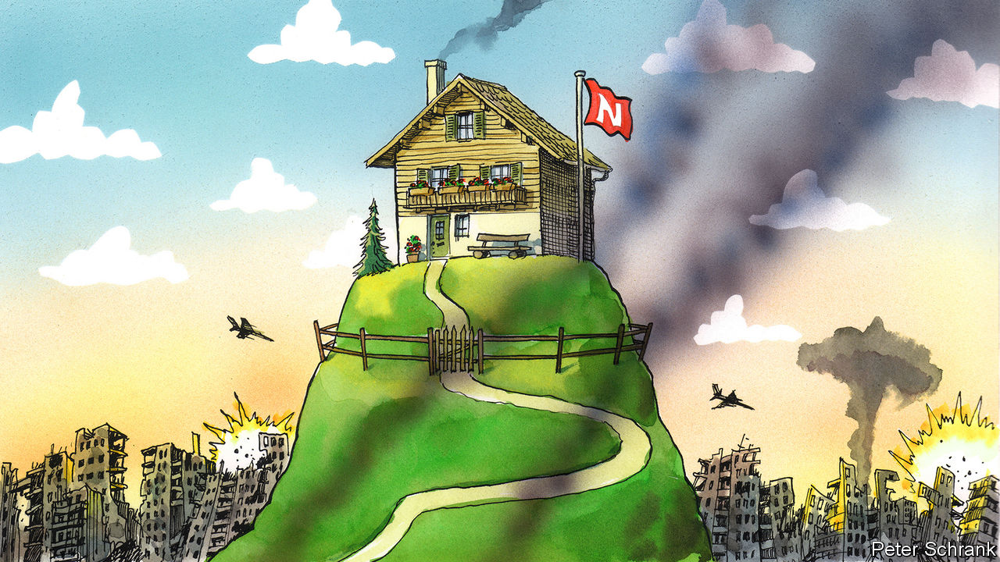

###### Charlemagne

# Europe’s “neutral” countries are having to adapt to the new world 

##### War in Ukraine makes the policy look hopelessly naive 

 

> Jan 19th 2023 

Government policies come and go, the victims of trends and fickle public opinion. The Swiss attachment to neutrality has had more staying power than most. Historians disagree whether it was formally adopted in 1515 or merely in 1648, or perhaps even as recently as 1815. Either way the idea that Switzerland should steer clear of foreign military entanglements has proved nearly as durable as its Alpine backdrops and discreet banks. Other countries have copied it. Before Russia attacked Ukraine last February, half a dozen European countries described themselves as neutral. Once the approach had an enlightened tinge to it: the virtuous foreign policy of well-run Nordic types. These days it looks hopelessly naive, if not worse. Some countries have binned the concept while others are sticking to their pacifist guns.

Whether Switzerland—Europe’s 20th-most-populous country, with just 9m people—is pitching in to a conflict may scarcely be noticeable to either belligerent. Yet the question has gained unexpected importance in recent weeks. The Bern government’s attachment to neutrality includes not sending arms made in Switzerland to war zones, nor allowing countries that had previously bought Swiss arms to re-export them without prior approval. Such authorisation has been refused to Spain and Germany, which want to forward Swiss-made kit and ammunition in their arsenals to help Ukraine fend off Russia. Swiss obstinacy has been lambasted by those on the front lines. “Ukraine sees this not as neutrality but as undermining our defence capabilities,” tweeted Anton Gerashchenko, a government adviser in Kyiv. 

Reports suggest the Swiss may find a way to circumvent their principles. That would be the latest blow to a policy which has not aged well. Five other countries have adopted some variant of neutrality in Europe, for different reasons. Finland and Austria were lumped with it to shake off the Soviet yoke: proclaiming themselves neutral was a condition for regaining their freedom after the second world war. Sweden has claimed neutrality for over two centuries; tiny Malta adopted it in 1980 to avoid getting crushed by cold-war rivalries. Ireland, out of the way and close to both America and Britain, has been neutral since at least the 1930s. (Cyprus is an honorary member of the club: it is not in NATO, but only because Turkey would block its accession.)

As war broke out on the continent, Sweden and Finland took the opportunity to join their non-neutral friends. Both applied to join NATO in May after public opinion swung against military standoffishness. The alliance wants them, but all 30 existing members need to ratify their accession. Turkey’s autocratic president, Recep Tayyip Erdogan, is holding Sweden to ransom, demanding it extradite Kurdish militants who have sought asylum there. A deal may be near; even if not, the Finns and Swedes have already picked their side. Finland has said it may offer advanced Leopard 2 battle tanks to Ukraine alongside other allies. Both Finland and Sweden have signed a security agreement with Britain, and are pondering one with America. (Arguably, joining the EU was itself a renunciation of neutrality, given that the club’s rules include a mutual-assistance clause.)

Finland has long sought to distance itself from the idea of neutrality, which was a reminder of how the Kremlin once circumscribed its foreign-policy choices. At least its “non-alignment” was not a way to scrimp on defence. Finland dedicates 2% of GDP to its military budget, in line with NATO guidance that only a handful in the alliance have met of late. That is perhaps unsurprising for a country with a 1,340km (830-mile) border with Russia. For other neutrals, the scrimping is part of the appeal. Sweden spends 1.3% of GDP, on a par with much-criticised Germany. Malta, Switzerland and Austria dedicated under 1% of GDP to their armed forces before the war; Ireland is the stingiest in the EU, at just 0.3%. 

Apart from the Nordics, the neutral status quo looks set to endure without much questioning. Ireland has gone through diplomatic contortions to proclaim itself “not politically neutral, but militarily neutral”. Instead of sending guns to Ukraine it has delivered first-aid kits. Austria and Switzerland have reaffirmed their commitment to the doctrine. Both have offered their services as conveners of peace talks between Russia and Ukraine, a much-hyped traditional role for neutrals (other countries’ posh hotels are available if and when talks are afoot). “Austria was neutral, Austria is neutral, Austria will also remain neutral,” said its chancellor, Karl Nehammer, while pledging to boost military spending. Neutrality is popular and enshrined in its constitution.

Switzerland, for its part, recently reviewed its neutrality doctrine and found it to be suitable. It would aid Ukraine if the UN Security Council condemned Russia—not too likely, given that Russia wields a veto there. Its most important contribution to the war effort has been largely to mirror sanctions imposed by the EU. These have hobbled the trading of Russian oil in Geneva and frozen piles of oligarch cash stashed in Zurich. But populists have criticised even this as drifting away from non-alignment.

No war please, we’re neutral!

Neutrality looks increasingly like a simplistic answer to complex geopolitical questions. The security of Europe is being fought over in Ukrainian trenches. Any country on the continent declaring itself neutral about the outcome is announcing that its own safety is of scant concern. Non-neutrals resent this. Their guns are implicitly defending the likes of Austria, which get to splurge on more butter and boast of their virtue to boot.

Countries that declare themselves neutral can change their minds. Congress was so determined that America should remain unaligned that it proclaimed its neutrality in 1935, 1936, 1937 and 1939. Yet by 1941 it had joined the allies. Switzerland or Ireland throwing its weight behind Ukraine is unlikely to have the same effect. But it would be a welcome decision to join the real world.■


