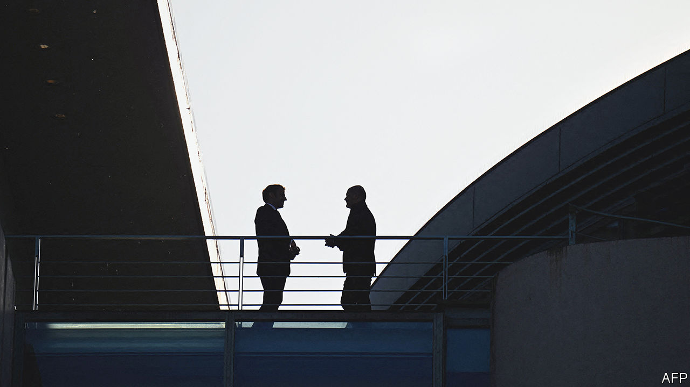

###### Reaching over the Rhine

# France and Germany stifle their spats to celebrate a 60-year friendship 

##### The war in Ukraine puts a testy partnership under stress 

 

> Jan 19th 2023 

Beneath the crystal chandeliers of the Elysée Palace on January 22nd 1963, the leaders of France and Germany signed a treaty to cement their friendship. On January 22nd this year, 60 years after Charles de Gaulle and Konrad Adenauer met, the two countries’ current leaders will renew their predecessors’ vows. 

Emmanuel Macron and Olaf Scholz, as well as scores of their ministers and parliamentarians, will gather in Paris for a day of festivities and meetings designed to mark the resilience and richness of this cross-border tie, which has no real equivalent elsewhere within the European Union. The day will begin, symbolically, at the Sorbonne, where in 2017 a freshly elected Mr Macron first laid out his vision for a more sovereign Europe. Both leaders will speak, ahead of a joint cabinet meeting, and doubtless find a common language to talk about Europe over the coming decade.

Yet the summit comes at a challenging time for the bilateral bond. The meeting was originally scheduled for last October, but was cancelled by the French at short notice—ostensibly due to diary issues, but widely interpreted as a reflection of irritation at Germany. French officials were already aghast when Mr Scholz failed in August to mention France in a big speech on Europe in Prague, and in another at a French-German business club. (German aides say these were not “snubs”.) They were even more so after Germany’s unilateral announcement that it would spend €200bn ($216bn) to protect Germans from high energy costs, without warning France, as would be customary for such a budget-busting move.

In truth, Russia’s war on Ukraine has “laid bare Franco-German differences, and they are struggling to find common ground,” says Tara Varma of the Brookings Institution, a think-tank. Foremost among these are defence and energy. 

France is delighted that Germany is spending more on defence. The two countries have, at last, reached an industrial agreement to develop a joint next-generation fighter aircraft. Yet the lesson that Germany and much of eastern Europe draw from the war is that the continent is right to look to America and NATO for cover. To French chagrin, Germany has chosen to equip its air force with €10bn-worth of new American F-35 fighter jets. For Mr Macron, who has a French defence industry to protect and Europe in his veins, the lesson is rather different: that the EU should push even harder for “strategic autonomy”, albeit in a way that is compatible with NATO, in defence as well as industry. 

Such differences have prompted public irritation. Mr Scholz has paid a high diplomatic price for being slow to step up for Ukraine. He is under particular pressure from European allies to send German-made Leopard 2 main battle tanks, and to enable others, notably Poland, that need German re-export permission to do so. But many in his government are galled that, although Germany has provided far more overall aid to Ukraine than France, Mr Macron has often got more credit. 

Take the president’s recent announcement that France would deliver light tanks to Ukraine, just a day before Germany and America made similar offers. Ever self-critical, German commentators were quick to suggest that Mr Macron’s move had “forced” a grudging Mr Scholz into action—something the chancellery in Berlin denies. “Macron knows we are eminently shame-able,” says Thorsten Benner of the Global Public Policy Institute, a think-tank.

On energy, too, the war has exposed old disagreements. France’s preference for nuclear power has for years rubbed up against Germany’s firm rejection of it. Germany’s reliance on cheap Russian fuel for its industry has forced a radical rethink of a strategy that kept it prosperous for the past 30 years. The pair have sparred in public over alternatives, notably an ill-fated plan to build a gas pipeline to France from Spain, which France squashed. “It’s not good for Europe”, declared Mr Macron, “when Germany isolates itself.”

France and Germany often disagree. The strength of their tie is their ability to find common ground, and bring others with them. Yet the war has dragged Germany’s attention eastwards. France likes to think it is always at the top of Germany’s concerns, a sensitivity German leaders traditionally indulge. But with a wobbly three-way coalition government, Germany has been distracted. Gazing ever-inward, on January 17th Mr Scholz replaced one relatively obscure loyalist from his party, Christine Lambrecht, with another, Boris Pistorius, as defence minister.

Nor have the two leaders found much personal chemistry. Mr Scholz’s persona is what Germans expect of a native of Hamburg: quiet pragmatism, a dry, tight-lipped formality and a slightly acid sense of humour. Useful in German politics, these qualities do not inspire passion, nor suit him to wartime leadership. For Mr Macron, who brims with energy and ideas and likes to speak his mind, this makes for a tricky partnership. The French, says one insider, find Mr Scholz unusually difficult to read.

The summit will doubtless disguise such troubles. Germany may be looking eastwards, and inwards. France may be strengthening other European ties: a new treaty with Spain, an upcoming summit with Britain. Yet the density of the link between France and Germany is unique. Both countries know that they are condemned to find a way to talk to each other, however tough that may be right now.■

