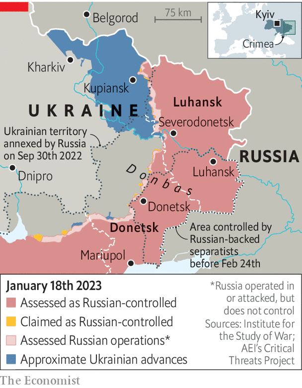

###### Uncertain allegiance

# Some liberated Ukrainian regions have mixed loyalties 

##### In pro-Russian areas the country will have to win back hearts and minds 

 

> Jan 19th 2023 


Near Kupiansk, an hour’s drive from the Russian border, Andrei, a Ukrainian aid worker, was distributing sweets to children when he noticed some taking photos of him with their phones. A soldier told him they were sending them to Russian social-media channels, and possibly to hit squads. On another occasion he saw villagers refusing aid from Ukrainians. “They still miss the Russians,” Andrei says.

Months since Ukraine recaptured Kupiansk, pro-Russian sentiment in the area remains high, says the town’s acting mayor, Andrii Besedin. Russian shelling has destroyed about a third of the city; only 17,000 of its 57,000 pre-war residents remain. Officials think some still send information on Ukrainian deployments to Russian troops, less than 10km (six miles) to the east. Some Ukrainian troops say they were told not to accept food from locals, for fear of poisoning. A broadcasting tower in Belgorod, a city north of the border, pumps Russian propaganda into local homes. The Ukrainians have been unable to block the signal. “A large majority of the people here were pro-Russian” before the war, says Mr Besedin, and not much has changed.

 


Russian forces entered Kupiansk without resistance days after the invasion began. The former mayor and most of the city council collaborated with the invaders. Over 200 of the 214 city-council employees, along with the mayor, are believed to have escaped to Russia. The Russians launched a new radio station, distributed copies of the Russian constitution and Russian tabloids, and began to publish their own newspaper, , packed with stories about Russia’s heroic campaign to save Ukraine from “Nazis”. To block news from the rest of Ukraine, they cut off mobile, television and internet access. 

Not everyone bought into the propaganda. The locals your correspondent encountered mostly backed Ukraine; many of those who sided with Russia have fled. One of them used copies of  to roll cigarettes, another as kindling for his stove. Luda Klimovets, a housewife caring for seven dogs, 25 cats and a hedgehog left behind by her neighbours, says she used them as toilet paper. 

Locals who opposed the occupation were often imprisoned or tortured. Vitaliy Sayapin, one of the few officials who refused to side with the Russians, spent over 100 days in a cell so crowded the inmates had to sleep standing up. Guards forced them to sing the Russian national anthem and Soviet folk songs. Those who refused were beaten. Electrocutions and mock executions were common. In between torture sessions, the Russians would stroll the corridor proclaiming that Ukraine’s leadership had fled. On Russia’s Flag Day, Mr Sayapin remembers, they offered each inmate two cigarettes.

Many residents travelled to Russia regularly and have relatives there. But Kupiansk is an exception: in most liberated areas, returning Ukrainian forces have been greeted as heroes. The invasion has alienated even Ukrainians once friendly to Russia. A missile strike on January 14th that killed at least 40 civilians in the city of Dnipro is just the latest atrocity. 

But Ukraine ultimately hopes to reconquer Crimea and Donbas, regions occupied by the Russians and their proxies since 2014 and historically more sympathetic to Russia. That would entail a battle for hearts and minds. Russian propaganda “works with horrific results”, Ukraine’s president, Volodymyr Zelensky, told  in an interview in December. Winning over Ukrainians who have spent nearly a decade exposed to it will be a challenge. 

Reconstruction is crucial. “We know that Russia is darkness, and that Ukraine belongs to the civilised world,” says Mr Besedin, the Kupiansk mayor, “but people need to see it with their own eyes.” The authorities have distributed humanitarian aid and restored electricity and water to over 90% of households, but rebuilding takes longer than blowing things up. Oleh Synehubov, the head of the military administration in Kharkiv, the regional capital, says foreign donors offered books in Ukrainian for schools and libraries around Kupiansk. “I said it’s a nice idea, but we don’t have schools and libraries left.” ■

