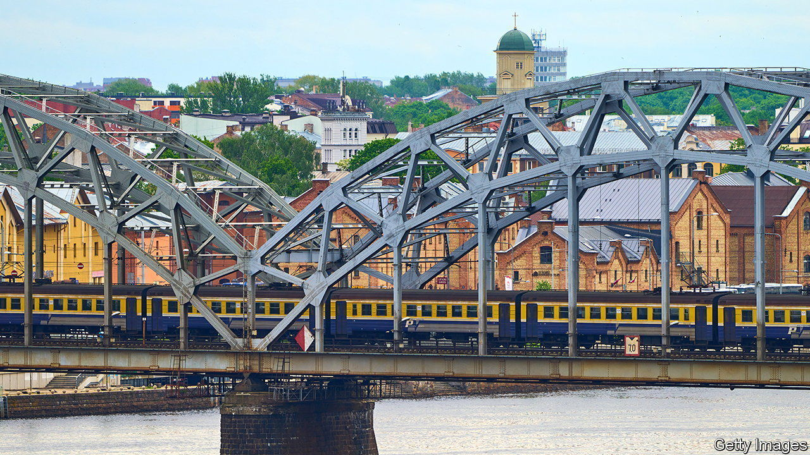
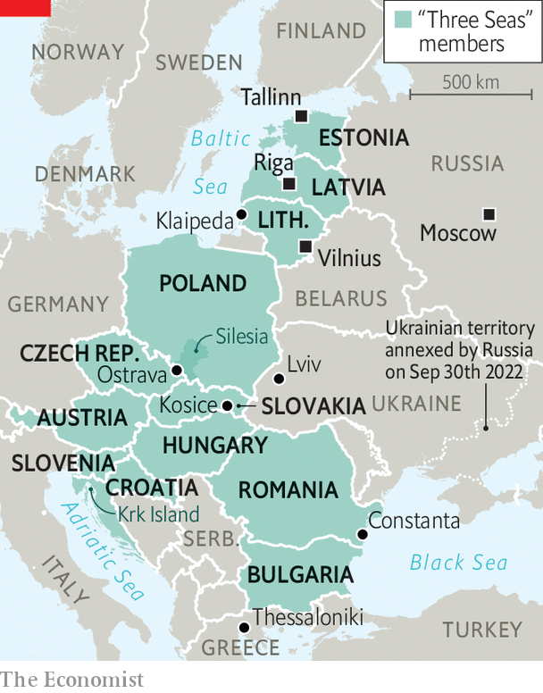

###### Between three seas

# The Ukraine war is forcing eastern Europe to build more links 

##### A region built on the Moscow-Berlin axis discovers north-south connections 

 

> Jan 19th 2023 


WHY DO TRAVELLERS take the bus in the Baltic countries? Their capitals—Tallinn, Riga and Vilnius—are only about 600km (370 miles) apart, a perfect distance for fast rail. But the winding train journey takes 12 hours and includes several changes. This is part of a broader problem. Look at any map of infrastructure links in eastern Europe, be they road, rail or pipeline: most run east-west. A few slow or minor routes run north-south. 

During the cold war, central and eastern European countries prioritised east-west corridors—those leading to Moscow. In recent decades their growing wealth made it possible to build a more omnidirectional web of cross-border links, but national squabbles got in the way. Now the war in Ukraine is prompting the region to push ahead with its neglected connections.

 


Eastern Europe’s energy and trade flows look very different today from a year ago. In April Russia cut off gas supplies to Poland and Bulgaria, forcing them to fall back on connections with others in the region. When Ukraine’s Black Sea ports were blockaded, trains and trucks could handle only a fraction of its grain exports. The country’s largest steelworks had to ship its goods by rail to ports in Poland—and reload them at the border, where the railway changes from Russia’s 1.52-metre gauge to Europe’s 1.435-metre one. Some worried that naval conflict in the Black Sea could shut Romania’s largest port, Constanta.

The turmoil has led to a flurry of new infrastructure plans. In May Denys Shmyhal, Ukraine’s prime minister, said his country would begin rebuilding its railways to European gauge. There is talk of turning the western Ukrainian city of Lviv, where many of the country’s businesses have relocated, into a hub with rail links to Kosice in Slovakia and Ostrava in the Czech Republic, as well as to southern Poland’s Silesia region.

Weaning Europe off Russian hydrocarbons has meant new regional energy links, too. In 2021 Croatia opened a liquefied natural gas terminal on its island of Krk. Last year Poland inaugurated an undersea gas pipeline to Norway, as well as links to Slovakia and Lithuania. In October Greece and Bulgaria opened a new gas link. Even Serbia is seeking to reduce its reliance on Russia, its friend, by plugging into Europe’s Southern Gas Corridor, says Olga Khakova of the Atlantic Council, a think-tank. Plans for fibre-optic and 5G connections spanning the region may take a while. But small projects are under way, says Viljar Veebel of the Baltic Defence College in Estonia.

One vehicle for co-ordination is the Three Seas Initiative (3Si), a forum of 12 EU countries spanning the Adriatic, Baltic and Black seas, founded in 2015. Its investment fund, set up in 2019, says it has raised at least $1.2bn. That is pocket change in the infrastructure world, and its flagship investments so far are small. (They include a Polish locomotive-leasing company, a data centre in the Baltics and some solar farms.) But central and eastern Europe has to date mainly been a recipient of western European largesse; 3Si is the region’s first collective attempt to invest its own money.

Despite their obvious benefits, infrastructure links have often been held up by bickering. The idea for a highway from the Lithuanian port city of Klaipeda to Thessaloniki in Greece appeared in 2006. It took nearly a decade to sign a deal to begin work on Via Carpathia, slated to open in 2025. The expected debut of Rail Baltica, the Baltic countries’ 870km high-speed railway, was pushed back from 2026 to 2030 after Estonia, Lithuania and Latvia squabbled over management, leading the EU to threaten to block funding for the €6bn ($6.5bn) project. “We will have flying cars before we get Rail Baltica,” says Mr Veebel.

For 3Si, the main roadblock is not money but political solidarity. Croatia and the Czech Republic, among others, worry that Poland could use the forum to grind its axe with the EU. Those fears are calming as more powerful backers come on board. This summer America confirmed it will invest $300m in the fund. Japan, Germany and the European Commission have also shown interest in the initiative. As ships full of grain queue up in the Black Sea, the war is showing that better connectivity in central and eastern Europe will pay off far beyond the region itself. ■

