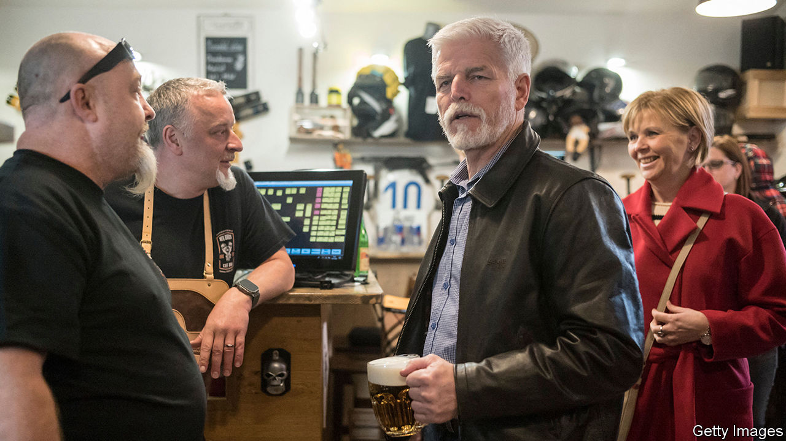

###### There will be mud

# The next Czech president will be a Trumpish oligarch or a general 

##### The election’s first round was a draw, so voters try again in two weeks 

 

> Jan 17th 2023 

Prague castle, the Gothic rockpile that looms over the Czech capital like a giant bat, is the official residence of the country’s president. In a Kafkaesque touch, no president has actually lived there in decades. On January 13th and 14th eight candidates vied to become the castle’s next official occupant, and in another Kafkaesque touch, none of them won. , an oligarch who served as prime minister until the autumn of 2021, and Petr Pavel, a retired general, finished neck-and-neck in the first round of the election. With the second round scheduled for January 27th and 28th, Mr Babis has unleashed a viciously negative campaign. It will be a “uniquely disgusting” two weeks, predicts Karel Schwarzenberg, a former Czech foreign minister who ran for president in 2013 and now backs Mr Pavel.

This is the Czech Republic’s third direct presidential election: a constitutional change in 2012 scrapped the previous system, a parliamentary process prone to back-room deals. Fully 68% of voters turned out. The candidates included Danuse Nerudova, an academic who hoped to become the country’s first female president, and Jaroslav Basta, a far-right populist. Mr Pavel got 35.4% of the vote, Mr Babis exactly 35%. Ms Nerudova, whom polls had shown doing well, unexpectedly finished a distant third with 13.9%. 

The president is head of state, but has limited powers. They include appointing judges on the constitutional court and board members of the central bank. Most presidents, including Vaclav Havel, a former anti-communist dissident, have been circumspect. But the incumbent, Milos Zeman, a hard-drinking populist who weathered several impeachment attempts, stretched the limits of his mandate. He meddled in foreign policy and flaunted his  and China. (He changed his pro-Russian stance only after Vladimir Putin invaded Ukraine.)

Mr Zeman backs Mr Babis. The former prime minister got a boost a few days before the election, when he was acquitted in a  related to €2m ($2.2m) in EU subsidies to one of his businesses. Piotr Fiala, the current centre-right prime minister who beat Mr Babis in 2021, is tacitly backing Mr Pavel, who promises to back progressive social policies.

Otto Eibl, a political scientist, says Mr Babis plays on voters’ fears of inflation and the war in Ukraine. As prime minister he led the country poorly during the pandemic. An admirer of Donald Trump, he handed out MAGA-style red baseball caps emblazoned with the slogan “Strong Czechia”. He embraces anti-immigrant policies and fostered close ties with Viktor Orban, Hungary’s populist leader.

Rural, less-educated and poorer Czechs are drawn to Mr Babis’s populism. Urban, educated, better-off and younger voters backed Mr Pavel or Ms Nerudova in the first round. Many of Ms Nerudova’s voters will switch to Mr Pavel. Mr Babis, who owns two newspapers and the country’s biggest commercial-radio station, kicked off his mudslinging right after the first round’s results were announced. He insinuated that Mr Pavel was a spy and compared him to Mr Putin. He also claimed that he had hailed the Red Army’s invasion of Czechoslovakia in 1968; Mr Pavel was seven years old at the time. Mr Babis later apologised.

Dirty campaigns are not new to Czech politics. In the presidential campaign of 2008 conservatives attacked Jan Svejnar, a liberal, for having a non-Czech-speaking wife. In the run-up to a parliamentary election in 2021, Mr Babis called the rival Pirate Party a “pro-migrant neo-communist group”. No doubt he has similar lines in store for Mr Pavel.■

