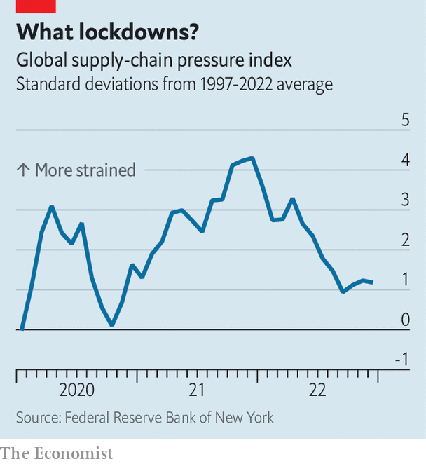

###### Return to sender

# China’s re-globalisation paradox 

##### In 2023 the world will visit more and buy less 

 

> Jan 19th 2023 

At the annual World Economic Forum meeting this week in Davos, Switzerland, China’s economic tsar, Liu He, met a number of “old friends” he had not seen during his country’s long battle with covid-19. In a solicitous speech, he acknowledged the importance of in-person meetings, lamented the fragmentation of the world and called for economic “re-globalisation”. In a philosophical aside, he also emphasised the “duality” of things. 

China’s recently abandoned “zero-covid” policy cut the country off from the rest of the world, contributing to the fragmentation Mr Liu bemoaned. But China’s period of isolation had a notable duality of its own. Although the movement of people across China’s borders was sharply curtailed, the movement of goods from China to the rest of the world was spectacular. Despite all the disruptions, China’s exports grew by almost 30% in dollar terms in 2021 and by another 7% in 2022, according to figures released on January 13th. Perhaps in-person meetings are overrated.

 


China’s episodic lockdowns proved less damaging to trade than feared at the time. When Shanghai was brought to a standstill in April and May, many worried it would clog international supply chains and push up global inflation. But a lot of trade passed through nearby Ningbo instead. An index of global supply-chain pressure, created by economists at the Federal Reserve Bank of New York, peaked at the end of 2021, before China’s fraught battles with Omicron last year. The index’s decline since then was interrupted by the Shanghai lockdown and Russia’s invasion of Ukraine, but not for long (see chart). Prices tell a similar story. In June, when the headline inflation rate in the United States peaked at 9.1%, the average price of Chinese imports into America rose by only 3.3%, compared with a year earlier. 

With the abrupt removal of China’s zero-covid policy, the flow of people, like Mr Liu, across the mainland’s borders has resumed. The number of passengers on Air China’s international routes rose by a third in December compared with the previous month. Other parts of the economy will also improve as the year unfolds. A recovery is expected in retail spending, which fell last year and would have been even weaker had it not been for the anxious stockpiling of food and medicines. The outlook should also improve for home sales, which shrank by more than a quarter in 2022, the sharpest decline on record. The government has given property developers a “blood transfusion”, Mr Liu reported in Davos, helping them raise finance. It has also taken steps to quicken the pulse of the market, which he hopes will help developers raise much-needed revenue.

But the glaring exception to this brighter outlook is exports. They are likely to fare worse in China’s year of reopening than in its last year of lockdowns. Indeed, the monthly figures have been negative in the past three releases. According to ubs, a bank, merchandise exports will shrink by 4% in dollar terms in 2023 as a whole. This would be only their fifth such fall since 1980. The re-globalisation of China’s people will coincide with a deglobalisation of its goods. China will attract many more foreign visitors and fewer foreign sales.

In one important respect, China’s reopening has made life harder for its exporters. The turnaround in China’s zero-covid policy has contributed to a revival of the yuan, which has risen by 8% against the dollar since the start of November, making Chinese exports less competitive. Mr Liu invited his audience in Davos to visit China again. But even before the global capitalists arrive, global capital has rushed to reacquaint itself with Chinese assets, bidding up the price of its currency. Exporters have also converted more of their dollar earnings into yuan. 

The main reason for the export bust, though, lies outside China. The slowdown in the world economy will cut demand for its wares. And the landing will not necessarily be soft. In December, for example, China’s sales to America, the eu and Japan fell by 17% compared with a year earlier. Ting Lu of Nomura, another bank, worries that China will suffer from the so-called bullwhip effect. A small dip in demand from consumers can lead to pronounced drops in orders for upstream suppliers, just as a small flick of the wrist can lead to a vicious crack of the whip. 

Even if the level of global spending proves resilient, the mix is becoming less favourable to China. In America and other rich countries consumption has shifted from the sorts of electronic goods that are prized by people working from home to the services people enjoy when they are able to move and mingle. China’s global shipments of computers and their parts shrank by 35% in the latest trade figures. When the threat of lockdowns dangled over global supply chains, people worried that China’s exporters were a source of vulnerability for the world economy. Instead, the world economy is proving a source of vulnerability for China’s exporters. ■


