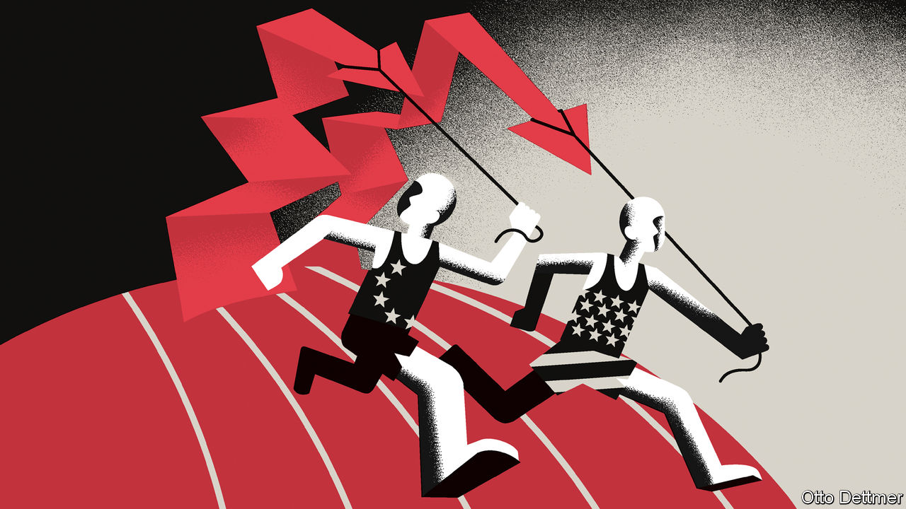

###### Free exchange

# Could Europe end up with a worse inflation problem than America? 

##### The new transatlantic divide 

 

> Jan 19th 2023 

Inflation is coming down. On both sides of the Atlantic, falling energy costs are provoking sighs of relief. Price-watchers are now focused on core inflation, a measure that strips out volatile food and energy prices, and is usually much slower to rise—and more difficult to bring down. Since October, core inflation in the euro zone has been higher than in America. Could Europeans end up with a worse inflation problem than their transatlantic peers? 

Every economist knows Milton Friedman’s dictum that “inflation is always and everywhere a monetary phenomenon.” But the Nobel-prizewinner’s words do not seem to capture the current bout of inflation, where post-pandemic supply disruptions, fiscal splurges, an energy shock and labour shortages have created a near-perfect storm causing prices to soar. How fast inflation comes down may therefore depend not only on what central banks do but on how these factors—the disruptions, energy shock and wage rises—affect economies on either side of the Atlantic.

Alongside these surprises, there has been extraordinary tumult in the basic operations of rich-world economies. Covid-19 altered how people work, what they consume and where they live, and did so in short order. Removing pandemic restrictions then led to a surge in demand for travel, nights out and treats. On top of this, governments in America and Europe have decided to subsidise green technologies on an unprecedented scale. Capital, production inputs and workers need to move to parts of the economy that are growing and away from those that are shrinking. Until they do, the economy cannot produce enough to meet demand.

Yet moving jobs or investing in new plants or software takes time. A boom accelerates the process. Recent work by Rüdiger Bachmann of the University of Notre Dame and colleagues shows that workers in Germany are more likely to change jobs when demand is high than during recessions. Another study, using American data, suggests that moving to a growing firm increases pay for the job-switching worker substantially. The current shifts in the economy are therefore likely to produce some inflation—and that may be desirable. A recent paper by Veronica Guerrieri of the University of Chicago and colleagues argues that monetary policy should tolerate somewhat higher inflation if doing so allows workers to find a new job during periods of economic change.

Government policies in America and Europe have affected the pace of adjustment to these changes. Europe’s approach was generally to try to freeze things in place during the pandemic. The continent’s governments created generous furlough schemes, which kept workers in their existing jobs. Unlike America, there was no boom in durable-goods consumption, financed by stimulus cheques, that required expanded production. Nor did Europe run its economy hot to aid a reallocation of workers and capital. If inflation in America is the result of an economic reshuffle, it may come down faster than Europe’s once that process is complete. 

Europe also had to cope with a different economic hit. Julian di Giovanni of the Federal Reserve and colleagues show that, compared with America, supply crunches accounted for a greater share of inflation in 2020-21. Wholesale gas and electricity prices began to rise in autumn 2021, and soared after Russia invaded Ukraine, with oil and coal prices following. This added much more to inflation in energy-importing Europe than it did in America. 

The consensus in economics is that central banks should not tighten policy too much in response to a temporary supply or energy shock. Coping with such a shock is hard enough—no need to give the screw another turn. The effects should subside over time so long as inflation expectations stay stable. Now that supply crunches in everything from lumber to chips are easing and energy prices are coming down, Europe should benefit more than America. That is if inflation has not become entrenched. 

Inflation gets baked into economies when workers and firms come to believe that prices will keep rising. In the worst-case scenario, this creates a wage-price spiral, with workers and firms unable to agree on a division of the economic pie. In a tight, flexible labour market like America’s, which has little collective bargaining, wage growth should quickly track inflation. And that is what happened: wage growth accelerated when inflation began to rise. As a new paper by Guido Lorenzoni of Northwestern University and Ivan Werning of the Massachusetts Institute of Technology argues, this theoretically increases the risk of a wage-price spiral. But America seems to have made it past the point of greatest danger. According to Indeed, a hiring website, the country’s wage growth, though high, has been coming down for a while. 

Blessed unions

In Europe, wages are often decided in collective-bargaining agreements. Across the eu around six in ten workers are covered by such arrangements. Deals typically last a year or more, meaning that wages take time to adjust to economic conditions. That was great when inflation got going. Wage pressures did not immediately add to inflation. Unions and firms could negotiate about how to divide the blow to incomes and profits. After all, the two sides meet at the same table every year, to take stock and adjust. Since they cover large chunks of the economy, they have reason to take the macroeconomic effects of any deal into account.

But relations are feeling the strain. With inflation in Europe stubbornly high, unions are demanding extra compensation for their members. Germany’s public-sector outfits are seeking a 10.5% increase in the latest round of bargaining. Such delayed increases in pay are a normal feature of an economy where wages take time to adjust and which has been hit by a supply shock. As Messrs Lorenzoni and Werning demonstrate, real wages typically take a hit before recovering to their old level. But whereas America appears to be making progress, the old continent remains some way behind. Europe’s inflation race has longer to run. ■


