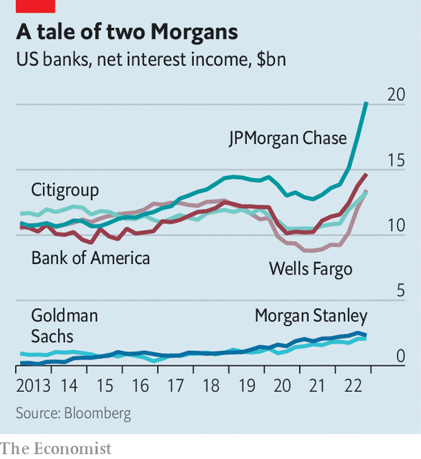

###### Marginal profits

# Investment banks are struggling in a high-interest-rate world 

##### But the change does not fully explain Goldman Sachs’s struggles 

 

> Jan 17th 2023 

Shareholders like profits: a steady stream of income they can count on, quarter after quarter. The earnings America’s biggest banks make, however, are often pushed around by the volatility of the economy they serve. If the economy accelerates, demand for loans takes off; if it slows, bankers must set aside provisions for bad loans. Investment banks’ trading businesses tend to do well in times of  and uncertainty, but their advisory services sell best when markets are healthy and stable. Bank bosses must try to balance their exposure to these forces.

The past three years, during which the American economy has experienced a pandemic-induced shutdown, a financial boom and a rate shock, have been unusually volatile. As a result, the period has been an interesting test of just how successful bank bosses have been in their efforts to balance the performance of their businesses. The results were on show between January 13th and 17th as Bank of America, Citigroup, Goldman Sachs, JPMorgan Chase, Morgan Stanley and Wells Fargo took it in turns to report fourth quarter and full-year earnings.

 


Altogether profits at the six banks fell by 20% from $34bn in the fourth quarter of 2021 to around $27bn in the same period of 2022—but the pain was not evenly spread. Earnings at JPMorgan and Bank of America were up a little. Meanwhile, at Goldman Sachs they were down by two-thirds. Some of this gap can be explained by their different strengths. Firms with big consumer banks, such as Bank of America and JPMorgan, typically do well when interest rates jump. Rising rates tend to increase the difference between what banks pay out on deposits and earn on loans. Net interest income, as this gap is called, zoomed higher in 2022. It climbed by $17bn between the end of 2021 and 2022 across the big six banks, reaching $66bn. 

This increase is partly offset by the fact that higher interest rates will make it harder for consumers and companies to pay back debts. Banks also set aside some $7.2bn for loan losses in the fourth quarter of 2022. Jamie Dimon, boss of JPMorgan, and Brian Moynihan, boss of Bank of America, have both predicted a mild recession in America this year. Yet for the moment the net effect of higher interest rates on profits remains positive. 

Investment-bank revenues, which fall when stockmarkets do badly, dropped by around 50% at Goldman and Morgan Stanley. But the divergence in profits between the six banks cannot simply be explained by the differing performance of investment and consumer banks. For one thing, profits at Morgan Stanley, where non-investment-bank businesses did well, dropped far less sharply than at Goldman. For another, Wells Fargo offered up another bleak quarter, despite its big consumer bank, with profits half their level a year ago. 

The pain at Wells can be explained by regulatory troubles. In December the bank agreed to pay an enormous fine of $1.7bn to the Consumer Financial Protection Bureau, for improperly managing millions of consumer accounts. It is harder to explain the situation at Goldman. The firm sought to build a consumer bank, in part to diversify its business. But it has had to set aside unusually high provisions for loan losses in that department, and is now scaling back its efforts. “What went wrong?” asked one analyst on the Goldman earnings call on January 17th. David Solomon, the bank’s boss, argued the firm had tried to do too much, too fast and had lacked the talent to pull off some of its wide-ranging ambitions. Six days earlier the company had sacked 6.5% of its workforce. 

The enormous economic shocks in recent years have revealed just how different the six banks have become. In some cases, the shocks have also revealed just how poorly they have been managed. ■


