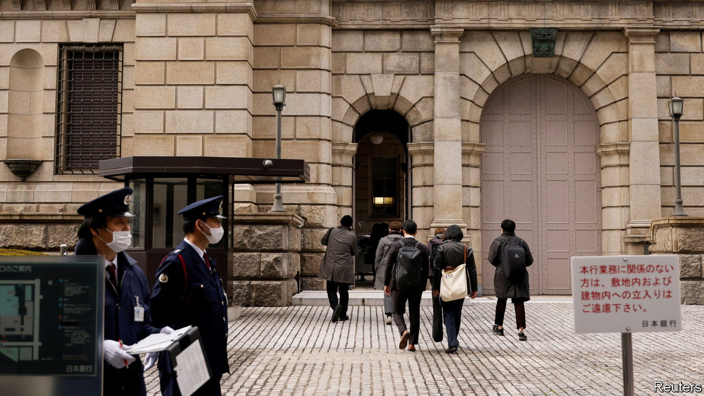
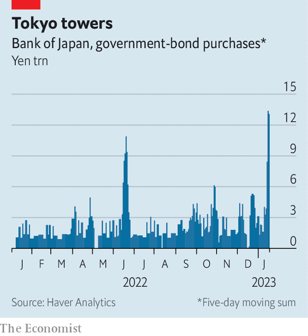

###### Speculators swatted

# Japan’s extraordinarily expensive defence of its monetary policy 

##### As the central bank defies speculators, potential costs mount 

 

> Jan 18th 2023 

In december the  (boj) gave speculators an opening. By lifting its cap on ten-year government bond yields from 0.25% to 0.5%, the central bank raised the prospect that it would abandon its “yield-curve-control” policy entirely. Since then, officials have been put to the test by increasingly unco-operative bond markets. The boj has been forced to make enormous bond purchases in an attempt to drive down the yield, buying ¥9.5trn ($72bn) on January 12th and 13th alone.

Speculators excitedly awaited the boj’s next meeting. Would it be the moment the central bank gave up the fight? On January 18th the boj announced it would in fact keep going. The bank even promised to buy more bonds if necessary. The yen slumped on the news; short-sellers licked their wounds. Yet defending the policy is becoming astonishingly costly. The boj’s difficult decisions are not going away.

 


Yield-curve control was introduced by the bank in 2016 as part of an aggressive programme of monetary easing, which officials hoped would lift Japan’s . The boj is one of the few central banks to have stuck to its guns in 2022—neither raising interest rates nor halting big asset purchases—as inflation has risen around the world. 

Japanese inflation has increased, too, but only to 3.8% year-on-year in December. This is less than half the peaks in America and the euro zone. And much of the surge is the result of high energy prices and the weak yen, which hit a 32-year low against the dollar in October. Thus the boj argues underlying inflation is yet to rise to its target level of 2% in a sustainable manner.

The central bank’s decision to lift the cap on bond yields in December was an attempt to improve liquidity and facilitate more trading. It seems to have backfired. The boj owns around half of the country’s bond market, and more than 95% of some bond issuances, after a decade of hefty purchases. Extra purchases to defend the cap have worsened market shortages.

The boj’s decision to hold fast could exacerbate the situation. The central bank is building vast potential losses on its bond portfolio. If Japanese bond yields were to rise by just 0.25 percentage points, the bank’s total holdings as of January 10th would slump in value by around ¥7.5trn, or 1.4% of gdp, according to our calculations. Every extra bond bought to maintain the yield cap increases the potential loss. 

Higher yields also alter Japan’s fiscal arithmetic. Government net debt ran to about 173% of gdp in the third quarter of last year, the highest of any rich country. Some 8% of the national budget is spent on interest payments. If payments on the stock of government debt rose by the same amount—0.25 percentage points—the total bill would run to ¥11trn, or 10% of this year’s government budget. In the year ahead, the boj has no good options. ■


