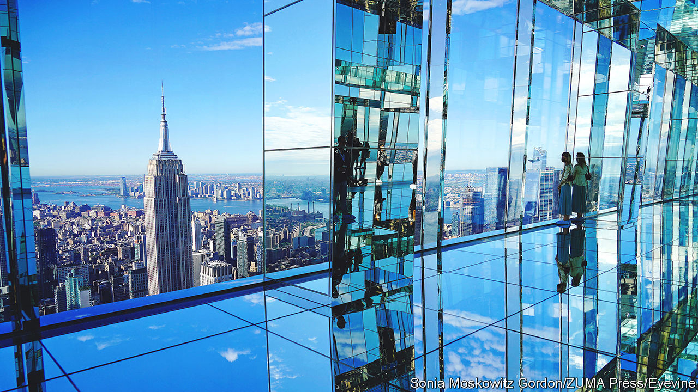

###### Property

# The rise of the uber-luxurious office 

##### How the top end of the market is defying the gloom 

 

> Jan 19th 2023 

It is lunchtime at One Vanderbilt, a new  which juts out of midtown Manhattan. The building’s vast basement kitchen hums, as harried staff in chef’s whites leap in and out of swing doors. Upstairs, gourmet salads and soup are served in a lounge overlooking Grand Central Station; a sit-down restaurant offers, grilled scallops and other dishes from Daniel Boulud, a celebrity chef. There is not a soggy, al-desko sandwich in sight.

Across the rich world, the commercial-property industry is in a grim state. Tenants have come to terms with the fact that working from home is here to stay, and are downsizing appropriately. In cities such as Hong Kong, London and Paris vacancy rates have hit record highs. Another indicator of the darkening mood is that global investment in offices last year fell by 42%, compared with a 28% drop for property as a whole. A recent paper by Arpit Gupta of New York University and Vrinda Mittal and Stijn Van Nieuwerburgh of Columbia University forecasts that  in New York could lose almost 40% of their value between 2019 and 2029, equivalent to $453bn.

Yet One Vanderbilt, a 93-storey skyscraper with a sparkling “hall of light” observatory at its top (pictured), is among a spate of new trophy properties and renovated buildings offering interiors and services akin to those at elite private-members clubs. Last year tenants in Manhattan signed deals for 6.1m square feet (566,709 square metres) of high-end office space, double the amount the year before, according to jll, a property firm. The luxurious turn was under way before the pandemic, but accelerated as companies found themselves in competition with home offices. If a firm needs space for only half its workers each day, it can pay more per square foot. 

The picture at the top of the commercial property market is therefore very different to the misery in the lower echelons. Although New York is home to the most opulent new-builds, extravagant offices are appearing in other global cities, too. In London 105 Victoria Street’s owners are adding 30,000 square feet of green space—the equivalent of 14 tennis courts—including an urban farm and a “walk-and-talk” track. Merdeka 118, a skyscraper under construction in Kuala Lumpur, will boast one of the world’s loftiest observation decks. 

Before the pandemic, desks accounted for around 60% of office space, according to Cushman and Wakefield, a property consultancy. Things have changed considerably. New and refurbished offices are using half that space for workstations, and raising the share dedicated to amenities from 5% to 20%. Meditation rooms, bike storage, showers, outdoor spaces and other treats are now .

The result is an arms-race at the very top of the market, particularly in the most competitive cities. Many of the new breed of luxury offices offer concierges—some having poached hospitality teams from places such as the Four Seasons hotel chain—and rooftop bars serving high-quality booze. They typically boast eye-catching entrances. The lobby in 425 Park Avenue, an office block round the corner from One Vanderbilt, is three storeys tall. At Spiral, a new tower with tree-lined terraces on every floor, the lobby is infused with a signature scent and soothing music.

The ambition is to make life as cushy as possible for workers—not just to get people back into the office, but also to aid recruitment in a tight labour market. Tenants at 50 Hudson Yards, home to BlackRock, an investment firm, and Meta, a social-media giant, have access to a helipad, which offers five-minute transfers to John F. Kennedy International Airport for roughly the price of an Uber suv. Other offices provide services such as pet care, baby-sitting and dry cleaning. Landlords are rushing to spruce up older offices as well. The gm Building, a 55-year-old tower overlooking Central Park and once owned by the Trump Organisation, was recently refurbished to include a bar, lounge and fitness centre with spin and yoga studios. 

Modern workers do not just seek luxury, however. They also want to salve their consciences. As a result, green buildings are increasingly popular. For landlords, these have the twin advantages of attracting higher rents and hedging against obsolescence, as countries look to meet their net-zero carbon goals. New energy-efficiency requirements for buildings in England and Wales mean that more than half of London’s office stock could be unusable by 2027. In Europe buildings will be required to source roughly half their energy from renewable sources by 2030. Among the newer breed of offices, clean air, minimal carbon emissions and better insulation are commonplace. One Manhattan West, another tower in the Hudson Yards development, is powered entirely by renewable energy. Like many developers, the tower’s owner, Brookfield, is aiming to achieve net-zero emissions by 2050.

Yet one question hovers over the luxury boom, and it is a big one. What happens to the market if economic conditions deteriorate? After the global financial crisis of 2007-09, premium buildings were hit less hard than their more humble rivals, but the whole industry suffered. In London, prime-office rents in the third quarter of 2009 were 35% below their peak in 2007. The owners of today’s luxury towers must hope that  and high-tech gyms will protect them next time around. ■


