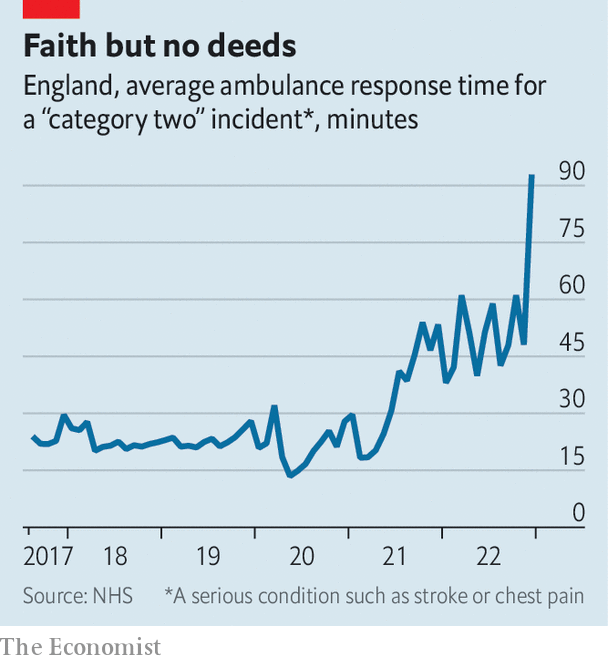
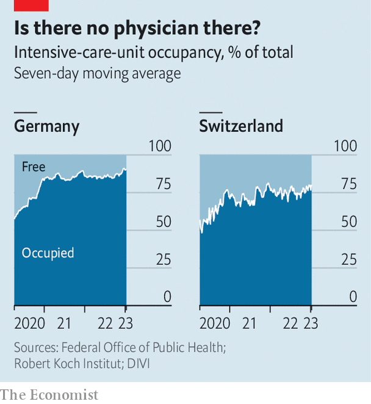
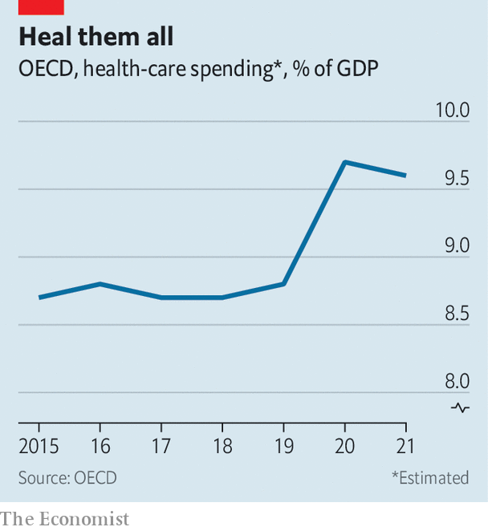
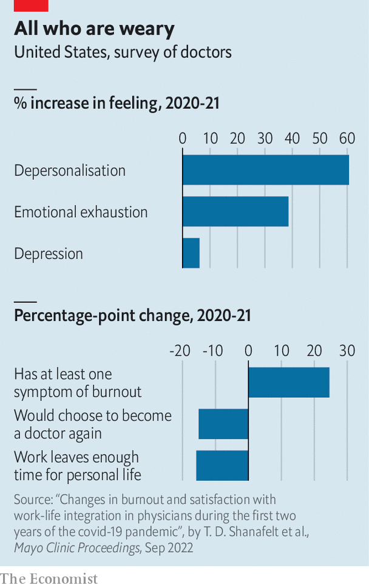

###### Ouch

# Why health-care services are in chaos everywhere 

##### Now is an especially bad time to suffer a heart attack 

 

> Jan 15th 2023 

The imposition of lockdowns during the  pandemic had one overarching aim: to prevent hospitals from being overwhelmed. Governments hoped to space out infections, buying time to build capacity. In the end, however, much of this extra capacity went unused. England’s seven “Nightingale” hospitals closed having received only a few patients, as did many of America’s field hospitals. A study of Europe’s experience in , a journal, found only one example where there were more covid patients than intensive-care beds: in the Italian region of Lombardy on April 3rd 2020. Although there are now stories of , as the country confronts a great exit wave, it is too soon to know whether these are isolated examples or represent broader, systematic failure.

Outside , covid weighs less heavily on people’s minds these days. Yet health-care systems in much of the rich world are closer to collapse than at any point since the disease started to spread. Unlike for unemployment or gdp, there are few comparable, up-to-date figures on health-care performance across countries. So  has trawled statistics produced by countries, regions and even individual hospitals to paint a picture of what is going on. The results suggest patients, doctors and nurses are experiencing the brutal after-effects of the pandemic.

 


Start with Britain, which produces high-quality data. The National Health Service (nhs), the country’s state-run provider, is in dire straits. Just before the pandemic struck, someone with a medical issue requiring urgent but not immediate attention, a category that includes those suffering strokes and heart attacks, waited on average 20 minutes for an ambulance. Now they wait longer than an hour and a half (see chart). The number of lengthy “trolley waits”—the time between a decision to admit a patient and arriving at a hospital ward—has jumped. 

Other countries have less comprehensive statistics, but equally miserable populations. In September Ipsos, a pollster, released a global survey that included a question on the quality of local health care. In almost all of the 20-odd rich countries surveyed, people were less likely than in 2021 to say that the service on offer to them was “good” or “very good”. In Britain the share saying so fell by five percentage points. In Canada it fell by ten, in Italy by 12.

Italian hospitals inundated by covid patients in early 2020 are struggling once again. We analysed data from the Pope John XXIII hospital in Bergamo, site of some of the harrowing images of people on ventilators nearly three years ago. In the year covid hit Italy, the hospital’s waiting lists rose slightly on some measures. They then fell slightly the next year. But in 2022 they jumped. Someone in the city looking for a non-urgent breast ultrasound may have to wait as long as two years. Officials in Emilia-Romagna, another region hit hard in 2020, have launched a plan to return waiting lists to pre-pandemic levels.

Newspapers across the Anglosphere are filled with horror stories. In New South Wales, Australia, a quarter of patients had to wait more than half an hour to be transferred from paramedics to emergency-room staff in the third quarter of 2022, up from a tenth two years before. In Canada waiting times have reached an all-time high, with a median delay of half a year between referral and treatment. 

 


Even the richest, most competent systems are feeling the strain. In Switzerland there are fewer free intensive-care beds than at most points in the pandemic. Germany is seeing similar problems, with a surge in patients reducing intensive-care capacity (see chart). In Singapore patients waited for about nine hours to be seen in the average polyclinic at the end of 2021. By October 2022 they were waiting for 13.

America is doing better than most countries, thanks to the vast amount of money it spends on health care and the excess capacity this funds. But it is not doing well. Average hospital-occupancy rates recently exceeded 80% for the first time. Even in the darkest days of the pandemic few states reported paediatric wards under stress (which we define as 90% or more beds being occupied). In early November fully 17 states were in this position, the result of a rise in all sorts of bugs in kids. 

Every kind of sickness and disaster

The collapse in the quality of health care is contributing to an astonishing rise in “excess deaths”—those above what would be expected in a normal year. In many rich-world countries 2022 proved deadlier even than 2021, a year of several big waves of covid. Monthly deaths across Europe are currently about 10% higher than expected. Germany is in the middle of a vast mortality wave: weekly deaths have been more than 10% above normal since September. In early December they were 23% higher. 

What is going on? Politicians, at both a national and regional level, are taking the blame—and occasionally deserve it. But the forces creating the chaos are common across countries, and are linked to a shared experience of the pandemic. They may also, in the short term at least, be almost impossible for governments to overcome. 

 


In the oecd club of mostly rich countries, health expenditure is now not far short of 10% of gdp, having been below 9% before the pandemic (see chart). Of the 20 countries for which there are data for 2021, 18 spent more per person than ever before. Almost all spent more as a share of gdp than in 2019. Even adjusting the figures for ageing populations does not meaningfully change these findings. 

Thus the immediate problems facing health-care systems are not caused by a lack of cash. Much of the increased spending has gone on programmes to combat covid, including testing and tracing, and vaccines. But funding is now rising across systems more broadly. In almost every rich country more people are working in health care than ever before. Total employment in hospitals in 2021 was 9% higher than in the year before the pandemic in the six oecd countries we surveyed. The latest data suggest that in Canada 1.6m people now work in health care, the most ever. In the eu more than 12m people work in “human-health activities”, a record. American hospitals employ 5.3m people, another record. 

Perhaps the real problem is not staff numbers, but how efficiently they are working. Real output in America’s hospital and ambulatory-health-care sector, which in effect measures the quantity of care provided, is only 3.9% above its pre-pandemic level, whereas output across the economy as a whole is 6.4% higher. In England elective-care activity (ie, surgery planned in advance) is slightly lower than it was before the pandemic struck. In Western Australia the share of delayed elective surgeries jumped from 11% to 24% in the two years to November. Put simply, hospitals are doing less with more. 

 


Although falling productivity growth is an economywide phenomenon, health care currently suffers from additional pressures. A recent paper by Diane Coyle of Cambridge University and colleagues, looking at Britain, considers the effects of dealing with covid. “Donning and doffing” protocols to replace protective kit, and cleaning requirements after dealing with covid patients, both of which are still in force in many countries today, slow everything down. The segregation of covid from non-covid patients limits bed allocation. 

Meanwhile, staff feel wretched after three gruelling years. A report in , a journal, finds that quantitative measures of “burnout” among American physicians have shot up (see chart). If health-care workers are exhausted, they may do fewer of the things that kept the show on the road, such as staying late to make sure the patients’ register is in order or helping with the treatment of another medic’s patient. 

Many among you are weak

Productivity has fallen—but it has not plummeted in the manner that would be needed to explain the chaos. This suggests the true explanation for the breakdown lies elsewhere: in exploding demand. 

Coming out of lockdowns, people seem to require more help than ever before. Some of this is to do with immunity. People went two years without being exposed to bugs. Since then, endemic pathogens such as respiratory syncytial virus have bloomed. Everyone you know has the flu. 

But the pandemic also bottled up other conditions, which are only now being diagnosed. In 2020-21 many people delayed seeking treatment for fear of catching covid, or because their local hospital was shut to non-covid conditions. In Italy cancer diagnoses fell by about 40% in 2020 compared with 2018-19. A study of American patients noted a particular reduction in diagnoses was recorded, over a similar period, in cancers normally found during a screening or routine examination. 

In England the nhs waiting list has grown by more than 60% since the pandemic was declared. Many of the people on the list, and on similar ones in other countries, are likely to be sicker, and thus to take up more resources than if they had received care in 2020. A recent paper published in , another journal, estimates that over the next two decades deaths from colorectal cancer could be nearly 10% higher in Australia than pre-pandemic trends suggested, in part because of delays in treatment.

Covid continues to add to demand as well. The Institute for Fiscal Studies, a think-tank, estimates that the disease is cutting the number of available beds in the nhs by 2-7%. As covid-positive patients draw resources, providers offer everyone worse care. Research by Thiemo Fetzer of Warwick University and Christopher Rauh of Cambridge University suggests that for every 30 or so extra covid deaths, one non-covid patient dies, “caused by the disruption to the quality of care”. 

The effects of malfunctioning health-care systems go beyond unnecessary deaths. People come to feel that their country is falling apart. If you live in a rich country and fall ill, you expect someone to help. And someone is definitely supposed to help when the tax burden is at or close to an all-time high, as it is in many places. In time, the backlog created by the pandemic will disappear. The surge in respiratory viruses in adults and children has probably peaked. Administrators have made progress in tackling enormous waiting lists. But with an ageing population, and covid now an ever-present threat, pre-pandemic health care may come to seem like it was from a lost golden age. ■


