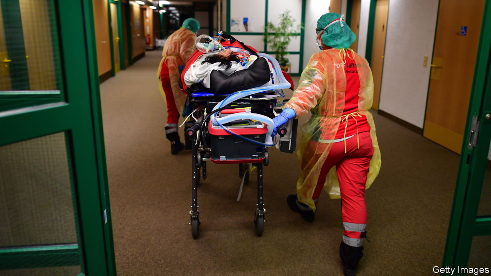
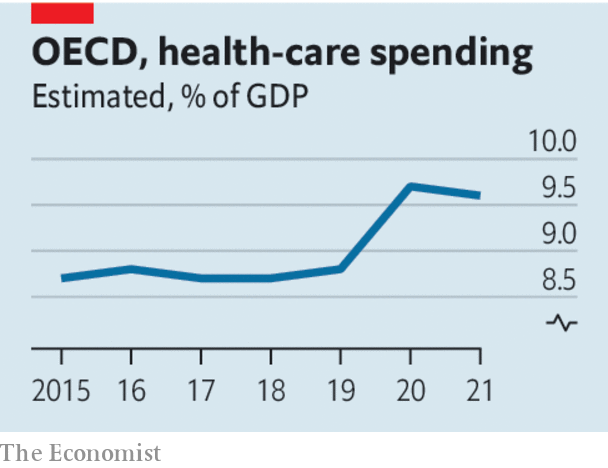

###### Flashing red

# Excess deaths are soaring as health-care systems wobble 

##### What lessons can be learned from a miserable winter across the rich world? 

 

> Jan 19th 2023 

In 1516 thomas more described the ideal health-care system. “These hospitals are well supplied with all types of medical equipment and the nurses are sympathetic,” the philosopher wrote in “Utopia”. “Though nobody’s forced to go there, practically everyone would rather be ill in hospitals than at home.” 

Five centuries later, those who prefer to be ill in hospital would struggle to make it past the lobby. People often lament the shortcomings of . They tend to ignore the extent to which pressure is visible across the rich world. Britain’s National Health Service (nhs) is in a winter crisis like none before, with people who have heart attacks waiting 90 minutes for an ambulance. In Canada things are so bad that a children’s hospital called in the Red Cross. Even in Switzerland, whose health care is often admired, the system is under enormous stress. 

 


Worse care is contributing to huge numbers of excess deaths. Mortality in Europe is about 10% higher than expected in a normal year. In mid-December French and German deaths were a quarter higher. The chaos is also damaging in ways that cannot be measured. It is distressing to think that one day you will need to call 911, 112 or 999—and that no one will come to help.

Spending on health care is at an all-time high in the rich world. The trouble is that “all-time high” does not necessarily mean “enough”. Ageing populations increase demand. Health-care systems compete for staff with other parts of the economy, so doctors’ and nurses’ wages must keep pace with prevailing rates of pay. Costs rise even if health-care productivity stagnates. The unforgiving logic of this “cost disease” means that in ageing societies health-care spending must usually grow as a share of the economy just to maintain a given level of provision. Countries, such as Britain and Italy, that in the years before the covid-19 pandemic cut health-care spending as a share of gdp, or held it constant, were already on a path to worse services. 

Yet squeezed budgets do not fully explain the disarray. Even in places with ample funding, health care is struggling with the unprecedented effects of the pandemic. On the demand side, covid has left behind sicker populations. After years of avoiding flu, many people are now getting it. The world is also discovering some of the costs of lockdowns. In 2020-21 many hospitals and family doctors cancelled appointments for non-covid conditions. People who postponed treatment for other maladies are presenting with later-stage illnesses that need more expensive treatment; they also have poorer chances of recovery. 

Covid hits the supply side, too. Many hospitals continue to isolate covid-positive patients and maintain strict cleaning regimes. This eats up time and resources. In addition, staff are burned out. The result seems to have been a decline in productivity. Excluding primary care, the nhs has 13% more doctors and 10% more nurses than in 2019, yet it is treating fewer patients from its waiting list. 

What can be done? More money would make little immediate difference. It takes time to hire staff and vacancies are already high. But it may be possible to boost productivity by winding down anti-covid measures that are unnecessary in mostly vaccinated populations. Beyond this year, spare capacity is needed. Governments that cannot find ways to boost productivity will have no choice but to increase funding and therefore raise taxes. Reforms that were already desirable, such as streamlining processes or introducing more competition, may come to be essential. 

Governments thinking about the next pandemic should also note the long-term consequences of lockdowns. There is a painful trade-off between suppressing disease in the short term and avoiding bottled-up problems in the future. As More counselled, “it’s a pretty poor doctor who cannot cure one disease without giving you another.” ■

