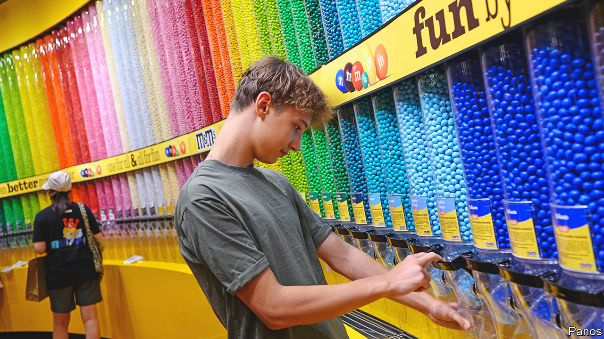

###### Don’t try to dig what we all say

# How to sell to the young 

##### A myth-busting memo for your boss 

 

> Jan 19th 2023 

Dear boss—You have always tried to attract young and youngish consumers, and our consultants have always come up with new ways to label them. I don’t need to remind you that “millennials” and, increasingly, . Together they make up a majority of the world’s population and a third of America’s. The trouble is that coming up with rules to define a swathe of humanity is more art than science. It is liable to become an exercise in applying stereotypes; not every youngster is sipping kombucha in a Brooklyn warehouse. Luckily you have me, and I’m here to tell you that much of what is written about marketing to today’s most prized consumers is a myth.

Start with the idea that, glued to smartphones, Gen Z barely notices the physical world and slavishly follows the latest hype from Instagram or TikTok. It’s true that the days of marketing chiefly through television, newspapers and magazines are long gone. Yet social media has not just changed the ways in which people discover brands; it has undermined the power of marketing as a whole. Such is the ease with which digital natives can fact-check our dodgy marketing claims and swipe left on our ads that it is getting harder to build brand loyalty. Online, talk is cheap and prices are readily Googled. Surveys suggest that young Americans are among the most price-sensitive food shoppers. It doesn’t help that they have accumulated less wealth than earlier generations had by the same age.

There is a similar temptation to think that physical shops no longer matter. Young consumers love their Amazon deliveries. It makes sense for our company to make sales via social media and ship directly to customers’ homes. But what works best is the seamless combination of the digital and physical worlds. Remember those online-only influencer-backed beauty brands like Glossier, which took the world by storm during the pandemic? It turns out that they struggle to get repeat business and have had to pair up with physical retailers lumbered with bricks and mortar. Remember that most Americans still buy their cosmetics at Walmart. If we want to succeed, we need to offer the best of both physical and virtual worlds.

And don’t assume that all young customers are DiAngelo-reading social justice warriors. Four-fifths of America’s Gen Z consider a brand’s sustainability and social impact before checkout, according to one survey. But considering something is not the same as surrendering to it. Gen Z cares less for consumer boycotts than its virtue-signalling parents. It is chiefly youngsters who buy cheap “fast-fashion” outfits to wear once and then send to landfill. And plenty of chains do well among young people without being woke. Just look at Chick-fil-A, which is America’s most popular restaurant among teenagers, according to another survey, despite its chairman’s past opposition to gay marriage and its donations to socially conservative causes.

What really matters is avoiding hypocrisy. Insincerity is easily exposed online, where everyone loves a takedown. Remember the backlash against Boohoo, a fast-fashion firm, when it appointed Kourtney Kardashian, a jet-setting socialite, as a “sustainability ambassador”? Don’t post pictures from your private plane, obviously, but don’t pretend you’re Greta Thunberg, either. Avoid platitudes, commit only to causes you can tangibly support and be frank when you are putting profits first. Nobody is perfect. To pretend otherwise is so 2013. We are people just as our customers are and people contain multitudes. Isn’t the story of your life that yesterday’s hippies are tomorrow’s suits? ■

