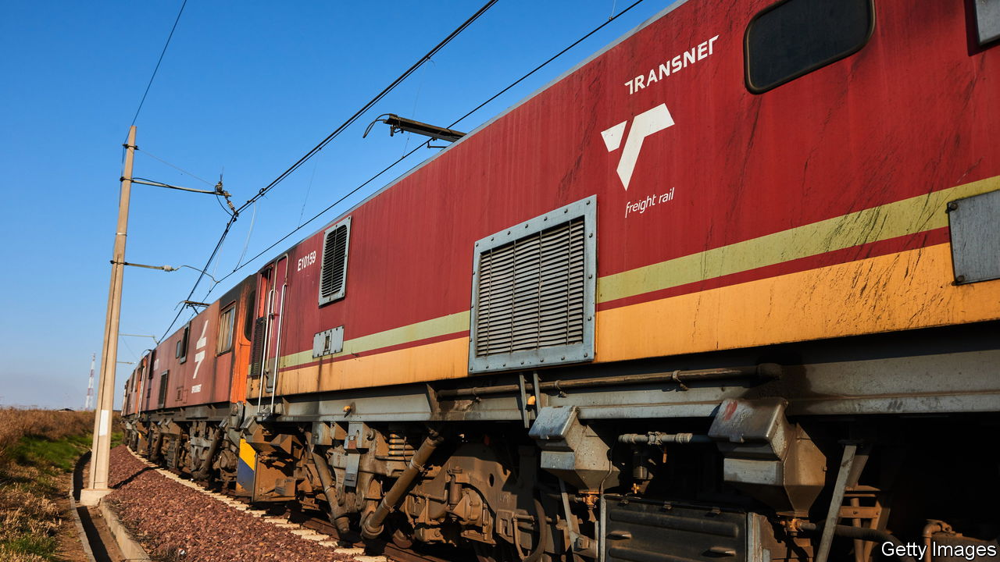

###### Arresting development

# South Africa’s collapsing railway company is a cautionary tale 

##### A “developmental state” is less useful than keeping the lights on and trains running 

 

> Jan 19th 2023 

The global financial crisis of 2007-09 showed that huge bombs had been placed in the rich world’s banking systems and capital markets. If one blew up, as Lehman Brothers did, it could send a blast wave through the rest of the economy. 

The companies that run power stations, railways and ports can be every bit as systemically important as banks. Eskom, South Africa’s state-owned electricity firm, was once among the world’s largest utilities by installed capacity. In recent decades it has been hollowed out by graft, cronyism and mismanagement. Daily blackouts now close South African factories, offices and shops. The government reckons this “load-shedding” trimmed gdp growth by about 1.3 percentage points in 2019. The effect is now surely worse: there were roughly four times as many blackouts in the first nine months of 2022 as in all of 2019. 

Another South African firm stumbling towards collapse may be even more systemically important, since it affects not just its home country but the wider region. , which runs the railways, ports and pipelines that connect sub-Saharan Africa’s most industrial economy with the outside world, is in deep trouble. Like Eskom, it was badly managed by hacks “deployed” by the ruling party and then pillaged through corrupt contracts, many signed during the era of “state capture” under Jacob Zuma, a former president. Now, weighed down by debt and with hundreds of broken locomotives, it cannot keep all of its freight trains running.

Last year, even as coal prices were booming, South Africa’s coal exports slumped to their lowest level since 1993. This is because Transnet’s main coal line, which ought to carry 81m tonnes to ports, carried just 54m. This represented lost exports worth at least 80bn rand ($4.7bn). Iron-ore exports, which also go by train, slumped to their lowest since 2012, while volumes of general freight sank to levels last seen during the second world war, reckons Jan Havenga of Stellenbosch University. Add to these the extra costs from inefficiency of going by road, and the total hit comes to around 400bn rand, or 6% of gdp. 

The poor performance of just these two firms goes a long way towards explaining why South Africa’s gdp is likely to grow by a feeble 1.6% over the next three years, less than half the pace of sub-Saharan Africa. That ought to prompt some introspection by South Africa’s government, which has long insisted it needs to own big firms to invest, create jobs and reduce racial inequality. This idea of a “developmental state” is also popular in the rest of Africa. Many governments still have Marxist leanings or see in China a model of state-led development.

Yet often politicians want firms to be state-owned so they can give jobs to pals or enrich themselves. These firms tend to arrest development, not accelerate it. A recent IMF study found that fully 40% of state-owned firms in sub-Saharan Africa were unprofitable and that their losses could destabilise local banking systems, hurting the flow of credit to the rest of the economy. Another IMF note in 2019 found that they account for 20% of public debt and their annual losses were equal to 1% of gdp. 

Freight expectations

Given that Africa is still poor and underindustrialised, it is tempting for governments to cook up grand strategies filled with buzzwords like “the fourth industrial revolution”. But industry cannot thrive if the lights are off and the trains do not run. South Africa’s utilities need private investment and effective management, which will not be forthcoming so long as they are the playthings of a dysfunctional ruling party. Transnet’s woes, like Eskom’s, should serve as a cautionary tale. ■

