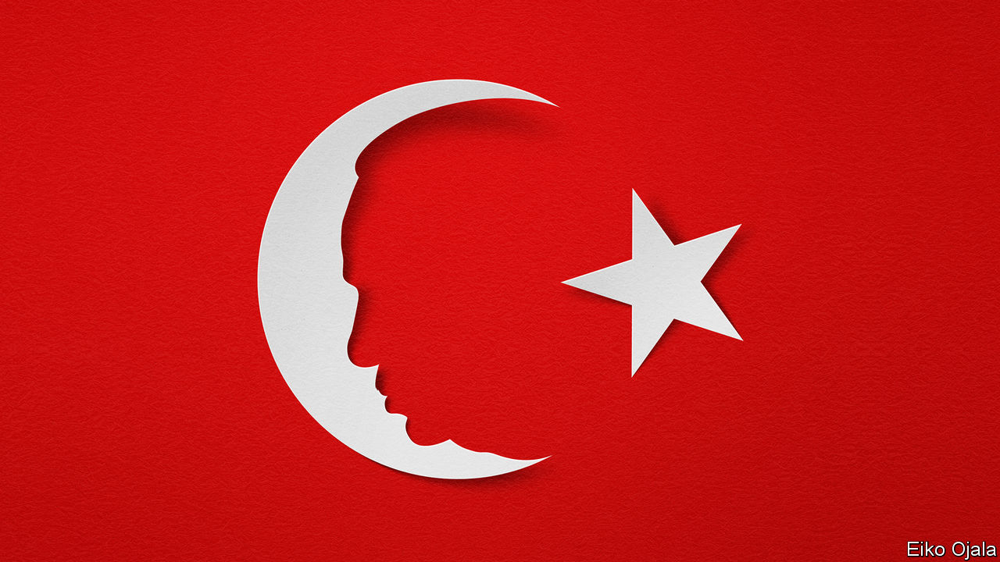

###### Recep for trouble

# Turkey could be on the brink of dictatorship 

##### President Erdogan could tip his country over the edge 

 

> Jan 19th 2023 

TURKEY HAS NATO’s second-biggest armed forces. It plays a crucial role in a turbulent neighbourhood, especially in war-scorched Syria. It exerts growing influence in the western Balkans, in the eastern Mediterranean and more recently in Africa. Above all, it is important in the Black Sea and in Russia’s war in Ukraine; last year it helped broker a deal to let more Ukrainian grain be shipped to a hungry world.

So outsiders should pay attention to Turkey’s presidential and parliamentary elections, which Recep Tayyip Erdogan suggested this week will be held on May 14th. All the more so since, under its increasingly erratic president, the country is on the brink of disaster. Mr Erdogan’s behaviour as the election approaches could push what is today a deeply flawed democracy over the edge into a full-blown dictatorship.

When he first became prime minister in March 2003, Mr Erdogan held out much promise for Turkey. Secularists feared that he had an excessively Islamist agenda, but he and his Justice and Development (AK) party have not got far in pursuing it. In its early years Mr Erdogan’s government gave new economic and political stability to a country that had for decades lacked either. He defanged the generals who had too often meddled in politics and mounted coups. He brought in reforms to boost the economy. He even put out peace-feelers to the Kurds, Turkey’s biggest ethnic minority, who had long suffered persecution at the hands of the army. In 2005 he deservedly secured a prize that had eluded all his predecessors: the formal opening of talks about Turkey one day joining the European Union. 

However, the longer Mr Erdogan has been in power, the more autocratic he has grown. After 11 years as prime minister he was elected president, and set about turning that previously weak post into a dominant one. After an attempted coup in 2016 he had tens of thousands of people purged from their jobs or arrested, often for the merest whisper of a connection to the religious group blamed for the plot, such as having attended one of its schools as a child. 

As our  in this issue explains, he has steadily co-opted institutions and eroded checks and balances. He has turned much of the media into a tool of state propaganda. He has, in effect, censored the internet. He has thrown many critics, including opposition leaders, into jail. He has sidelined rivals within the AK party. He has suborned the judiciary, using the courts to harass opponents. 

Approaching his third decade in power, he sits in a vast palace snapping orders at courtiers too frightened to tell him when he is wrong. His increasingly eccentric beliefs swiftly become public policy. Thus, he has imposed on a previously independent central bank a monetary theory that is flatly bonkers. He thinks the cure for inflation is to make money cheaper. This is the main reason why Turkish inflation is 64%. Living standards are shrivelling; tempers are fraying.

Voters, especially in cities, are pushing back. Three years ago Mr Erdogan’s party lost the mayoral elections in the three biggest cities of Ankara, Istanbul and Izmir. Polls suggest he could lose the presidency in four months, if the opposition unites behind its best candidate and the election is more or less clean.

That is a big if. Mr Erdogan is determined to tilt an already-uneven field even more in his favour. The mayor of Istanbul, Ekrem Imamoglu, perhaps Mr Erdogan’s most plausible rival, was recently sentenced to prison and banned from politics, for calling election officials who annulled his first mayoral victory “idiots”. The government is asking the constitutional court to shut down the People’s Democratic Party (HDP), the largest Kurdish party, many of whose leaders languish in jail. The court has frozen the HDP’s bank accounts. The opposition will need the support of Kurdish voters if it is to oust the president. 

Mr Erdogan once likened democracy to a tram journey: when you reach your destination, you get off. Under him, elections have seldom been completely fair, but they have been broadly free, with large numbers of voters taking part. The worry this time is that, with Mr Erdogan fearing defeat, he alights and ensures that the elections are neither fair nor free. 

Western leaders need to speak out. America and the EU have too often held back from criticising Mr Erdogan for fear of alienating a pivotal if troublesome ally. No one wants a country as important as Turkey to go completely rogue. All are aware that a resentful, isolated Turkish president could do great mischief. He could foment fiercer territorial quarrels with Greece and with Cyprus. He could create further confusion and strife in Syria. He could allow the 5m migrants and refugees in Turkey to set sail for southern Europe, something many would try if they could. And he could go beyond his current refusal to take sides in Ukraine, despite being a NATO member, by continuing to block NATO accession for Finland and Sweden.

Yet Turkey also needs the West, not least to restore some stability to its battered economy. Although its membership talks may be stuck, it still hopes for an upgraded and expanded customs union with the EU that would boost growth. It needs to find a way to revive foreign direct investment, which has tumbled in response to political and economic uncertainty. Turkey relies on Western technology to improve its low productivity. And it wants Western weapons, notably American fighter aircraft. It would be unable to secure any of these things if Mr Erdogan were to turn his back on democracy and join the dictators’ club. All this gives him a strong incentive to keep in with the West.

Time for bluntness from Biden

And that should give Western leaders bargaining power. Mr Erdogan is a bully who sees timidity as a reason to press his advantage and toughness as an incentive to —as he has recently with many of his Middle Eastern neighbours. Western leaders should therefore show Mr Erdogan how much they care about his behaviour, by speaking out before the election, privately and publicly, against the prospective bans on Mr Imamoglu and the HDP. It is not too late to pull Mr Erdogan back from the brink. But the West needs to start warning him off now. ■


