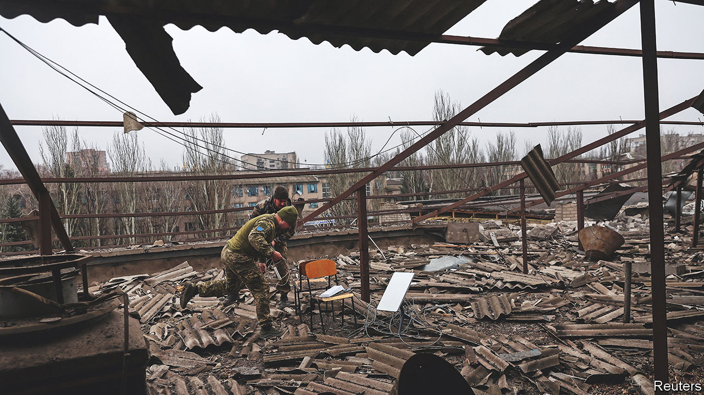

###### On free speech, Starlink terminals, America’s towns, future populations, weight, Pope Benedict’s shoes, food, presents

# Letters to the editor 

##### A selection of correspondence 

 

> Jan 19th 2023 


Self-censoring academics

I was pleased to see Bagehot mention the Free Speech Union’s support for Joe Kelly (), who is challenging his criminal conviction for posting a “grossly offensive” tweet. We agree that it should not be a criminal act to be “grossly offensive” online. The law is vague, malleable and open to abuse. A government that says it is committed to free speech should scrap this offence. 

But, I disagree with Bagehot’s analysis of the government’s “cartoonish” focus on free speech in British universities. A recent survey by Tena Prelec, an academic, found that 57% of social-science faculty members think there is a risk to freedom of expression on campus. A separate study from the University and College Union found that 35% of British academics in general self-censor. These statistics are not surprising for us. 

We have come to the aid of hundreds of students and academics who have been dragged through long and distressing internal investigative and disciplinary procedures, merely for having expressed unorthodox but lawful opinions. Some are coerced to resign, some get sacked, others forced out on sick leave. For most “heretics” the process is the punishment and, for their peers, a clear warning not to challenge the orthodoxies of the day. Britain has a problem with free speech and, unfortunately, it is not confined to section 127 of the Communications Act. 

Karolien Celie

Legal officer

Free Speech Union


 


Poland’s war contribution

You mentioned that the Starlink terminals that are so important to Ukraine’s war effort were delivered by SpaceX at the request of the Ukrainian government (“”, January 7th). That was true for the first batch, but at the moment the majority of Starlinks (almost 20,000 units) were sent and paid for by Polish government institutions. We strongly believe that the terminals, which cost only a fraction of a howitzer shell, are an extremely cost-effective way to support Ukraine in its brave fight against the Russian invaders.

Janusz Cieszynski

Secretary of state, government plenipotentiary for cyber-security


 


Shaping America’s towns

Your article on city planning referred to the land ordinance of 1785 and the grid of property lines created to promote westward expansion in America (“”, December 24th). The Rectangular Survey System replaced traditional property markers, such as rocks, trees and buildings, which could change over time. Tested in eastern Ohio, the system created vertical rows of townships, divided into “sections”. These were a mile square, or 640 acres, and could be subdivided into half-, quarter- and quarter-of-quarter-sections, the last of which was 40 acres; hence the expression “40 acres and a mule” as the basis for subsistence farming.

Almost everything west of Ohio was surveyed this way and innumerable deeds today refer back to these original subdivisions. In a flight over America’s western areas the checkerboard pattern of land parcels, direct descendants of the Rectangular System, is readily apparent.

Jeffrey Darbee


 


Rocks of ages

The philosophical debate about how to value lives that have not yet been born dwells too much on the present and future (“”, December 24th). As a palaeontologist, my view of what is basically the study of contingency (what if?) is rooted in the past and the evolution of humanity, rather than Derek Parfit’s vision of a future, miserable overpopulated world, his “repugnant conclusion”.  formed in Africa, a continent untroubled by the advances and retreats of glaciers that would have got in the way of human evolution. Various species of  spread out across the Sahara and Middle East. With a different arrangement of continents this would never have happened. Each of these waves was different culturally, and the early adaptability of . , honed in the deserts of the Middle East, helped their later colonisation of the rest of Asia and Europe. 

But what if the rising seas had flooded the Suez isthmus preventing migration? What if one of the glacial periods had been long and cold enough to hold up evolution? Human and geological history are full of “what if?” moments. It’s even possible that we are living in some previous visionary’s repugnant conclusion right now, experiencing Parfit’s fearful muzak and potatoes. We just don’t know it. 

Professor Mike Stephenson

Honorary research associate

British Geological Survey


The question of the unborn is older than you may think. The Talmud contains one such discussion. In the tractate of Bava Metzia rabbis debate whether it would have been better for man not to have been created at all. The Talmud ultimately concludes that it is better that man was created, as he has the ability to do good deeds and improve the world, and the potential to achieve great things. However, it also notes that man’s capacity for evil and wrongdoing is also a result of his creation, and that this must be balanced by his capacity for good.

David Rothenberg


David Benatar, a philosopher, argues that, because of the asymmetry between the harms and benefits of coming into existence, it is always better not to be born. When someone is not brought into the world they are spared the hardships of life yet not deprived of potential positive experiences because there is no one to experience the deprivation. The possible person in question is a purely theoretical concept. There are therefore existential as well as social and economic benefits to reducing the number of people brought into the world. 

Chris Gilmore


Your thorough and lucid analysis of how to treat the well-being of people whose very existence may be the consequence of policy decisions raises the question: Is it good policy to bring more moral philosophers into this world? They make every question more complex and thereby leave the rest of us even more confused than we were before. 

Avinash Dixit

Emeritus professor of economics

Princeton University


 


Weight v health

Regarding the economics of thinness (“”, December 24th), we now know that a lifetime of exercise and disciplined eating (low to no fat, no pizza, rarely consuming ice cream or deserts) has contributed to weak bones in women. We thought thin was healthy, beautiful, powerful. Thin gave us control socially and politically. But now we are in our 60s and have the bones of an 80-to-90 year old. We could have eaten the pizza.

MARA WINICK


 


The papal shoes

Your recent obituary of Pope Benedict XVI made a common error regarding his “fashion-conscious almost to foppishness” choice of dress (“”, January 7th). On the foppishness I agree, but the “red Gucci slippers” made famous by the deceased pontiff were actually the product of a pair of cobblers working in the city, Adriano Stefanelli of Italy and Antonio Arellano of Peru.

Joseph Doyle


 


Soul food

Reading about how food affects the mind was an eye-opener indeed (“”, December 24th). But it wouldn’t come as news to Jerome K. Jerome, who in 1889 wrote the following in “Three Men in A Boat”: 

“How good one feels when one is full—how satisfied with ourselves and with the world! People who have tried it, tell me that a clear conscience makes you very happy and contented; but a full stomach does the business quite as well, and is cheaper, and more easily obtained. One feels so forgiving and generous after a substantial and well-digested meal—so noble-minded, so kindly hearted.”

RON GIELGUN


 


The art of giving presents

I have solved the inefficiencies of buying gifts at Christmas (“”, December 24th) by creating an online spreadsheet. Everyone in the family has their own tab where they enter what they want and provide links and descriptions. At the end of each November the list gets locked and many secret chats are created in which only one member of the family is excluded and everyone can say which gift they are buying for that person. This way everyone gets only the gift they want (and just one of it). 

MICHAL ZYWCZYK


