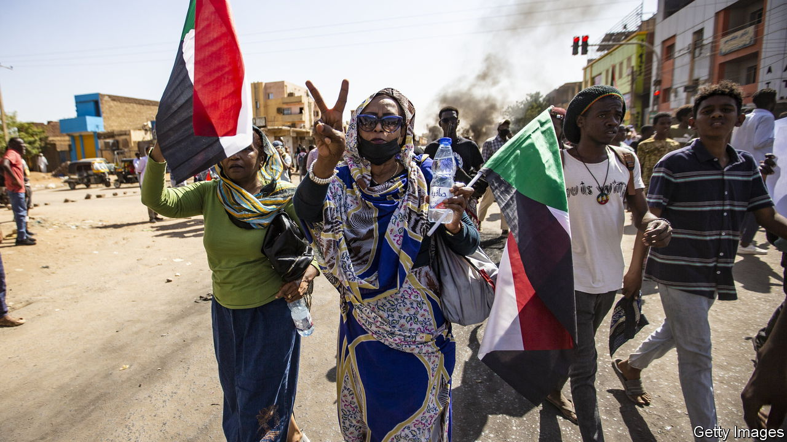

###### Vive la résistance

# How young Sudanese are still fighting for democracy 

##### The youthful committees that toppled Sudan’s dictator have not given up 

 

> Jan 19th 2023 

Civil-society activism in Africa can sometimes seem like an exercise in empty sloganeering: “mobilising the grassroots”, “empowering the youth”, and so on. Not in Sudan, where in recent years thousands of neighbourhood “resistance committees” have sprung up throughout the country. Forged in 2018 in the , they began as autonomous networks of local protesters aimed at toppling Omar al-Bashir, an Islamist despot  by the International Criminal Court, and at shepherding the country towards democracy. 

Four years on, their revolution is unfinished. In 2019, after protesters had taken to the streets for months, Sudan’s generals gave Mr Bashir a final shove and seized power. They have clung to it ever since. Nonetheless, the committees offer a glimpse of how ordinary people were able to come together to fight for freedom.

In parts of Sudan, committees can be found at every administrative rung down to the village, each with its own rules governing its affairs. Over time they have become more sophisticated. Many have elected separate field, political, liaison and media officers. Some provide first aid or welfare, such as handing out fuel and flour.

But their core business is still organising demonstrations. Since the generals’ latest coup, staged in October 2021, the committees have brought people onto the streets almost every week. “It basically takes a WhatsApp message and we can shut down all the roads in Sudan,” says Ahmed Ismat, a spokesman for a committee in Khartoum, the capital.

The committees are distinctive in several ways compared with other youth movements in the region such as the “Qeerroo”, an ethnic-nationalist organisation of young men in neighbouring Ethiopia. For one thing, Sudan’s committees have no single figurehead. Decisions are taken collectively, by an elaborate if time-consuming process of local consultation. Members’ views from marginalised states such as Darfur, where a government-backed militia has raped and butchered for years, have been given special weight. “They have more at stake, they matter more,” says Mr Ismat. 

Young women, too, are unusually prominent. When it is time for a protest, it is usually they who sound the z—a high-pitched ululation that brings people to the streets. Many are in positions of authority. Sajida al-Mubarak, a medical student, is just 23 years old. But as a senior spokesperson for an influential committee in Khartoum, “she’d be my boss,” notes 37-year-old Waleed Adam, an activist. 

In December the generals and leaders of the civilian opposition struck a new pact that is meant to lead to elections, a fully civilian government and the withdrawal of the army from politics and the economy. As part of it, talks are still under way on sticky issues, such as the prosecution of some generals for genocide and crimes against humanity. But the committees see the process as merely the latest stitch-up by a coterie of ageing generals and politicians in Khartoum. “We are sick and tired of people gathering in closed rooms and giving us orders,” says Ms Mubarak. Many suspect, for instance, that a deal granting an under-the-table amnesty to the top generals has already been negotiated. 

What the committees are articulating, instead, is a vision of politics that overturns the old model of “one person who calls all the shots”, says Mr Adam. Rather than wait for the old guard to hand down a new federal constitution, the committees have been drafting their own. This includes radical proposals to tackle the root causes of Sudan’s recurrent crises. Members like Nabeel Gasim, from a Khartoum suburb, believe the committees should seize back control of formal politics by trying to win seats in a future legislature. “The committees are transforming from being a mobilising force into an overtly political organisation,” notes Kholood Khair, an analyst in the capital. 

Yet some reckon that the committees are a busted flush. Street protests against the agreement reached in December were more muted than before. Internal fissures are widening. Some members argue that the deal should be given a chance. Several committees refused to sign a draft constitutional charter published in October, complaining that it had been drawn up without enough consultation. 

Even so, the movement remains a force to be reckoned with, so long as Sudan’s democratic transition seems to be stalling. “We are building a state,” says Ms Mubarak. “We won’t stop until our goals are met.” ■

