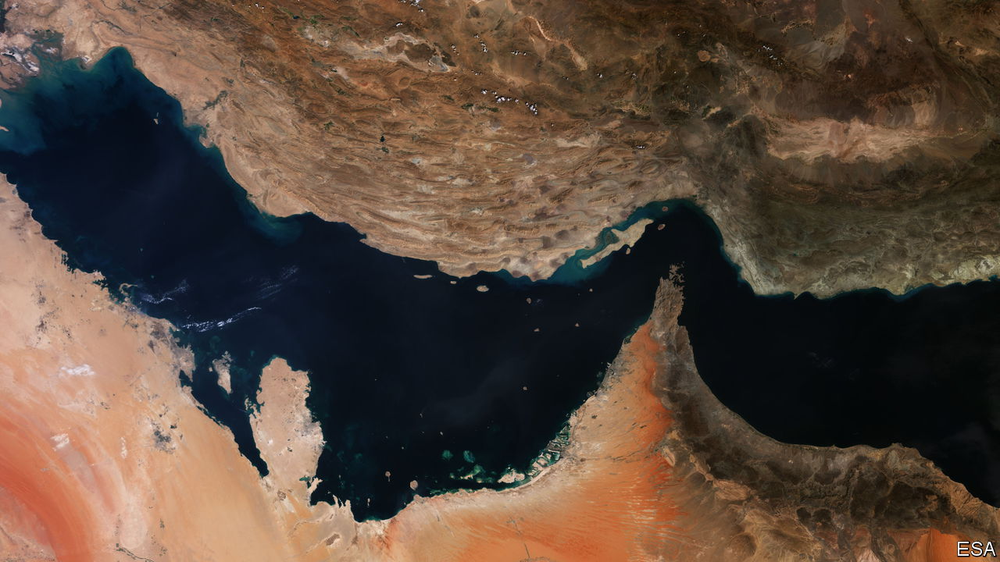

###### A Gulf apart

# Iran and its Arab neighbours are divided over a name 

##### Iraqis are backing those who call the waterway the Arabian Gulf 

 

> Jan 19th 2023 

ITS WATERS are beguilingly calm. But a tempest is brewing over their name. Iran insists that the waterway that divides the country from its Arab neighbours should be known as the Persian Gulf. Most Western cartographers agree. But across the sea, Arabs are angling for it to be called the Arabian Gulf. (Google Earth hedges its bets by using both names.) A natural barrier for centuries of Arab-Persian rivalry, the waters reflect increasingly troubled relations.

The latest catalyst is a football tournament. For the first time in decades Iraq has been hosting the Arabian Gulf Cup, which involves all the states bordering the waterway, bar Iran. It has been keen to show where its loyalties lie. “Today we’re part of the Arab system and we’re eager to maintain our relations with the states of the Arabian Gulf,” said Iraq’s prime minister, Muhammad al-Sudani, ahead of the opening ceremony in Basra, the host city, which is near the border with Iran. Other Iraqi politicians have chimed in. “Welcome to the states of the Arabian Gulf,” tweeted Muqtada al-Sadr, a cleric who heads Iraq’s biggest group in parliament.

Iran is crying foul. It has shown treaties purporting to prove that the Gulf has been Persian since Darius the Great in the fifth century bc. It has also summoned Iraq’s ambassador, denounced Iraq in Iran’s parliament and projected the words “Persian Gulf” onto a football stadium in Tehran, the capital. “It has been and always will be Persian,” insists Alireza Salami, a tetchy Iranian MP, who says Iraq must apologise.

Iran’s sense of grievance is all the more bitter because Mr Sudani’s government had been hailed as the most pro-Iranian since Shah Abbas conquered Baghdad four centuries ago. One of Iran’s largest trading partners, Iraq is also the only other Middle Eastern state ruled by Shia Muslims. And it has 120,000 fighters who profess loyalty to Iran’s supreme leader, Ayatollah Ali Khamenei. That is even more than Hizbullah, Lebanon’s pro-Iranian Shia militia.

However, the economies of the oil-rich Gulf states offer Iraq juicier investment opportunities than Iran, which is hampered by Western sanctions. And though most of Basra’s inhabitants are Shias, like their Iranian neighbours across the border, many look to the football cup to revive the happy memories of Kuwaitis and Saudis, who follow the Sunni version of Islam but still used to come to the city for fun. 

This time tens of thousands of fans jammed Basra’s corniche to cheer on their teams from across the so-called Arabian Gulf. “Iran’s occupation has been a disaster for Iraq’s economy and Arabic culture,” says Talib Abdulaziz, a Basra poet, referring to Iran’s political influence. Three decades after its invasion of Kuwait made Iraq a pariah among Arab states, the country is, he says, “coming home”. ■

